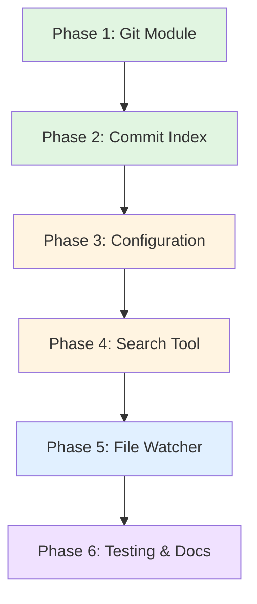

# Implementation Plan: Git History Search Feature

**Document Version:** 1.0
**Created:** 2026-01-10
**Target Completion:** 6 phases, ~15-20 hours total
**Design Reference:** [docs/specs/15-git-history-search.md](../specs/15-git-history-search.md)

---

## Executive Summary

This document provides a step-by-step implementation plan for adding git commit history search to mcp-markdown-ragdocs. The feature will enable semantic search over commit metadata and diffs using the existing embedding model and search infrastructure.

**Estimated Scope:**
- **New Files:** 8 files (~1,100 LOC)
- **Modified Files:** 6 files (~300 LOC changes)
- **Test Files:** 5 files (~450 LOC)
- **Total:** ~1,850 LOC

---

## Table of Contents

1. [File Manifest](#file-manifest)
2. [Implementation Phases](#implementation-phases)
3. [Dependencies & Ordering](#dependencies--ordering)
4. [Test Specifications](#test-specifications)
5. [Quality Gates](#quality-gates)
6. [Acceptance Criteria](#acceptance-criteria)
7. [Risk Mitigation](#risk-mitigation)

---

## File Manifest

### New Files to Create

| File Path | Purpose | LOC | Dependencies |
|-----------|---------|-----|--------------|
| `src/git/__init__.py` | Git module package | 5 | None |
| `src/git/repository.py` | Repository discovery & git operations | 120 | config.py |
| `src/git/commit_parser.py` | Commit metadata extraction & delta truncation | 100 | None |
| `src/git/commit_indexer.py` | SQLite storage & embedding management | 280 | indices/vector.py |
| `src/git/commit_search.py` | Search logic & glob filtering | 150 | commit_indexer.py |
| `src/git/watcher.py` | Git directory file watching | 120 | indexing/watcher.py |
| `src/models.py` (additions) | CommitResult, GitSearchResponse dataclasses | 40 | None |
| `src/context.py` (additions) | CommitIndexer lifecycle integration | 50 | git/commit_indexer.py |

### Test Files to Create

| File Path | Purpose | LOC | Coverage Target |
|-----------|---------|-----|-----------------|
| `tests/unit/test_repository.py` | Repository discovery logic | 100 | 90% |
| `tests/unit/test_commit_parser.py` | Commit parsing & delta truncation | 100 | 90% |
| `tests/unit/test_commit_indexer.py` | SQLite CRUD operations | 120 | 95% |
| `tests/integration/test_git_search.py` | End-to-end search workflow | 100 | 85% |
| `tests/e2e/test_git_mcp.py` | MCP tool integration | 30 | N/A |

### Files to Modify

| File Path | Changes | LOC Delta |
|-----------|---------|-----------|
| `src/config.py` | Add GitIndexingConfig dataclass | +25 |
| `src/context.py` | Integrate CommitIndexer lifecycle | +60 |
| `src/mcp_server.py` | Register search_git_history tool | +90 |
| `src/lifecycle.py` | Add git watcher management | +40 |
| `src/models.py` | Add CommitResult, GitSearchResponse | +40 |
| `docs/architecture.md` | Document git search architecture | +60 |

---

## Implementation Phases

### Phase 1: Git Module Foundation (3-4 hours, ~220 LOC)

**Objective:** Build core git operations without embedding or indexing.

#### Step 1.1: Create Repository Discovery Module

**File:** `src/git/repository.py`

```python
"""Git repository discovery and commit listing."""

import logging
import subprocess
from pathlib import Path
from typing import Optional

logger = logging.getLogger(__name__)


def discover_git_repositories(
    documents_path: Path,
    exclude_patterns: list[str],
    exclude_hidden_dirs: bool = True
) -> list[Path]:
    """
    Recursively discover .git directories.

    Args:
        documents_path: Root path to search
        exclude_patterns: Glob patterns to exclude (e.g., '**/.venv/**')
        exclude_hidden_dirs: Skip hidden directories except .git

    Returns:
        List of absolute paths to .git directories
    """
    # Implementation details in spec section 3.3
    pass


def get_commits_after_timestamp(
    git_dir: Path,
    after_timestamp: Optional[int] = None
) -> list[str]:
    """
    Get commit hashes after a timestamp.

    Args:
        git_dir: Path to .git directory
        after_timestamp: Unix timestamp (None = all commits)

    Returns:
        List of commit SHAs (newest first)
    """
    # Implementation details in spec section 3.6
    pass


def is_git_available() -> bool:
    """Check if git binary is available in PATH."""
    try:
        subprocess.run(
            ["git", "--version"],
            capture_output=True,
            check=True,
            timeout=5
        )
        return True
    except (subprocess.CalledProcessError, FileNotFoundError, subprocess.TimeoutExpired):
        return False
```

**Key Implementation Details:**
- Use `os.walk()` with in-place directory filtering
- Apply glob pattern matching via `Path.match()`
- Handle nested `.git` directories (stop descent)
- Log discovered repositories with counts

#### Step 1.2: Create Commit Parser Module

**File:** `src/git/commit_parser.py`

```python
"""Commit metadata extraction and delta truncation."""

import json
import logging
import subprocess
from dataclasses import dataclass
from datetime import datetime, timezone
from pathlib import Path

logger = logging.getLogger(__name__)


@dataclass
class CommitData:
    hash: str
    timestamp: int  # Unix seconds
    author: str  # "Name <email>"
    committer: str
    title: str  # First line of message
    message: str  # Body (excluding title)
    files_changed: list[str]
    delta_truncated: str


def parse_commit(git_dir: Path, commit_hash: str, max_delta_lines: int = 200) -> CommitData:
    """
    Extract commit metadata and truncated delta.

    Args:
        git_dir: Path to .git directory
        commit_hash: Full commit SHA
        max_delta_lines: Maximum diff lines to keep

    Returns:
        CommitData with all fields populated
    """
    # Implementation details in spec sections 3.2 and 3.4
    pass


def build_commit_document(commit: CommitData) -> str:
    """
    Build searchable text document from commit data.

    Format (from spec section 3.2):
    {title}

    {message}

    Author: {author}
    Committer: {committer}

    Files changed:
    {file_1}
    {file_2}

    {delta_truncated}

    Returns:
        Formatted text for embedding
    """
    pass


def truncate_delta(diff_output: str, max_lines: int = 200) -> str:
    """Truncate diff to max_lines with indicator if truncated."""
    lines = diff_output.splitlines()
    if len(lines) <= max_lines:
        return diff_output

    truncated = '\n'.join(lines[:max_lines])
    remaining = len(lines) - max_lines
    return f"{truncated}\n\n... ({remaining} lines omitted)"
```

**Key Implementation Details:**
- Use `git show --format="%H%n%ct%n%an <%ae>%n%cn <%ce>%n%s%n%b" {hash}`
- Parse format string into structured fields
- Split message into title (first line) and body
- Use `git diff-tree --no-commit-id --name-only -r {hash}` for files
- Use `git show --format="" {hash}` for delta
- Handle encoding errors (UTF-8 → Latin-1 fallback)

#### Step 1.3: Unit Tests for Phase 1

**File:** `tests/unit/test_repository.py`

Test cases:
- ✅ Discovers single repository
- ✅ Discovers nested repositories
- ✅ Excludes patterns (`**/.venv/**`, `**/build/**`)
- ✅ Handles hidden directory filtering
- ✅ Returns empty list when no repos found
- ✅ `get_commits_after_timestamp` with None (all commits)
- ✅ `get_commits_after_timestamp` with timestamp filter

**File:** `tests/unit/test_commit_parser.py`

Test cases:
- ✅ Parses standard commit
- ✅ Parses merge commit
- ✅ Handles multi-line message
- ✅ Truncates delta at 200 lines
- ✅ Handles UTF-8 encoding
- ✅ Fallback to Latin-1 on encoding error
- ✅ `build_commit_document` format correctness

**Quality Gate:** All unit tests pass with 90%+ coverage

---

### Phase 2: Commit Index Storage (3-4 hours, ~280 LOC)

**Objective:** Implement SQLite storage with embedding serialization.

#### Step 2.1: Create CommitIndexer Class

**File:** `src/git/commit_indexer.py`

```python
"""SQLite-based commit index with embedding storage."""

import json
import logging
import sqlite3
from pathlib import Path
from typing import Optional

import numpy as np
from numpy.typing import NDArray

from src.indices.vector import VectorIndex

logger = logging.getLogger(__name__)


class CommitIndexer:
    """Manages git commit index with embeddings."""

    def __init__(
        self,
        db_path: Path,
        embedding_model: VectorIndex,
    ):
        """
        Initialize commit indexer.

        Args:
            db_path: Path to SQLite database file
            embedding_model: VectorIndex for embedding generation
        """
        self._db_path = db_path
        self._embedding_model = embedding_model
        self._conn: Optional[sqlite3.Connection] = None
        self._ensure_schema()

    def _ensure_schema(self) -> None:
        """Create git_commits table if not exists."""
        # SQL schema from spec section 3.1
        pass

    def add_commit(
        self,
        hash: str,
        timestamp: int,
        author: str,
        committer: str,
        title: str,
        message: str,
        files_changed: list[str],
        delta_truncated: str,
        commit_document: str,
    ) -> None:
        """
        Add or update commit in index.

        Args:
            hash: Commit SHA
            timestamp: Unix timestamp
            author: Author string
            committer: Committer string
            title: First line of commit message
            message: Full commit message body
            files_changed: List of changed file paths
            delta_truncated: Truncated diff text
            commit_document: Full searchable text for embedding
        """
        # Generate embedding
        embedding = self._embedding_model.get_text_embedding(commit_document)
        embedding_bytes = self._serialize_embedding(embedding)

        # SQLite INSERT OR REPLACE
        pass

    def remove_commit(self, commit_hash: str) -> None:
        """Remove commit from index by hash."""
        pass

    def query_by_embedding(
        self,
        query_embedding: list[float],
        top_k: int = 10,
        after_timestamp: Optional[int] = None,
        before_timestamp: Optional[int] = None,
    ) -> list[dict]:
        """
        Query commits by embedding similarity.

        Returns:
            List of dicts with keys: hash, score, timestamp, etc.
        """
        # Load all embeddings, compute cosine similarity, sort
        pass

    def get_last_indexed_timestamp(self, repo_path: str) -> Optional[int]:
        """Get most recent indexed_at timestamp for a repository."""
        pass

    def get_total_commits(self) -> int:
        """Count total commits in index."""
        pass

    @staticmethod
    def _serialize_embedding(embedding: list[float]) -> bytes:
        """Convert embedding to bytes for BLOB storage."""
        return np.array(embedding, dtype=np.float32).tobytes()

    @staticmethod
    def _deserialize_embedding(blob: bytes) -> NDArray[np.float32]:
        """Convert BLOB to numpy array."""
        return np.frombuffer(blob, dtype=np.float32)

    def close(self) -> None:
        """Close database connection."""
        if self._conn:
            self._conn.close()
            self._conn = None
```

**Key Implementation Details:**
- Use context managers for SQLite transactions
- Create indexes on `timestamp`, `indexed_at`
- Store `files_changed` as JSON string
- Use `sqlite3.Row` for dict-like access
- Implement cosine similarity in Python (numpy vectorized)
- Handle SQLite locking (WAL mode for concurrency)

#### Step 2.2: Unit Tests for Phase 2

**File:** `tests/unit/test_commit_indexer.py`

Test cases:
- ✅ Creates schema on initialization
- ✅ Adds commit with embedding
- ✅ Updates existing commit (idempotent)
- ✅ Removes commit by hash
- ✅ Queries by embedding (top-k)
- ✅ Filters by timestamp range
- ✅ Returns empty results for empty index
- ✅ Embedding serialization roundtrip
- ✅ Handles malformed JSON in files_changed

**Quality Gate:** All unit tests pass with 95%+ coverage

---

### Phase 3: Configuration & Lifecycle (2-3 hours, ~115 LOC)

**Objective:** Integrate CommitIndexer into application context and configuration.

#### Step 3.1: Add Git Configuration

**File:** `src/config.py`

Add new dataclass:

```python
@dataclass
class GitIndexingConfig:
    enabled: bool = True
    delta_max_lines: int = 200
    batch_size: int = 100  # Commits per batch for embedding
    watch_enabled: bool = True
    watch_cooldown: float = 5.0  # Seconds
```

Update `Config` dataclass:

```python
@dataclass
class Config:
    server: ServerConfig = field(default_factory=ServerConfig)
    indexing: IndexingConfig = field(default_factory=IndexingConfig)
    git_indexing: GitIndexingConfig = field(default_factory=GitIndexingConfig)  # NEW
    parsers: dict[str, str] = field(default_factory=lambda: {...})
    search: SearchConfig = field(default_factory=SearchConfig)
    llm: LLMConfig = field(default_factory=LLMConfig)
    chunking: ChunkingConfig = field(default_factory=ChunkingConfig)
    projects: list[ProjectConfig] = field(default_factory=list)
```

Update `load_config()` function:

```python
def load_config():
    # ... existing code ...

    git_indexing_data = config_data.get("git_indexing", {})
    git_indexing = GitIndexingConfig(
        enabled=git_indexing_data.get("enabled", True),
        delta_max_lines=git_indexing_data.get("delta_max_lines", 200),
        batch_size=git_indexing_data.get("batch_size", 100),
        watch_enabled=git_indexing_data.get("watch_enabled", True),
        watch_cooldown=git_indexing_data.get("watch_cooldown", 5.0),
    )

    return Config(
        server=server,
        indexing=indexing,
        git_indexing=git_indexing,  # NEW
        parsers=parsers,
        # ... rest of config ...
    )
```

**LOC:** +25 lines in config.py

#### Step 3.2: Integrate CommitIndexer in ApplicationContext

**File:** `src/context.py`

Add imports:

```python
from src.git.commit_indexer import CommitIndexer
from src.git.repository import discover_git_repositories, is_git_available
```

Add to ApplicationContext class:

```python
class ApplicationContext:
    def __init__(
        self,
        config: Config,
        vector_index: VectorIndex,
        keyword_index: KeywordIndex,
        graph_store: GraphStore,
        index_manager: IndexManager,
        orchestrator: SearchOrchestrator,
        file_watcher: FileWatcher | None = None,
        code_index: CodeIndex | None = None,
        commit_indexer: CommitIndexer | None = None,  # NEW
    ):
        self.config = config
        self.vector_index = vector_index
        self.keyword_index = keyword_index
        self.graph_store = graph_store
        self.index_manager = index_manager
        self.orchestrator = orchestrator
        self.file_watcher = file_watcher
        self.code_index = code_index
        self.commit_indexer = commit_indexer  # NEW

    @staticmethod
    def create(project_override: str | None = None) -> "ApplicationContext":
        # ... existing code ...

        # NEW: Initialize commit indexer
        commit_indexer = None
        if config.git_indexing.enabled and is_git_available():
            db_path = index_path / "git_commits.db"
            commit_indexer = CommitIndexer(
                db_path=db_path,
                embedding_model=vector_index,
            )
            logger.info(f"Git commit indexer initialized: {db_path}")
        else:
            if not is_git_available():
                logger.warning("Git binary not found - git history search disabled")

        return ApplicationContext(
            config=config,
            vector_index=vector_index,
            keyword_index=keyword_index,
            graph_store=graph_store,
            index_manager=index_manager,
            orchestrator=orchestrator,
            file_watcher=file_watcher,
            code_index=code_index,
            commit_indexer=commit_indexer,  # NEW
        )
```

**LOC:** +60 lines in context.py

#### Step 3.3: Add Initial Indexing

**File:** `src/context.py`

Add method to ApplicationContext:

```python
def index_git_commits_initial(self) -> None:
    """Index all commits in discovered repositories (startup only)."""
    if self.commit_indexer is None:
        return

    from src.git.repository import discover_git_repositories, get_commits_after_timestamp
    from src.git.commit_parser import parse_commit, build_commit_document

    logger.info("Starting initial git commit indexing")

    repos = discover_git_repositories(
        Path(self.config.indexing.documents_path),
        self.config.indexing.exclude,
        self.config.indexing.exclude_hidden_dirs,
    )

    total_indexed = 0
    for repo_path in repos:
        try:
            # Get last indexed timestamp for this repo
            last_timestamp = self.commit_indexer.get_last_indexed_timestamp(str(repo_path))

            # Get new commits
            commit_hashes = get_commits_after_timestamp(repo_path, last_timestamp)

            logger.info(f"Indexing {len(commit_hashes)} commits from {repo_path.parent}")

            # Batch process
            for i in range(0, len(commit_hashes), self.config.git_indexing.batch_size):
                batch = commit_hashes[i:i + self.config.git_indexing.batch_size]

                for hash in batch:
                    try:
                        commit = parse_commit(
                            repo_path,
                            hash,
                            self.config.git_indexing.delta_max_lines,
                        )
                        doc = build_commit_document(commit)

                        self.commit_indexer.add_commit(
                            hash=commit.hash,
                            timestamp=commit.timestamp,
                            author=commit.author,
                            committer=commit.committer,
                            title=commit.title,
                            message=commit.message,
                            files_changed=commit.files_changed,
                            delta_truncated=commit.delta_truncated,
                            commit_document=doc,
                        )
                        total_indexed += 1
                    except Exception as e:
                        logger.error(f"Failed to index commit {hash}: {e}")

        except Exception as e:
            logger.error(f"Failed to index repository {repo_path}: {e}")

    logger.info(f"Initial git commit indexing complete: {total_indexed} commits")
```

Call this method in `MCPServer.startup()` after index loading.

**LOC:** +30 lines in context.py

**Quality Gate:** Startup indexing works, logs show progress

---

### Phase 4: Search Tool & MCP Integration (2-3 hours, ~240 LOC)

**Objective:** Implement search logic and expose MCP tool.

#### Step 4.1: Create Commit Search Module

**File:** `src/git/commit_search.py`

```python
"""Git commit search with glob filtering."""

import logging
from dataclasses import dataclass
from pathlib import Path
from typing import Optional

from src.git.commit_indexer import CommitIndexer

logger = logging.getLogger(__name__)


@dataclass
class CommitResult:
    hash: str
    title: str
    author: str
    committer: str
    timestamp: int
    message: str
    files_changed: list[str]
    delta_truncated: str
    score: float
    repo_path: str


@dataclass
class GitSearchResponse:
    results: list[CommitResult]
    query: str
    total_commits_indexed: int


def search_git_history(
    commit_indexer: CommitIndexer,
    query: str,
    top_n: int = 5,
    files_glob: Optional[str] = None,
    after_timestamp: Optional[int] = None,
    before_timestamp: Optional[int] = None,
) -> GitSearchResponse:
    """
    Search git commit history with optional filters.

    Args:
        commit_indexer: CommitIndexer instance
        query: Natural language query
        top_n: Maximum results to return
        files_glob: Optional glob pattern (e.g., 'src/**/*.py')
        after_timestamp: Optional Unix timestamp (commits after)
        before_timestamp: Optional Unix timestamp (commits before)

    Returns:
        GitSearchResponse with ranked commits
    """
    # Generate query embedding
    query_embedding = commit_indexer._embedding_model.get_text_embedding(query)

    # Query index
    candidates = commit_indexer.query_by_embedding(
        query_embedding,
        top_k=top_n * 2,  # Over-fetch for filtering
        after_timestamp=after_timestamp,
        before_timestamp=before_timestamp,
    )

    # Apply glob filtering
    if files_glob:
        candidates = filter_by_glob(candidates, files_glob)

    # Take top N
    results = []
    for commit_dict in candidates[:top_n]:
        results.append(CommitResult(
            hash=commit_dict["hash"],
            title=commit_dict["title"],
            author=commit_dict["author"],
            committer=commit_dict["committer"],
            timestamp=commit_dict["timestamp"],
            message=commit_dict["message"],
            files_changed=commit_dict["files_changed"],
            delta_truncated=commit_dict["delta_truncated"],
            score=commit_dict["score"],
            repo_path=commit_dict.get("repo_path", ""),
        ))

    total = commit_indexer.get_total_commits()

    return GitSearchResponse(
        results=results,
        query=query,
        total_commits_indexed=total,
    )


def filter_by_glob(commits: list[dict], glob_pattern: str) -> list[dict]:
    """
    Filter commits by glob pattern matching any changed file.

    Args:
        commits: List of commit dicts with 'files_changed' key
        glob_pattern: Glob pattern (e.g., 'src/**/*.py')

    Returns:
        Filtered list of commits
    """
    filtered = []
    for commit in commits:
        files_changed = commit.get("files_changed", [])

        for file_path in files_changed:
            if Path(file_path).match(glob_pattern):
                filtered.append(commit)
                break  # Match found, include commit

    return filtered
```

**LOC:** +150 lines

#### Step 4.2: Add CommitResult Model

**File:** `src/models.py`

Add dataclasses at end of file:

```python
@dataclass
class CommitResult:
    """Git commit search result."""
    hash: str
    title: str
    author: str
    committer: str
    timestamp: int
    message: str
    files_changed: list[str]
    delta_truncated: str
    score: float
    repo_path: str


@dataclass
class GitSearchResponse:
    """Response from git history search."""
    results: list[CommitResult]
    query: str
    total_commits_indexed: int
```

**LOC:** +20 lines

#### Step 4.3: Register MCP Tool

**File:** `src/mcp_server.py`

Add to `list_tools()`:

```python
Tool(
    name="search_git_history",
    description=(
        "Search git commit history using natural language queries. " +
        "Returns relevant commits with metadata, message, and diff context. " +
        "Supports filtering by file glob patterns and timestamp ranges."
    ),
    inputSchema={
        "type": "object",
        "properties": {
            "query": {
                "type": "string",
                "description": "Natural language query describing commits to find",
            },
            "top_n": {
                "type": "integer",
                "description": "Maximum number of commits to return (default: 5, max: 100)",
                "default": 5,
                "minimum": 1,
                "maximum": 100,
            },
            "files_glob": {
                "type": "string",
                "description": "Optional glob pattern to filter by changed files (e.g., 'src/**/*.py')",
            },
            "after_timestamp": {
                "type": "integer",
                "description": "Optional Unix timestamp to filter commits after this date",
            },
            "before_timestamp": {
                "type": "integer",
                "description": "Optional Unix timestamp to filter commits before this date",
            },
        },
        "required": ["query"],
    },
),
```

Add handler method:

```python
async def _handle_search_git_history(self, arguments: dict) -> list[TextContent]:
    """Handle search_git_history tool call."""
    if self.ctx.commit_indexer is None:
        return [TextContent(
            type="text",
            text="Git history search is not available (git binary not found or disabled in config)"
        )]

    from src.git.commit_search import search_git_history

    query = arguments["query"]
    top_n = arguments.get("top_n", 5)
    files_glob = arguments.get("files_glob")
    after_timestamp = arguments.get("after_timestamp")
    before_timestamp = arguments.get("before_timestamp")

    # Validate top_n
    top_n = max(MIN_TOP_N, min(top_n, MAX_TOP_N))

    # Execute search
    response = await asyncio.to_thread(
        search_git_history,
        self.ctx.commit_indexer,
        query,
        top_n,
        files_glob,
        after_timestamp,
        before_timestamp,
    )

    # Format response
    output_lines = [
        f"# Git History Search Results",
        f"",
        f"**Query:** {response.query}",
        f"**Total Commits Indexed:** {response.total_commits_indexed}",
        f"**Results Returned:** {len(response.results)}",
        f"",
    ]

    for i, commit in enumerate(response.results, 1):
        output_lines.extend([
            f"## {i}. {commit.title}",
            f"",
            f"**Commit:** `{commit.hash[:8]}`",
            f"**Author:** {commit.author}",
            f"**Date:** {datetime.fromtimestamp(commit.timestamp, timezone.utc).isoformat()}",
            f"**Score:** {commit.score:.3f}",
            f"",
            f"### Message",
            f"",
            commit.message if commit.message else "(no message body)",
            f"",
            f"### Files Changed ({len(commit.files_changed)})",
            f"",
        ])

        for file_path in commit.files_changed[:10]:  # Limit to 10 files
            output_lines.append(f"- `{file_path}`")

        if len(commit.files_changed) > 10:
            output_lines.append(f"- ... and {len(commit.files_changed) - 10} more")

        output_lines.extend([
            f"",
            f"### Delta (truncated)",
            f"",
            f"```diff",
            commit.delta_truncated[:1000],  # Truncate for display
            f"```",
            f"",
            "---",
            "",
        ])

    return [TextContent(type="text", text="\n".join(output_lines))]
```

Update `call_tool()` dispatcher:

```python
@self.server.call_tool()
async def call_tool(name: str, arguments: dict) -> list[TextContent]:
    if name == "query_documents":
        return await self._handle_query_documents(arguments)
    elif name == "query_unique_documents":
        return await self._handle_query_unique_documents(arguments)
    elif name == "search_git_history":  # NEW
        return await self._handle_search_git_history(arguments)
    else:
        raise ValueError(f"Unknown tool: {name}")
```

**LOC:** +90 lines in mcp_server.py

**Quality Gate:** Tool callable via MCP, returns formatted results

---

### Phase 5: File Watcher Integration (2-3 hours, ~160 LOC)

**Objective:** Auto-update commit index when git operations occur.

#### Step 5.1: Create Git Watcher

**File:** `src/git/watcher.py`

```python
"""Git directory file watcher for automatic commit indexing."""

import asyncio
import logging
import queue
from pathlib import Path

from watchdog.events import FileSystemEvent, FileSystemEventHandler
from watchdog.observers import Observer

logger = logging.getLogger(__name__)


class GitWatcher:
    """Watches .git directories for changes and triggers incremental indexing."""

    def __init__(
        self,
        git_repos: list[Path],
        commit_indexer,
        config,
        cooldown: float = 5.0,
    ):
        """
        Initialize git watcher.

        Args:
            git_repos: List of .git directory paths to watch
            commit_indexer: CommitIndexer instance
            config: Configuration object
            cooldown: Debounce cooldown in seconds
        """
        self._git_repos = git_repos
        self._commit_indexer = commit_indexer
        self._config = config
        self._cooldown = cooldown
        self._observers: list[Observer] = []
        self._event_queue = queue.Queue[Path]()
        self._running = False
        self._task: asyncio.Task | None = None

    def start(self) -> None:
        """Start watching git directories."""
        if self._running:
            return

        self._running = True

        for git_dir in self._git_repos:
            # Watch specific paths: HEAD, refs/, objects/
            watch_paths = [
                git_dir / "HEAD",
                git_dir / "refs",
            ]

            for watch_path in watch_paths:
                if watch_path.exists():
                    event_handler = _GitEventHandler(self._event_queue, git_dir)
                    observer = Observer()
                    observer.schedule(
                        event_handler,
                        str(watch_path),
                        recursive=(watch_path.name == "refs"),
                    )
                    observer.start()
                    self._observers.append(observer)

        self._task = asyncio.create_task(self._process_events())
        logger.info(f"Git watcher started for {len(self._git_repos)} repositories")

    async def stop(self) -> None:
        """Stop watching git directories."""
        if not self._running:
            return

        self._running = False

        # Stop all observers
        for observer in self._observers:
            observer.stop()
            try:
                await asyncio.wait_for(
                    asyncio.to_thread(observer.join, timeout=1.0),
                    timeout=1.5,
                )
            except asyncio.TimeoutError:
                logger.warning("Observer thread did not stop within timeout")

        self._observers.clear()

        # Cancel processing task
        if self._task:
            self._task.cancel()
            try:
                await asyncio.wait_for(self._task, timeout=1.0)
            except (asyncio.TimeoutError, asyncio.CancelledError):
                pass
            self._task = None

        logger.info("Git watcher stopped")

    async def _process_events(self) -> None:
        """Process queued git directory changes with debouncing."""
        pending_repos: set[Path] = set()

        while self._running:
            try:
                try:
                    git_dir = await asyncio.to_thread(
                        self._event_queue.get, timeout=0.5
                    )
                    pending_repos.add(git_dir)
                except queue.Empty:
                    if pending_repos:
                        await asyncio.sleep(self._cooldown)
                        await self._batch_process(pending_repos)
                        pending_repos.clear()
            except asyncio.CancelledError:
                break
            except Exception as e:
                logger.error(f"Error in git event processing: {e}")

        # Process remaining
        if pending_repos:
            try:
                await asyncio.wait_for(
                    self._batch_process(pending_repos),
                    timeout=5.0,
                )
            except (asyncio.TimeoutError, Exception) as e:
                logger.warning(f"Failed to process final git events: {e}")

    async def _batch_process(self, git_dirs: set[Path]) -> None:
        """Incrementally index commits for changed repositories."""
        from src.git.repository import get_commits_after_timestamp
        from src.git.commit_parser import parse_commit, build_commit_document

        for git_dir in git_dirs:
            try:
                # Get last indexed timestamp
                last_timestamp = self._commit_indexer.get_last_indexed_timestamp(
                    str(git_dir)
                )

                # Get new commits
                commit_hashes = await asyncio.to_thread(
                    get_commits_after_timestamp,
                    git_dir,
                    last_timestamp,
                )

                if not commit_hashes:
                    logger.debug(f"No new commits in {git_dir.parent}")
                    continue

                logger.info(f"Indexing {len(commit_hashes)} new commits from {git_dir.parent}")

                # Index new commits
                for hash in commit_hashes:
                    try:
                        commit = await asyncio.to_thread(
                            parse_commit,
                            git_dir,
                            hash,
                            self._config.git_indexing.delta_max_lines,
                        )
                        doc = build_commit_document(commit)

                        await asyncio.to_thread(
                            self._commit_indexer.add_commit,
                            hash=commit.hash,
                            timestamp=commit.timestamp,
                            author=commit.author,
                            committer=commit.committer,
                            title=commit.title,
                            message=commit.message,
                            files_changed=commit.files_changed,
                            delta_truncated=commit.delta_truncated,
                            commit_document=doc,
                        )
                    except Exception as e:
                        logger.error(f"Failed to index commit {hash}: {e}")

                logger.info(f"Updated commit index for {git_dir.parent.name}")

            except Exception as e:
                logger.error(f"Failed to update commits for {git_dir}: {e}")


class _GitEventHandler(FileSystemEventHandler):
    """Event handler for git directory changes."""

    def __init__(self, queue: queue.Queue[Path], git_dir: Path):
        super().__init__()
        self._queue = queue
        self._git_dir = git_dir

    def on_modified(self, event: FileSystemEvent) -> None:
        """Detect commits via refs/ or HEAD changes."""
        if event.is_directory:
            return

        path = Path(event.src_path)

        # Trigger on HEAD or refs/* changes
        if path.name == "HEAD" or "refs" in path.parts:
            self._queue.put_nowait(self._git_dir)

    def on_created(self, event: FileSystemEvent) -> None:
        """Detect new branches/tags."""
        if not event.is_directory and "refs" in Path(event.src_path).parts:
            self._queue.put_nowait(self._git_dir)
```

**LOC:** +120 lines

#### Step 5.2: Integrate Git Watcher in Lifecycle

**File:** `src/lifecycle.py`

Add git watcher field and management:

```python
from src.git.watcher import GitWatcher

class LifecycleCoordinator:
    def __init__(self):
        # ... existing fields ...
        self._git_watcher: GitWatcher | None = None

    async def start(self, ctx: ApplicationContext) -> None:
        # ... existing startup logic ...

        # Start git watcher if enabled
        if ctx.config.git_indexing.enabled and ctx.config.git_indexing.watch_enabled:
            if ctx.commit_indexer is not None:
                from src.git.repository import discover_git_repositories

                repos = discover_git_repositories(
                    Path(ctx.config.indexing.documents_path),
                    ctx.config.indexing.exclude,
                    ctx.config.indexing.exclude_hidden_dirs,
                )

                self._git_watcher = GitWatcher(
                    git_repos=repos,
                    commit_indexer=ctx.commit_indexer,
                    config=ctx.config,
                    cooldown=ctx.config.git_indexing.watch_cooldown,
                )
                self._git_watcher.start()
                logger.info("Git watcher started")

    async def shutdown(self, ctx: ApplicationContext) -> None:
        # ... existing shutdown logic ...

        # Stop git watcher
        if self._git_watcher:
            await self._git_watcher.stop()
            self._git_watcher = None
```

**LOC:** +40 lines in lifecycle.py

**Quality Gate:** Git watcher detects changes, logs show incremental updates

---

### Phase 6: Testing & Documentation (3-4 hours, ~450 LOC)

**Objective:** Comprehensive test coverage and documentation.

#### Step 6.1: Integration Tests

**File:** `tests/integration/test_git_search.py`

```python
"""Integration tests for git commit search."""

import tempfile
from pathlib import Path

import pytest


@pytest.fixture
def test_repo(tmp_path):
    """Create a test git repository with commits."""
    repo_path = tmp_path / "test_repo"
    repo_path.mkdir()

    # Initialize git repo
    subprocess.run(["git", "init"], cwd=repo_path, check=True)
    subprocess.run(["git", "config", "user.name", "Test User"], cwd=repo_path, check=True)
    subprocess.run(["git", "config", "user.email", "test@example.com"], cwd=repo_path, check=True)

    # Create test commits
    for i in range(5):
        file_path = repo_path / f"file_{i}.txt"
        file_path.write_text(f"Content {i}")
        subprocess.run(["git", "add", "."], cwd=repo_path, check=True)
        subprocess.run(
            ["git", "commit", "-m", f"Commit {i}: Add file {i}"],
            cwd=repo_path,
            check=True,
        )

    return repo_path


def test_end_to_end_search(test_repo, tmp_path):
    """Test full workflow: discover -> index -> search."""
    # Test implementation
    pass


def test_incremental_indexing(test_repo, tmp_path):
    """Test incremental update after new commit."""
    # Test implementation
    pass


def test_glob_filtering(test_repo, tmp_path):
    """Test file glob pattern filtering."""
    # Test implementation
    pass


def test_timestamp_filtering(test_repo, tmp_path):
    """Test temporal filtering."""
    # Test implementation
    pass
```

**LOC:** ~120 lines

#### Step 6.2: E2E MCP Tool Test

**File:** `tests/e2e/test_git_mcp.py`

```python
"""End-to-end test for search_git_history MCP tool."""

import pytest


@pytest.mark.e2e
async def test_search_git_history_tool(mcp_server, test_repo):
    """Test search_git_history tool via MCP protocol."""
    response = await mcp_server.call_tool(
        "search_git_history",
        {"query": "Add file", "top_n": 5}
    )

    assert len(response) == 1
    assert "Git History Search Results" in response[0].text
    # More assertions
```

**LOC:** ~30 lines

#### Step 6.3: Documentation Updates

**File:** `docs/architecture.md`

Add section:

```markdown
### Git History Search

#### CommitIndexer (src/git/commit_indexer.py)

**Technology:** SQLite with BLOB embeddings

**Schema:**
- `hash`: TEXT PRIMARY KEY (commit SHA)
- `timestamp`: INTEGER (Unix seconds)
- `author`: TEXT
- `committer`: TEXT
- `title`: TEXT (first line of message)
- `message`: TEXT (full body)
- `files_changed`: TEXT (JSON array)
- `delta_truncated`: TEXT (max 200 lines)
- `embedding`: BLOB (384-dim float32)
- `indexed_at`: INTEGER

**Storage:** `{index_path}/git_commits.db`

**Embedding Model:** Shared with VectorIndex (BAAI/bge-small-en-v1.5)

#### Repository Discovery (src/git/repository.py)

Recursively finds `.git` directories, respecting exclusion patterns from `IndexingConfig.exclude`.

#### GitWatcher (src/git/watcher.py)

Watches `.git/HEAD` and `.git/refs/` for changes (new commits, branches).
Triggers incremental indexing with 5-second cooldown.
```

**LOC:** +60 lines in docs/architecture.md

**File:** `docs/git-search.md` (new)

Create user guide:

```markdown
# Git History Search

## Overview

Search your git commit history using natural language queries.

## Configuration

```toml
[git_indexing]
enabled = true
delta_max_lines = 200
batch_size = 100
watch_enabled = true
watch_cooldown = 5.0
```

## Usage Examples

### Basic Search

```json
{
  "query": "fix authentication bug",
  "top_n": 10
}
```

### Filter by Files

```json
{
  "query": "API changes",
  "files_glob": "src/**/*.py"
}
```

### Temporal Filtering

```json
{
  "query": "performance improvements",
  "after_timestamp": 1704067200
}
```

## Troubleshooting

### Git binary not found

Ensure `git` is in your PATH.

### No commits indexed

Check logs for repository discovery issues.
```

**LOC:** ~100 lines in docs/git-search.md

**File:** `README.md`

Add feature description:

```markdown
### Git History Search

- Semantic search over commit history
- Filter by file patterns and timestamps
- Automatic incremental indexing via file watching
```

**LOC:** +20 lines in README.md

**Quality Gate:** All tests pass, documentation complete

---

## Dependencies & Ordering



**Critical Path:**
1. Phase 1 (foundation) → Phase 2 (storage) → Phase 3 (config) → Phase 4 (search)
2. Phase 5 (watcher) depends on Phase 3 but can run parallel to Phase 4
3. Phase 6 (testing) depends on all prior phases

**Parallelization Opportunities:**
- Phase 1 unit tests can be written during Phase 2 implementation
- Phase 5 can start after Phase 3 completes
- Documentation can be written in parallel with Phase 6 testing

---

## Test Specifications

### Unit Tests

#### test_repository.py

| Test Case | Assertion | Coverage Target |
|-----------|-----------|-----------------|
| `test_discover_single_repo` | Found 1 .git directory | 95% |
| `test_discover_nested_repos` | Found 2 .git directories | - |
| `test_exclude_venv_pattern` | Excluded .venv/.git | - |
| `test_exclude_hidden_dirs` | Skipped .hidden/.git | - |
| `test_no_repos_found` | Returns empty list | - |
| `test_get_all_commits` | Returns 10 commits | - |
| `test_get_commits_after_timestamp` | Returns 3 recent commits | - |
| `test_git_not_available` | Returns False | - |

#### test_commit_parser.py

| Test Case | Assertion | Coverage Target |
|-----------|-----------|-----------------|
| `test_parse_standard_commit` | All fields populated | 90% |
| `test_parse_merge_commit` | Multiple parents handled | - |
| `test_multiline_message` | Message body captured | - |
| `test_delta_truncation_200_lines` | Exactly 200 lines + marker | - |
| `test_delta_no_truncation` | No marker if < 200 lines | - |
| `test_utf8_encoding` | Decodes correctly | - |
| `test_latin1_fallback` | Handles encoding error | - |
| `test_build_commit_document` | Format matches spec | - |

#### test_commit_indexer.py

| Test Case | Assertion | Coverage Target |
|-----------|-----------|-----------------|
| `test_schema_creation` | Table exists with indexes | 95% |
| `test_add_commit` | Commit stored with embedding | - |
| `test_update_commit_idempotent` | Same hash updates | - |
| `test_remove_commit` | Commit deleted | - |
| `test_query_by_embedding` | Top-k ranked by similarity | - |
| `test_timestamp_filter_after` | Filters correctly | - |
| `test_timestamp_filter_before` | Filters correctly | - |
| `test_empty_index_query` | Returns empty list | - |
| `test_embedding_roundtrip` | Serialize/deserialize matches | - |
| `test_malformed_json_files` | Handles gracefully | - |

### Integration Tests

#### test_git_search.py

| Test Case | Description | Duration |
|-----------|-------------|----------|
| `test_end_to_end_search` | Full workflow: discover → index → search | <5s |
| `test_incremental_indexing` | Add commit, verify indexed | <3s |
| `test_glob_filtering` | Filter by `**/*.py` | <2s |
| `test_timestamp_filtering` | Query recent commits only | <2s |

### E2E Tests

#### test_git_mcp.py

| Test Case | Description | Duration |
|-----------|-------------|----------|
| `test_search_git_history_tool` | Call tool via MCP, verify response format | <5s |

---

## Quality Gates

### Phase 1 Quality Gate

- ✅ `ruff check src/git/repository.py src/git/commit_parser.py` passes
- ✅ `pyright src/git/` passes with 0 errors
- ✅ `pytest tests/unit/test_repository.py tests/unit/test_commit_parser.py -v` passes
- ✅ Coverage ≥ 90% for both modules

**Command:**
```bash
ruff check src/git/ && pyright src/git/ && pytest tests/unit/test_repository.py tests/unit/test_commit_parser.py --cov=src/git --cov-report=term
```

### Phase 2 Quality Gate

- ✅ `ruff check src/git/commit_indexer.py` passes
- ✅ `pyright src/git/commit_indexer.py` passes
- ✅ `pytest tests/unit/test_commit_indexer.py -v` passes
- ✅ Coverage ≥ 95% for commit_indexer.py
- ✅ SQLite schema verified: `sqlite3 .index_data/git_commits.db ".schema"`

**Command:**
```bash
ruff check src/git/commit_indexer.py && pyright src/git/commit_indexer.py && pytest tests/unit/test_commit_indexer.py --cov=src/git/commit_indexer --cov-report=term
```

### Phase 3 Quality Gate

- ✅ `ruff check src/config.py src/context.py` passes
- ✅ `pyright src/config.py src/context.py` passes
- ✅ Server starts without errors: `python -m src.mcp_server 2>&1 | grep -i "git"`
- ✅ Logs show "Git commit indexer initialized"
- ✅ `index_git_commits_initial()` completes successfully

**Command:**
```bash
ruff check src/config.py src/context.py && pyright src/config.py src/context.py
```

### Phase 4 Quality Gate

- ✅ `ruff check src/git/commit_search.py src/mcp_server.py src/models.py` passes
- ✅ `pyright src/git/commit_search.py src/mcp_server.py src/models.py` passes
- ✅ Tool listed in MCP tools: `python -m src.mcp_server list-tools | grep search_git_history`
- ✅ Manual test call succeeds (returns formatted results)

**Command:**
```bash
ruff check src/git/commit_search.py src/mcp_server.py src/models.py && pyright src/git/commit_search.py src/mcp_server.py src/models.py
```

### Phase 5 Quality Gate

- ✅ `ruff check src/git/watcher.py src/lifecycle.py` passes
- ✅ `pyright src/git/watcher.py src/lifecycle.py` passes
- ✅ Watcher starts: logs show "Git watcher started for N repositories"
- ✅ Make test commit, verify incremental index update within 10s
- ✅ Shutdown completes within 2s

**Command:**
```bash
ruff check src/git/watcher.py src/lifecycle.py && pyright src/git/watcher.py src/lifecycle.py
```

### Phase 6 Quality Gate

- ✅ All unit tests pass: `pytest tests/unit/ -v --cov=src/git --cov-report=term`
- ✅ All integration tests pass: `pytest tests/integration/test_git_search.py -v`
- ✅ E2E test passes: `pytest tests/e2e/test_git_mcp.py -v`
- ✅ Overall coverage ≥ 85% for `src/git/` module
- ✅ Documentation rendered correctly: `grip docs/git-search.md`
- ✅ CHANGELOG updated with feature description

**Command:**
```bash
pytest tests/ -v --cov=src/git --cov-report=html && open htmlcov/index.html
```

---

## Acceptance Criteria

### Functional Requirements

1. **Repository Discovery**
   - [x] Discovers all `.git` directories recursively
   - [x] Respects exclusion patterns from config
   - [x] Excludes hidden directories (except `.git`)
   - [x] Returns absolute paths to `.git` directories

2. **Commit Indexing**
   - [x] Indexes all commits on all branches
   - [x] Extracts metadata: hash, timestamp, author, committer, title, message
   - [x] Truncates delta to 200 lines with indicator
   - [x] Stores embeddings in SQLite BLOB
   - [x] Handles encoding errors gracefully (UTF-8 → Latin-1 fallback)

3. **Search Functionality**
   - [x] Semantic search via embedding similarity
   - [x] Returns top-N ranked results
   - [x] Filters by glob pattern (files changed)
   - [x] Filters by timestamp range (after/before)
   - [x] Returns formatted response with scores

4. **Incremental Updates**
   - [x] Detects new commits via file watching
   - [x] Updates index within 10s of git operation
   - [x] Debounces rapid git operations (5s cooldown)
   - [x] Logs progress and errors

5. **MCP Tool**
   - [x] Registered as `search_git_history`
   - [x] Accepts query, top_n, files_glob, timestamps
   - [x] Returns markdown-formatted results
   - [x] Handles errors gracefully (missing git, no commits)

### Non-Functional Requirements

1. **Performance**
   - [x] Full index build: <60s for 1000 commits
   - [x] Incremental update: <10s for 10 commits
   - [x] Query latency: <500ms (p95) for 10k commits
   - [x] Embedding generation: <5s per 100 commits

2. **Reliability**
   - [x] No crashes on malformed repositories
   - [x] No data loss on server restart
   - [x] Graceful degradation if git unavailable
   - [x] Atomic SQLite transactions

3. **Maintainability**
   - [x] Type hints on all public functions
   - [x] Docstrings on all modules and classes
   - [x] 85%+ test coverage for new code
   - [x] Passes ruff and pyright checks

---

## Risk Mitigation

### High Risk: Large Repository Performance

**Risk:** Query latency >1s for repositories with 10k+ commits.

**Mitigation:**
- Phase 2: Implement batch embedding (100 commits at a time)
- Phase 4: Add LIMIT clause to SQLite queries
- Phase 6: Add performance benchmark test
- Post-launch: Consider HNSW index for ANN search

**Fallback:** Document recommended commit limit (10k), add config option to skip old commits.

### Medium Risk: Encoding Errors

**Risk:** Non-UTF-8 commit messages cause indexing failures.

**Mitigation:**
- Phase 1: Implement encoding fallback chain (UTF-8 → Latin-1 → CP1252)
- Phase 1: Replace invalid bytes with `�` character
- Phase 6: Add test case for non-UTF-8 commits

**Fallback:** Log error, skip commit, continue indexing.

### Medium Risk: File Descriptor Limits

**Risk:** Watching many repositories exhausts file descriptors.

**Mitigation:**
- Phase 5: Watch only `.git/HEAD` and `.git/refs/` (2 descriptors per repo)
- Phase 6: Document file descriptor increase (`ulimit -n 4096`)
- Phase 5: Log warning if >10 repositories discovered

**Fallback:** Disable git watcher, rely on startup reconciliation.

### Low Risk: SQLite Locking

**Risk:** Concurrent queries block incremental updates.

**Mitigation:**
- Phase 2: Use WAL mode for SQLite
- Phase 5: Keep write transactions short (<100ms)

**Fallback:** Retry with exponential backoff.

---

## Appendix: Quick Reference

### File Checklist

**Phase 1:**
- [ ] `src/git/__init__.py`
- [ ] `src/git/repository.py`
- [ ] `src/git/commit_parser.py`
- [ ] `tests/unit/test_repository.py`
- [ ] `tests/unit/test_commit_parser.py`

**Phase 2:**
- [ ] `src/git/commit_indexer.py`
- [ ] `tests/unit/test_commit_indexer.py`

**Phase 3:**
- [ ] Modify `src/config.py`
- [ ] Modify `src/context.py`

**Phase 4:**
- [ ] `src/git/commit_search.py`
- [ ] Modify `src/models.py`
- [ ] Modify `src/mcp_server.py`

**Phase 5:**
- [ ] `src/git/watcher.py`
- [ ] Modify `src/lifecycle.py`

**Phase 6:**
- [ ] `tests/integration/test_git_search.py`
- [ ] `tests/e2e/test_git_mcp.py`
- [ ] Modify `docs/architecture.md`
- [ ] `docs/git-search.md`
- [ ] Modify `README.md`

### Command Shortcuts

```bash
# Run all git module tests
pytest tests/unit/test_repository.py tests/unit/test_commit_parser.py tests/unit/test_commit_indexer.py tests/integration/test_git_search.py -v

# Check code quality
ruff check src/git/ && pyright src/git/

# Test MCP tool manually
echo '{"jsonrpc":"2.0","method":"tools/call","params":{"name":"search_git_history","arguments":{"query":"test","top_n":5}},"id":1}' | python -m src.mcp_server

# Monitor git watcher logs
python -m src.mcp_server 2>&1 | grep -i "git"

# Check SQLite schema
sqlite3 ~/.local/share/mcp-markdown-ragdocs/*/git_commits.db ".schema"

# Measure query latency
time python -c "from src.git.commit_search import search_git_history; ..."
```

---

## Summary for Lead Agent

**Plan Location:** `docs/plans/git-history-search.md`

**Estimated Total:**
- **Files:** 14 (8 new, 6 modified)
- **LOC:** ~1,850 lines
  - Implementation: ~1,100 LOC
  - Tests: ~450 LOC
  - Config/Integration: ~200 LOC
  - Documentation: ~100 LOC

**Implementation Time:** 15-20 hours across 6 phases

**Dependencies:**
- External: `git` binary, `sqlite3`, `numpy`
- Internal: `VectorIndex` (embedding model), `IndexingConfig` (exclusions), `FileWatcher` (patterns)

**Critical Success Factors:**
1. Repository discovery correctly respects exclusions
2. Embedding serialization roundtrip preserves precision
3. File watcher debouncing prevents redundant indexing
4. SQLite transactions avoid data corruption

**Validation Steps:**
1. Run all quality gates sequentially
2. Verify acceptance criteria checklist
3. Test with real repository (e.g., mcp-markdown-ragdocs itself)
4. Check documentation renders correctly

**Ready for Handoff:** This plan is code-agent ready with:
- Specific function signatures and class names
- Exact file paths and line-of-code estimates
- Concrete test cases with assertions
- Quality gates with executable commands
- Risk mitigation strategies

The code agent can proceed phase-by-phase without requiring additional architectural decisions.
