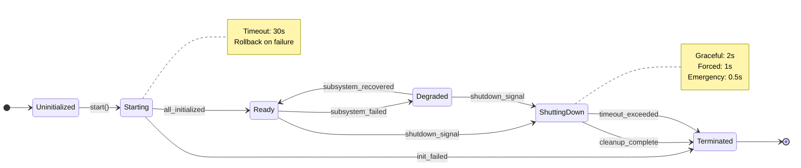
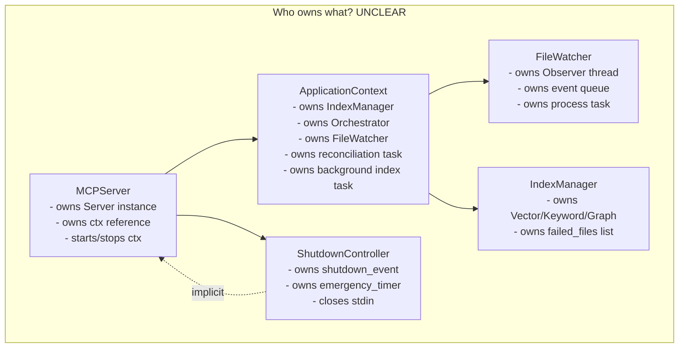
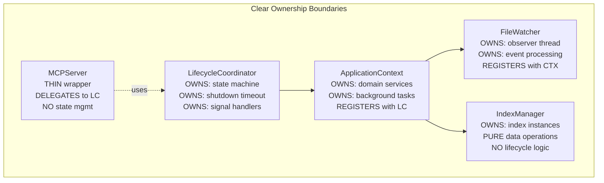
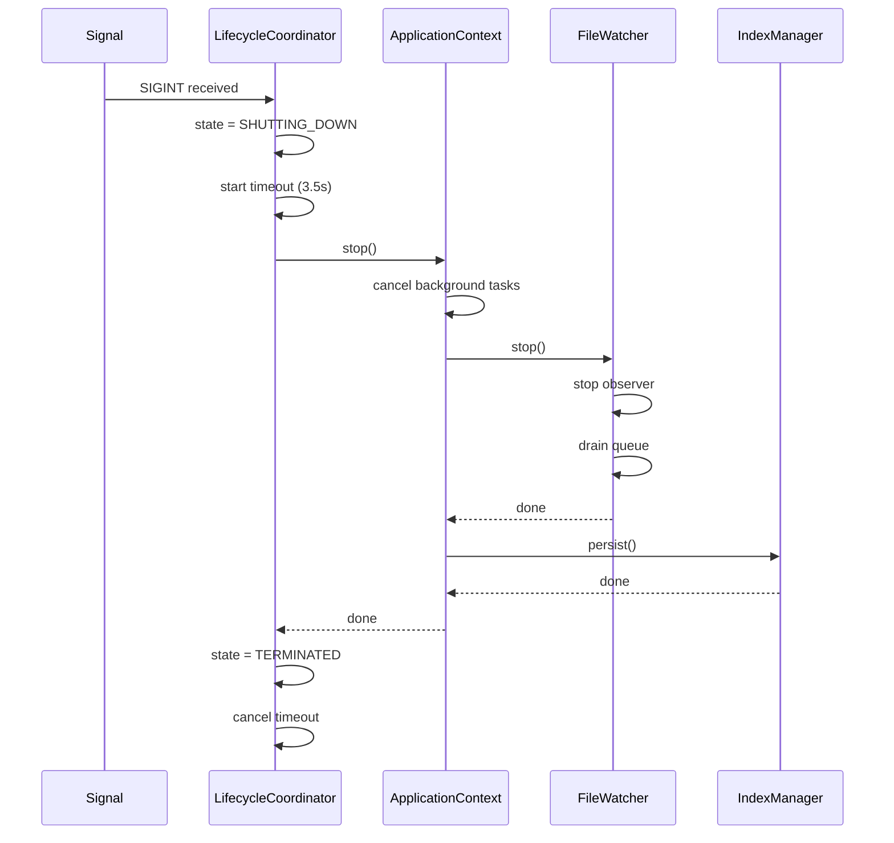
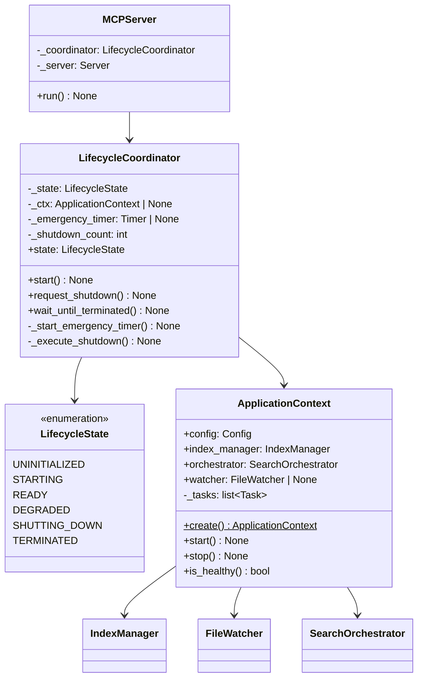

# Application State and Lifecycle Model

**Version:** 1.0.0
**Date:** 2025-12-27
**Status:** Draft
**Related:** [architecture-redesign.md](architecture-redesign.md), [concurrency-model.md](concurrency-model.md)

---

## Executive Summary

The mcp-markdown-ragdocs codebase exhibits scattered state management across five classes (`ApplicationContext`, `MCPServer`, `ShutdownController`, `FileWatcher`, `IndexManager`), leading to shutdown failures and unclear ownership. This document establishes a first-principles state machine for MCP servers, defines explicit lifecycle phases with single ownership, and proposes a simplified architecture that replaces the current layered shutdown mechanisms with a unified `LifecycleCoordinator`. Breaking changes permitted. The design eliminates implicit state coupling by making `ApplicationContext` the single source of truth for lifecycle state.

---

## Table of Contents

1. [First Principles Analysis](#first-principles-analysis)
2. [State Machine Design](#state-machine-design)
3. [Component Responsibilities](#component-responsibilities)
4. [Lifecycle Protocol](#lifecycle-protocol)
5. [Proposed Architecture](#proposed-architecture)
6. [Migration Path](#migration-path)
7. [Decision Matrix](#decision-matrix)
8. [API Contract](#api-contract)
9. [Risk Register](#risk-register)
10. [Acceptance Criteria](#acceptance-criteria)

---

## First Principles Analysis

### What is an MCP Server?

An MCP (Model Context Protocol) server is a **request-response service** that:
1. Receives requests via a transport (stdio, HTTP, SSE)
2. Processes requests using domain logic (search, indexing)
3. May have background activities (file watching, periodic reconciliation)
4. Must shut down cleanly when the transport closes or signal received

### Fundamental States

From first principles, any long-running service has exactly these states:

| State | Definition | Invariant |
|-------|------------|-----------|
| **Uninitialized** | No resources allocated | No threads, no files open, no memory allocated |
| **Starting** | Resources being allocated | Partial initialization; failure returns to Uninitialized |
| **Ready** | Accepting requests | All subsystems operational; can process requests |
| **Degraded** | Partially operational | Some subsystems failed; limited functionality |
| **ShuttingDown** | Resources being released | No new requests; completing in-flight work |
| **Terminated** | All resources released | Process can exit; no cleanup required |

### Valid Transitions

```
Uninitialized → Starting    (explicit start call)
Starting → Ready            (all subsystems initialized)
Starting → Terminated       (initialization failure, rollback)
Ready → ShuttingDown        (shutdown signal or transport close)
Ready → Degraded            (subsystem failure)
Degraded → Ready            (subsystem recovery)
Degraded → ShuttingDown     (shutdown signal)
ShuttingDown → Terminated   (all cleanup complete)
```

**Invalid Transitions:**
- `Terminated → *` (once terminated, no recovery)
- `ShuttingDown → Ready` (shutdown is irreversible)
- `* → Uninitialized` (can only reach via process restart)

### Key Invariants

1. **Single Active State:** The system is in exactly one state at any time
2. **Monotonic Shutdown:** Once `ShuttingDown` begins, state can only progress toward `Terminated`
3. **Bounded Initialization:** `Starting` must complete (success or failure) within a timeout
4. **Bounded Shutdown:** `ShuttingDown` must complete within a timeout or force-exit
5. **No Orphaned Resources:** Every resource acquired in `Starting` must be released in `ShuttingDown`

---

## State Machine Design

### State Diagram



### State Definitions

```python
from enum import StrEnum, auto

class LifecycleState(StrEnum):
    """Application lifecycle states."""
    UNINITIALIZED = auto()
    STARTING = auto()
    READY = auto()
    DEGRADED = auto()
    SHUTTING_DOWN = auto()
    TERMINATED = auto()
```

### Transition Guards

| From | To | Guard Condition |
|------|-----|-----------------|
| `Uninitialized` | `Starting` | `start()` called; no prior start attempt |
| `Starting` | `Ready` | All subsystems report ready |
| `Starting` | `Terminated` | Any critical subsystem fails; rollback complete |
| `Ready` | `ShuttingDown` | Signal received OR transport closed OR explicit shutdown |
| `Ready` | `Degraded` | Non-critical subsystem fails (e.g., file watcher) |
| `Degraded` | `Ready` | Failed subsystem recovers |
| `Degraded` | `ShuttingDown` | Same as Ready → ShuttingDown |
| `ShuttingDown` | `Terminated` | All cleanup tasks complete OR timeout exceeded |

### Ownership: Who Controls Transitions?

**Single Owner Principle:** Only one component may initiate state transitions.

| Transition | Owner | Mechanism |
|------------|-------|-----------|
| → `Starting` | Entry point (`main()`) | Explicit `coordinator.start()` |
| → `Ready` | `LifecycleCoordinator` | Internal callback from last subsystem |
| → `Degraded` | `LifecycleCoordinator` | Subsystem error callback |
| → `ShuttingDown` | Signal handler OR transport | `coordinator.request_shutdown()` |
| → `Terminated` | `LifecycleCoordinator` | Cleanup completion or timeout |

---

## Component Responsibilities

### Current State (Problem)



**Problems:**
1. `MCPServer` and `ShutdownController` both try to coordinate shutdown
2. `ApplicationContext` manages its own tasks but `MCPServer.shutdown()` calls `ctx.shutdown()`
3. `ShutdownController` closes stdin but doesn't know about `ApplicationContext`
4. State is implicit (boolean flags: `_shutting_down`, `_running`, `_shutdown_event`)

### Proposed Responsibilities



### Responsibility Matrix

| Component | Should Own | Should NOT Own |
|-----------|------------|----------------|
| **LifecycleCoordinator** | State enum, transitions, timeouts, signal handlers, shutdown coordination | Domain logic, index operations, search |
| **ApplicationContext** | Domain services (manager, orchestrator), background tasks, startup sequence | Shutdown timeouts, signal handling, state machine |
| **MCPServer** | MCP Server instance, tool handlers | Lifecycle state, shutdown logic |
| **FileWatcher** | Observer thread, event queue, debouncing | Index persistence, state machine interaction |
| **IndexManager** | Index instances, document operations | Background tasks, lifecycle events |

### Dependency Direction

```
main() → LifecycleCoordinator → ApplicationContext → [FileWatcher, IndexManager, Orchestrator]
                                                      ↓
                                               [VectorIndex, KeywordIndex, GraphStore]
```

**Rules:**
1. Dependencies flow downward only
2. Lower layers never reference upper layers
3. Lifecycle events propagate via explicit callbacks, not implicit dependencies

---

## Lifecycle Protocol

### Registration Pattern

Components register cleanup callbacks with the lifecycle coordinator:

```python
from typing import Protocol, Callable, Awaitable

class LifecycleParticipant(Protocol):
    """Protocol for components that participate in lifecycle."""

    async def start(self) -> None:
        """Initialize component. Raises on failure."""
        ...

    async def stop(self) -> None:
        """Release resources. Must complete within timeout."""
        ...

    def is_healthy(self) -> bool:
        """Return True if component is operational."""
        ...
```

### Shutdown Propagation

Shutdown propagates in reverse registration order:



### Timeout and Escalation Strategy

| Phase | Timeout | Action on Timeout |
|-------|---------|-------------------|
| **Graceful** | 2.0s | Cancel remaining async tasks |
| **Forced** | 1.0s | Close file descriptors |
| **Emergency** | 0.5s | `os._exit(0)` |
| **Total** | 3.5s | Process guaranteed to exit |

### Escalation Sequence

```python
async def shutdown(self) -> None:
    """Execute shutdown with escalating force."""
    self._state = LifecycleState.SHUTTING_DOWN

    # Phase 1: Graceful (2s)
    try:
        async with asyncio.timeout(2.0):
            await self._ctx.stop()
    except asyncio.TimeoutError:
        logger.warning("Graceful shutdown timed out")

    # Phase 2: Forced (1s)
    try:
        async with asyncio.timeout(1.0):
            await self._force_cancel_tasks()
    except asyncio.TimeoutError:
        logger.warning("Forced shutdown timed out")

    # Phase 3: Complete
    self._state = LifecycleState.TERMINATED
    self._cancel_emergency_timer()
```

---

## Proposed Architecture

### Class Structure



### New File: `src/lifecycle.py`

```python
"""Lifecycle coordination for mcp-markdown-ragdocs."""

from __future__ import annotations

import asyncio
import logging
import os
import signal
import sys
import threading
from dataclasses import dataclass, field
from enum import StrEnum, auto
from typing import TYPE_CHECKING

if TYPE_CHECKING:
    from src.context import ApplicationContext

logger = logging.getLogger(__name__)


class LifecycleState(StrEnum):
    """Application lifecycle states."""
    UNINITIALIZED = "uninitialized"
    STARTING = "starting"
    READY = "ready"
    DEGRADED = "degraded"
    SHUTTING_DOWN = "shutting_down"
    TERMINATED = "terminated"


@dataclass
class LifecycleCoordinator:
    """Single source of truth for application lifecycle.

    Responsibilities:
    - Owns state machine
    - Owns signal handlers
    - Owns shutdown timeouts
    - Coordinates startup/shutdown sequence
    """

    _state: LifecycleState = field(default=LifecycleState.UNINITIALIZED)
    _ctx: ApplicationContext | None = field(default=None)
    _emergency_timer: threading.Timer | None = field(default=None, repr=False)
    _shutdown_count: int = field(default=0, repr=False)
    _graceful_timeout: float = 2.0
    _forced_timeout: float = 1.0
    _emergency_timeout: float = 3.5

    @property
    def state(self) -> LifecycleState:
        return self._state

    def is_running(self) -> bool:
        return self._state in (LifecycleState.READY, LifecycleState.DEGRADED)

    async def start(self, ctx: ApplicationContext) -> None:
        """Initialize application. Raises on failure."""
        if self._state != LifecycleState.UNINITIALIZED:
            raise RuntimeError(f"Cannot start from state {self._state}")

        self._state = LifecycleState.STARTING
        self._ctx = ctx

        try:
            await ctx.start()
            self._state = LifecycleState.READY
            logger.info("Lifecycle: READY")
        except Exception:
            self._state = LifecycleState.TERMINATED
            raise

    def request_shutdown(self) -> None:
        """Request shutdown. Safe to call from signal handler."""
        self._shutdown_count += 1

        if self._shutdown_count >= 2:
            logger.warning("Forced exit (second signal)")
            self._force_exit()
            return

        if self._state == LifecycleState.SHUTTING_DOWN:
            return

        if self._state in (LifecycleState.READY, LifecycleState.DEGRADED):
            self._state = LifecycleState.SHUTTING_DOWN
            logger.info("Lifecycle: SHUTTING_DOWN")
            self._start_emergency_timer()
            self._close_stdin()

    def _close_stdin(self) -> None:
        """Close stdin to unblock stdio transport."""
        try:
            sys.stdin.close()
        except Exception:
            pass
        try:
            os.close(0)
        except Exception:
            pass

    def _start_emergency_timer(self) -> None:
        """Start timer for emergency exit."""
        def emergency_exit():
            logger.error(f"Emergency exit after {self._emergency_timeout}s")
            os._exit(1)

        self._emergency_timer = threading.Timer(
            self._emergency_timeout,
            emergency_exit,
        )
        self._emergency_timer.daemon = True
        self._emergency_timer.start()

    def _force_exit(self) -> None:
        """Immediate exit for second signal."""
        os._exit(0)

    async def shutdown(self) -> None:
        """Execute shutdown sequence."""
        if self._state == LifecycleState.TERMINATED:
            return

        self._state = LifecycleState.SHUTTING_DOWN

        if self._ctx:
            # Phase 1: Graceful
            try:
                async with asyncio.timeout(self._graceful_timeout):
                    await self._ctx.stop()
            except asyncio.TimeoutError:
                logger.warning("Graceful shutdown timed out")
            except Exception as e:
                logger.error(f"Error during shutdown: {e}")

        self._state = LifecycleState.TERMINATED
        self._cancel_emergency_timer()
        logger.info("Lifecycle: TERMINATED")

    def _cancel_emergency_timer(self) -> None:
        if self._emergency_timer:
            self._emergency_timer.cancel()
            self._emergency_timer = None

    def install_signal_handlers(self, loop: asyncio.AbstractEventLoop) -> None:
        """Install signal handlers for SIGINT/SIGTERM."""
        for sig in (signal.SIGINT, signal.SIGTERM):
            loop.add_signal_handler(sig, self.request_shutdown)
```

### Simplified ApplicationContext

Remove lifecycle concerns from `ApplicationContext`:

```python
@dataclass
class ApplicationContext:
    """Domain services container.

    Owns:
    - IndexManager, SearchOrchestrator, FileWatcher
    - Background tasks for reconciliation/indexing

    Does NOT own:
    - Lifecycle state machine
    - Signal handlers
    - Shutdown timeouts
    """

    config: Config
    index_manager: IndexManager
    orchestrator: SearchOrchestrator
    watcher: FileWatcher | None = None
    _tasks: list[asyncio.Task] = field(default_factory=list)

    async def start(self) -> None:
        """Initialize all services."""
        # ... startup logic (same as current startup())

    async def stop(self) -> None:
        """Stop all services. Must complete within timeout."""
        # Cancel tasks
        for task in self._tasks:
            task.cancel()

        # Wait for tasks with grace period
        await asyncio.gather(*self._tasks, return_exceptions=True)
        self._tasks.clear()

        # Stop watcher
        if self.watcher:
            await self.watcher.stop()

        # Persist indices
        await asyncio.to_thread(self.index_manager.persist)
```

### Simplified MCPServer

`MCPServer` becomes a thin wrapper:

```python
class MCPServer:
    """MCP server with stdio transport."""

    def __init__(self, project_override: str | None = None):
        self._project_override = project_override
        self._coordinator = LifecycleCoordinator()
        self._server = Server("mcp-markdown-ragdocs")
        self._ctx: ApplicationContext | None = None
        # ... tool handlers

    async def run(self) -> None:
        """Run server until shutdown."""
        loop = asyncio.get_running_loop()
        self._coordinator.install_signal_handlers(loop)

        try:
            self._ctx = ApplicationContext.create(
                project_override=self._project_override,
            )
            await self._coordinator.start(self._ctx)

            async with stdio_server() as (read, write):
                await self._server.run(read, write, ...)

        except asyncio.CancelledError:
            pass
        finally:
            await self._coordinator.shutdown()
```

### What Gets Deleted

| File/Component | Action | Reason |
|----------------|--------|--------|
| `src/shutdown.py` | **DELETE** | Merged into `LifecycleCoordinator` |
| `ApplicationContext._shutting_down` | Remove | State owned by coordinator |
| `MCPServer.shutdown()` | Simplify | Delegates to coordinator |
| Signal chaining in `mcp_server.py` | Remove | Coordinator handles signals |

---

## Migration Path

### Phase 1: Introduce LifecycleCoordinator (Day 1)

1. Create `src/lifecycle.py` with `LifecycleState` and `LifecycleCoordinator`
2. Add unit tests for state transitions
3. No integration yet—existing code unchanged

**Deliverables:**
- [lifecycle.py](src/lifecycle.py) (~150 LOC)
- [tests/unit/test_lifecycle.py](tests/unit/test_lifecycle.py) (~100 LOC)

### Phase 2: Migrate MCPServer (Day 2)

1. Replace `ShutdownController` usage with `LifecycleCoordinator`
2. Remove signal handler chaining from `mcp_server.py`
3. Test shutdown behavior

**Deliverables:**
- Modified [mcp_server.py](src/mcp_server.py) (-50 LOC)
- Integration test for shutdown

### Phase 3: Simplify ApplicationContext (Day 3)

1. Remove `_shutting_down` flag
2. Extract task management into explicit list
3. Make `shutdown()` → `stop()` rename
4. Ensure `stop()` is idempotent

**Deliverables:**
- Modified [context.py](src/context.py) (-30 LOC)
- Updated tests

### Phase 4: Delete ShutdownController (Day 4)

1. Delete `src/shutdown.py`
2. Remove all imports
3. Update tests

**Deliverables:**
- Delete [shutdown.py](src/shutdown.py) (-100 LOC)
- Net reduction: ~80 LOC

### Phase 5: Documentation and Cleanup (Day 5)

1. Update architecture docs
2. Add state diagram to README
3. Add inline documentation

---

## Decision Matrix

### D1: State Machine Location

| Option | Complexity | Extensibility | Risk | Recommendation |
|--------|:----------:|:-------------:|:----:|:---------------|
| **A. Dedicated LifecycleCoordinator** | Low | High | Low | **ADOPT** |
| B. Embedded in ApplicationContext | Low | Low | Medium | - |
| C. Embedded in MCPServer | Low | Low | High | - |

**Rationale:** Option A provides clear separation of concerns. ApplicationContext owns domain logic; LifecycleCoordinator owns lifecycle. Option B/C create coupling between domain and lifecycle concerns.

### D2: Shutdown Timeout Strategy

| Option | Complexity | Extensibility | Risk | Recommendation |
|--------|:----------:|:-------------:|:----:|:---------------|
| **A. Fixed escalating timeouts** | Low | Low | Low | **ADOPT** |
| B. Configurable via Config | Medium | High | Low | - |
| C. Per-component timeouts | High | High | Medium | - |

**Rationale:** Fixed timeouts (2s graceful, 1s forced, 3.5s emergency) cover all observed shutdown scenarios. Configuration adds complexity without clear benefit.

### D3: Signal Handler Approach

| Option | Complexity | Extensibility | Risk | Recommendation |
|--------|:----------:|:-------------:|:----:|:---------------|
| **A. asyncio loop.add_signal_handler** | Low | High | Low | **ADOPT** |
| B. signal.signal() | Low | Low | High | - |
| C. Third-party library (e.g., aiojobs) | Medium | High | Medium | - |

**Rationale:** `loop.add_signal_handler()` is async-safe and schedules callback in event loop. `signal.signal()` can interrupt arbitrary code, causing GIL issues with native threads.

---

## API Contract

### LifecycleCoordinator

```python
class LifecycleCoordinator:
    """Lifecycle state machine for MCP servers.

    Inputs:
        - ApplicationContext via start()
        - Shutdown request via request_shutdown()

    Outputs:
        - state: LifecycleState (observable)
        - is_running(): bool

    Invariants:
        - State transitions follow defined graph
        - shutdown() completes within emergency_timeout
        - Signal handlers are installed before start()

    Failures:
        - start() raises if ctx.start() fails → state = TERMINATED
        - request_shutdown() safe from any state
        - shutdown() catches all exceptions, always reaches TERMINATED

    Idempotency:
        - request_shutdown() idempotent (multiple calls safe)
        - shutdown() idempotent (multiple calls safe)

    Concurrency:
        - request_shutdown() safe from signal handler (non-blocking)
        - start() and shutdown() must not be called concurrently
    """
```

### ApplicationContext

```python
class ApplicationContext:
    """Domain services container.

    Inputs:
        - Config via create()
        - project_override via create()

    Outputs:
        - index_manager: IndexManager
        - orchestrator: SearchOrchestrator
        - watcher: FileWatcher | None

    Invariants:
        - After start(), all indices loaded or rebuilt
        - After stop(), all tasks cancelled, indices persisted

    Failures:
        - start() raises on critical failure (e.g., config invalid)
        - stop() catches and logs non-critical failures

    Idempotency:
        - stop() idempotent
        - start() NOT idempotent (must create new instance)
    """
```

---

## Risk Register

| ID | Risk | Likelihood | Impact | Mitigation | Level |
|----|------|:----------:|:------:|------------|:-----:|
| R1 | State machine logic errors cause invalid transitions | Low | High | Unit tests for all transitions; state assertions | Medium |
| R2 | Emergency timer fires during normal shutdown | Low | Medium | Set timeout > sum of graceful + forced | Low |
| R3 | Signal handler race condition | Low | High | Use `loop.add_signal_handler()`; counter for multiple signals | Medium |
| R4 | Migration breaks existing CLI commands | Medium | Medium | Run full test suite after each phase | Medium |
| R5 | Native threads (FAISS) prevent clean shutdown | Medium | Low | Accept as known limitation; emergency timer ensures exit | Low |

---

## Acceptance Criteria

### Functional

1. **Single Ctrl+C terminates process within 4s**
2. **Second Ctrl+C forces immediate exit**
3. **State observable:** `coordinator.state` reflects current lifecycle
4. **No orphaned resources:** All tasks cancelled, indices persisted on clean shutdown
5. **All existing tests pass**

### Quantitative

| Metric | Target | Current |
|--------|--------|---------|
| Shutdown time (normal) | < 4s | Variable (sometimes infinite) |
| Shutdown time (forced) | < 0.5s | N/A |
| LOC in lifecycle code | < 200 | ~250 (scattered) |
| State-related boolean flags | 1 (state enum) | 5+ (`_shutting_down`, `_running`, etc.) |

### Testable

```python
def test_state_transitions():
    """Verify all valid transitions."""
    coord = LifecycleCoordinator()
    assert coord.state == LifecycleState.UNINITIALIZED

    # ... start
    await coord.start(mock_ctx)
    assert coord.state == LifecycleState.READY

    # ... shutdown
    coord.request_shutdown()
    assert coord.state == LifecycleState.SHUTTING_DOWN

    await coord.shutdown()
    assert coord.state == LifecycleState.TERMINATED

def test_idempotent_shutdown():
    """Multiple shutdown requests are safe."""
    coord = LifecycleCoordinator()
    coord.request_shutdown()
    coord.request_shutdown()  # Second call = force exit
    # Test that state machine handles this

def test_emergency_timeout():
    """Process exits if shutdown hangs."""
    # Start server with mock that never completes stop()
    # Verify process exits within emergency_timeout
```

---

## Open Questions

- **Q1:** Should `LifecycleState.DEGRADED` be implemented in v1.0, or deferred until subsystem health monitoring exists? (Recommendation: defer)
- **Q2:** Should state transitions emit events for observability? (Recommendation: add logging; defer pub/sub until needed)

---

## Memory Entry

### User Preferences Applied
- Cool, detached, factual tone
- First principles analysis before solution
- Decision matrix with Complexity/Extensibility/Risk columns
- State diagrams with Mermaid
- Clear ownership boundaries
- Explicit API contracts with invariants/failures/idempotency/concurrency

### Codebase Knowledge Gained
- Current shutdown issues stem from distributed state across 5 classes
- `ShutdownController` was a symptom-fix, not root cause fix
- MCP library's `stdio_server()` creates unkillable stdin reader
- Emergency timer (`os._exit()`) is necessary evil for native thread cleanup
- State machine with single owner eliminates coordination bugs
