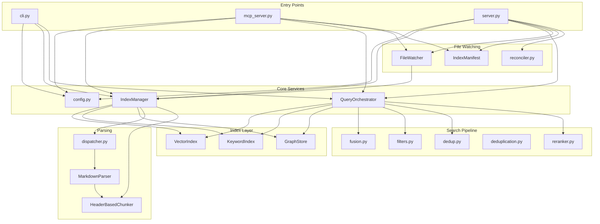
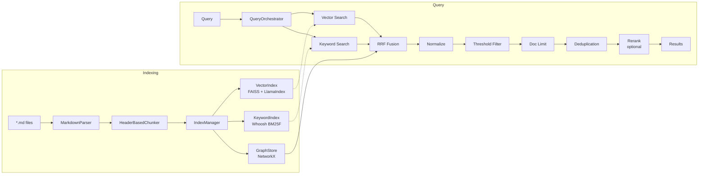
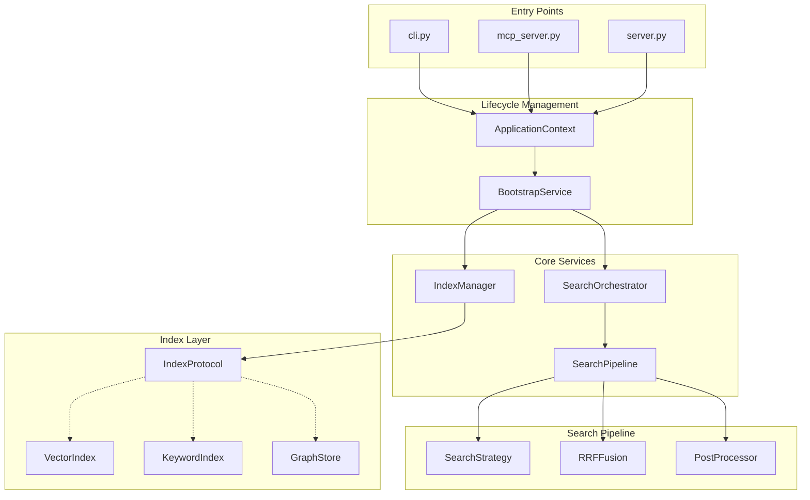
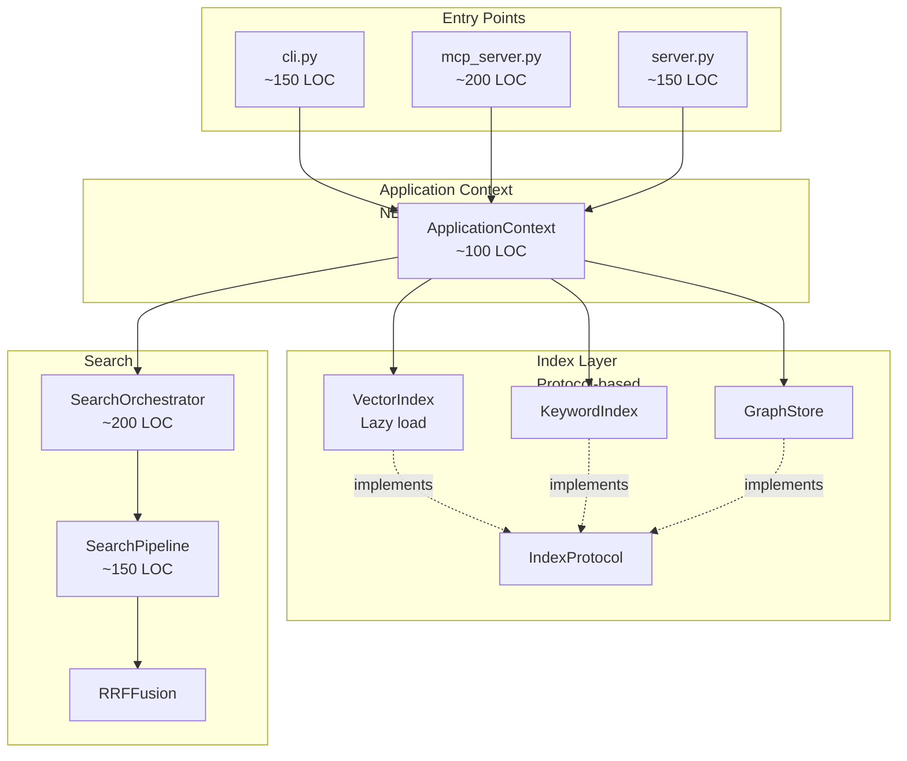

# Architecture Redesign: mcp-markdown-ragdocs

**Version:** 1.0.0
**Date:** 2025-12-26
**Status:** Draft

---

## Executive Summary

The `mcp-markdown-ragdocs` codebase provides hybrid search over local Markdown documentation via MCP stdio and HTTP interfaces. Analysis reveals five architectural concerns: (1) duplicated startup/lifecycle logic across `MCPServer`, `server.py` lifespan, and `cli.py` commands (~200 LOC overlap); (2) eager embedding model initialization blocking cold start by 2-4 seconds; (3) tight coupling between orchestrator, indices, and config making unit testing difficult; (4) no index protocol abstraction forcing parallel changes across vector/keyword/graph implementations; (5) redundant compression/dedup modules with overlapping responsibilities. The proposed redesign introduces a unified `ApplicationContext` lifecycle, lazy-loaded index facades with Protocol contracts, and consolidated search pipeline. Breaking changes permitted. Estimated effort: ~800 LOC modified, 4 phases over 2-3 weeks.

---

## Table of Contents

1. [Current State Analysis](#current-state-analysis)
2. [Problems Identified](#problems-identified)
3. [Proposed Solution](#proposed-solution)
4. [Decision Matrix](#decision-matrix)
5. [Breaking Changes](#breaking-changes)
6. [Implementation Plan](#implementation-plan)
7. [Risk Register](#risk-register)
8. [Acceptance Criteria](#acceptance-criteria)

---

## Current State Analysis

### Module Structure

```
src/
├── cli.py                    (~290 LOC) - Click CLI with 5 commands
├── config.py                 (~370 LOC) - 7 dataclasses, load/detect/resolve
├── models.py                 (~60 LOC)  - Document, Chunk, ChunkResult, CompressionStats
├── server.py                 (~280 LOC) - FastAPI HTTP server with lifespan
├── mcp_server.py             (~350 LOC) - MCP stdio server
├── chunking/
│   ├── base.py               (~15 LOC)  - ChunkingStrategy ABC
│   ├── factory.py            (~20 LOC)  - get_chunker factory
│   └── header_chunker.py     (~240 LOC) - Tree-sitter header-based chunking
├── compression/
│   └── deduplication.py      (~90 LOC)  - ChunkResult deduplication
├── indexing/
│   ├── manager.py            (~120 LOC) - IndexManager coordinating 3 indices
│   ├── manifest.py           (~65 LOC)  - IndexManifest versioning
│   ├── reconciler.py         (~50 LOC)  - File reconciliation
│   └── watcher.py            (~140 LOC) - Watchdog file watcher
├── indices/
│   ├── graph.py              (~60 LOC)  - NetworkX GraphStore
│   ├── keyword.py            (~150 LOC) - Whoosh KeywordIndex
│   └── vector.py             (~350 LOC) - FAISS VectorIndex with LlamaIndex
├── parsers/
│   ├── base.py               (~15 LOC)  - DocumentParser ABC
│   ├── dispatcher.py         (~55 LOC)  - Parser registry/dispatch
│   └── markdown.py           (~180 LOC) - Tree-sitter Markdown parser
└── search/
    ├── dedup.py              (~55 LOC)  - Tuple-based deduplication
    ├── filters.py            (~40 LOC)  - Confidence/doc-limit filters
    ├── fusion.py             (~60 LOC)  - RRF fusion + recency boost
    ├── orchestrator.py       (~360 LOC) - QueryOrchestrator
    └── reranker.py           (~55 LOC)  - Cross-encoder reranker

tests/
├── conftest.py               (~330 LOC) - Shared fixtures (session/module/function scoped)
├── unit/                     (~20 files) - Unit tests
├── integration/              (~10 files) - Integration tests
├── e2e/                      (~2 files)  - End-to-end tests
└── performance/              (~2 files)  - Performance benchmarks

Total src/: ~3,545 LOC
Total tests/: ~2,800 LOC
```

### Dependency Graph (Current)



### Data Flow: Index → Query



---

## Problems Identified

### P1: Duplicated Lifecycle Logic (Maintainability) — HIGH

**Symptom:** Three entry points (`cli.py`, `server.py`, `mcp_server.py`) each implement:
- Config loading + project detection
- Index initialization (VectorIndex, KeywordIndex, GraphStore)
- IndexManager creation
- Manifest checking + rebuild decision
- FileWatcher setup

**Impact:**
- ~200 LOC duplicated across files
- Bug fixes require 3 parallel changes
- Inconsistent behavior between CLI `query` (no watcher) and servers (with watcher)

**Evidence:**
- [cli.py#L115-L140](src/cli.py#L115-L140): `rebuild_index_cmd` creates indices manually
- [server.py#L100-L145](src/server.py#L100-L145): `lifespan()` duplicates same pattern
- [mcp_server.py#L114-L160](src/mcp_server.py#L114-L160): `startup()` duplicates again

### P2: Eager Embedding Model Load (Performance) — HIGH

**Symptom:** `VectorIndex.__init__()` unconditionally loads HuggingFace embedding model (~2-4s on cold start).

**Impact:**
- Cold start penalty even when loading pre-built indices
- CLI `check-config` pays embedding load cost unnecessarily
- Test fixtures slow due to embedding model creation

**Evidence:**
- [vector.py#L48-L55](src/indices/vector.py#L48-L55): Model loaded in `__init__`

### P3: No Index Protocol Abstraction (Maintainability) — MEDIUM

**Symptom:** Three index classes share common patterns (`add`, `remove`, `search`, `persist`, `load`) but no formal protocol. `IndexManager` and `QueryOrchestrator` access private attributes directly.

**Impact:**
- Cannot swap index implementations without modifying consumers
- Unit testing requires full implementations, not mocks
- Adding new index type requires updating multiple files

**Evidence:**
- [orchestrator.py#L154](src/search/orchestrator.py#L154): `self._vector._index` private access
- [manager.py#L100](src/indexing/manager.py#L100): `len(self._vector._doc_id_to_node_ids)` private access

### P4: Redundant Deduplication Modules (Maintainability) — MEDIUM

**Symptom:** Two deduplication implementations:
- `src/search/dedup.py` — tuple-based, used by orchestrator
- `src/compression/deduplication.py` — ChunkResult-based, used by MCP compressed endpoint

**Impact:**
- Confusion about which to use
- Duplicate cosine similarity implementations
- Different function signatures for same purpose

### P5: Tight Config Coupling (Testability) — MEDIUM

**Symptom:** `QueryOrchestrator` receives full `Config` object and accesses 10+ nested attributes throughout query pipeline.

**Impact:**
- Tests must construct complete `Config` even when testing single feature
- Cannot inject mock config for specific behaviors
- Feature flags scattered across orchestrator methods

**Evidence:**
- [orchestrator.py#L88-L105](src/search/orchestrator.py#L88-L105): Direct config.search.* access in query()

---

## Proposed Solution

### Architecture Overview



### Component Changes

#### 1. ApplicationContext (NEW)

Unified lifecycle management replacing duplicated startup code.

```python
# src/context.py (~100 LOC)
@dataclass
class ApplicationContext:
    config: Config
    index_manager: IndexManager
    orchestrator: SearchOrchestrator
    watcher: FileWatcher | None = None

    @classmethod
    def create(
        cls,
        project_override: str | None = None,
        enable_watcher: bool = True,
        lazy_embeddings: bool = True,
    ) -> "ApplicationContext":
        """Single entry point for application bootstrap."""
        ...

    async def startup(self) -> None:
        """Initialize indices, check manifest, start watcher."""
        ...

    async def shutdown(self) -> None:
        """Stop watcher, persist indices."""
        ...
```

#### 2. IndexProtocol (NEW)

Formal contract for index implementations.

```python
# src/indices/protocol.py (~30 LOC)
from typing import Protocol

class IndexProtocol(Protocol):
    def add_chunk(self, chunk: Chunk) -> None: ...
    def remove(self, doc_id: str) -> None: ...
    def search(self, query: str, top_k: int) -> list[dict]: ...
    def persist(self, path: Path) -> None: ...
    def load(self, path: Path) -> None: ...
    def is_loaded(self) -> bool: ...
```

#### 3. Lazy VectorIndex (MODIFIED)

Defer embedding model load until first use.

```python
# src/indices/vector.py (modification)
class VectorIndex:
    def __init__(self, embedding_model_name: str = "BAAI/bge-small-en-v1.5"):
        self._embedding_model_name = embedding_model_name
        self._embedding_model = None  # Lazy
        self._index = None
        ...

    def _ensure_model_loaded(self) -> None:
        if self._embedding_model is None:
            from llama_index.embeddings.huggingface import HuggingFaceEmbedding
            self._embedding_model = HuggingFaceEmbedding(
                model_name=self._embedding_model_name
            )
            Settings.embed_model = self._embedding_model
```

#### 4. SearchPipeline (NEW)

Consolidate orchestrator + dedup + filters + reranker into composable pipeline.

```python
# src/search/pipeline.py (~150 LOC)
@dataclass
class SearchPipelineConfig:
    min_confidence: float = 0.0
    max_chunks_per_doc: int = 0
    dedup_enabled: bool = False
    dedup_threshold: float = 0.85
    rerank_enabled: bool = False
    rerank_model: str = "cross-encoder/ms-marco-MiniLM-L-6-v2"
    rerank_top_n: int = 10

class SearchPipeline:
    def __init__(self, config: SearchPipelineConfig):
        self._config = config
        self._reranker: ReRanker | None = None  # Lazy

    def process(
        self,
        fused_results: list[tuple[str, float]],
        get_embedding: Callable[[str], list[float] | None],
        get_content: Callable[[str], str | None],
        query: str,
    ) -> tuple[list[tuple[str, float]], CompressionStats]:
        """Apply full post-processing pipeline."""
        ...
```

#### 5. Unified Deduplication (DELETE + MODIFY)

Delete `src/compression/deduplication.py`, keep `src/search/dedup.py` as single implementation.

### Target Architecture



---

## Decision Matrix

### D1: Lifecycle Management Approach

| Option | Description | Complexity | Extensibility | Risk | Performance |
|--------|-------------|:----------:|:-------------:|:----:|:-----------:|
| **A. ApplicationContext** | Single factory class managing lifecycle | Low | High | Low | Neutral |
| B. Dependency Injection | Full DI container (e.g., `dependency-injector`) | High | High | Medium | Neutral |
| C. Module-level factories | Factory functions in each module | Low | Low | Low | Neutral |

**Decision:** Option A. Provides sufficient abstraction without external dependencies. DI container overkill for this codebase size.

### D2: Index Protocol Design

| Option | Description | Complexity | Extensibility | Risk | Performance |
|--------|-------------|:----------:|:-------------:|:----:|:-----------:|
| **A. typing.Protocol** | Structural subtyping, no inheritance | Low | High | Low | Neutral |
| B. ABC inheritance | Explicit inheritance required | Low | Medium | Low | Neutral |
| C. Duck typing | No formal contract | None | Low | Medium | Neutral |

**Decision:** Option A. Python 3.13 Protocols provide type safety without forcing inheritance. Enables mocking without modifying production code.

### D3: Embedding Model Lazy Loading

| Option | Description | Complexity | Extensibility | Risk | Performance |
|--------|-------------|:----------:|:-------------:|:----:|:-----------:|
| **A. Lazy on first use** | Load model on first `add_chunk()` or `search()` | Low | High | Low | +2-4s cold start |
| B. Background thread | Load in background, block if needed | Medium | Medium | Medium | +0.5s perceived |
| C. Optional pre-warming | Explicit `warm_up()` method | Low | High | Low | Configurable |

**Decision:** Option A with Option C fallback. Simple lazy loading covers 90% of cases. CLI `query` can call `warm_up()` if latency-sensitive.

### D4: Search Pipeline Consolidation

| Option | Description | Complexity | Extensibility | Risk | Performance |
|--------|-------------|:----------:|:-------------:|:----:|:-----------:|
| **A. Single SearchPipeline** | Monolithic pipeline with config | Low | Medium | Low | Neutral |
| B. Composable stages | Chain of responsibility pattern | Medium | High | Low | Neutral |
| C. Keep current split | Orchestrator + separate modules | Low | Low | Low | Neutral |

**Decision:** Option A. Current pipeline is fixed (normalize→threshold→doc_limit→dedup→rerank). Composability adds complexity without clear benefit until pipeline customization is needed.

---

## Breaking Changes

### API Changes

| Component | Change | Migration |
|-----------|--------|-----------|
| `VectorIndex.__init__` | `embedding_model` param removed | Use `embedding_model_name: str` |
| `QueryOrchestrator.__init__` | Signature changed | Use `SearchOrchestrator` + `SearchPipeline` |
| `src/compression/deduplication.py` | Module deleted | Use `src/search/dedup.py` |
| CLI commands | Internal refactor only | No user-facing changes |

### Fixture Changes

| Fixture | Change | Migration |
|---------|--------|-----------|
| `shared_embedding_model` | No longer needed | Delete fixture |
| Integration test setup | Use `ApplicationContext.create()` | Update test factories |

---

## Implementation Plan

### Phase 1: IndexProtocol + Lazy Loading (~200 LOC, 2-3 days)

1. Create `src/indices/protocol.py` with `IndexProtocol`
2. Add `is_loaded()` method to all index classes
3. Implement lazy embedding model loading in `VectorIndex`
4. Add `warm_up()` method for explicit pre-warming
5. Update `conftest.py` to use lazy loading

**Acceptance:**
- `uv run mcp-markdown-ragdocs check-config` completes in <500ms (no embedding load)
- All existing tests pass

### Phase 2: ApplicationContext (~150 LOC, 2-3 days)

1. Create `src/context.py` with `ApplicationContext`
2. Extract common startup logic from `server.py` and `mcp_server.py`
3. Refactor `cli.py` commands to use `ApplicationContext`
4. Update entry points to use context

**Acceptance:**
- Single source of truth for lifecycle
- `rebuild-index`, `query`, `mcp`, `run` all use `ApplicationContext`

### Phase 3: SearchPipeline (~200 LOC, 2-3 days)

1. Create `src/search/pipeline.py` with `SearchPipeline`
2. Extract pipeline logic from `QueryOrchestrator`
3. Delete `src/compression/deduplication.py`
4. Rename `QueryOrchestrator` to `SearchOrchestrator`
5. Update tests

**Acceptance:**
- Single deduplication implementation
- Pipeline stages configurable via `SearchPipelineConfig`

### Phase 4: Cleanup + Documentation (~100 LOC, 1-2 days)

1. Remove dead code paths
2. Update architecture documentation
3. Add inline documentation for new components
4. Performance benchmarks for cold/warm start

**Acceptance:**
- Cold start p95 < 1s (with lazy loading)
- Warm start (reindex single file) p95 < 200ms
- Documentation updated

### LOC Summary

| Phase | Files Added | Files Modified | LOC Added | LOC Removed | Net |
|-------|:-----------:|:--------------:|:---------:|:-----------:|:---:|
| 1     | 1           | 3              | +80       | -30         | +50 |
| 2     | 1           | 4              | +150      | -200        | -50 |
| 3     | 1           | 3              | +150      | -180        | -30 |
| 4     | 0           | 5              | +50       | -100        | -50 |
| **Total** | **3**   | **15**         | **+430**  | **-510**    | **-80** |

---

## Risk Register

| ID | Risk | Likelihood | Impact | Level | Mitigation |
|----|------|:----------:|:------:|:-----:|------------|
| R1 | Lazy loading introduces race condition | Low | High | Medium | Use threading.Lock in `_ensure_model_loaded()` |
| R2 | ApplicationContext adds unwanted coupling | Medium | Medium | Medium | Keep context as thin coordinator, avoid business logic |
| R3 | Protocol changes break downstream code | Low | Low | Low | No external consumers; internal refactor only |
| R4 | Test suite regression during refactor | Medium | Medium | Medium | Run full suite after each phase; maintain coverage |
| R5 | Cold start regression if lazy loading fails | Low | High | Medium | Fallback to eager loading in error case; add metrics |

---

## Acceptance Criteria

1. **Cold start latency**: p95 < 1.0s for `check-config` command (currently ~3s)
2. **Warm start latency**: p95 < 200ms for single-file reindex
3. **Test coverage**: ≥ 85% line coverage maintained
4. **Type safety**: 0 pyright errors, 0 ruff errors
5. **Duplicate code**: < 50 LOC overlap between entry points (currently ~200 LOC)

---

## Open Questions

- **DEFERRED:PERF:embedding-cache**: Should embedding model be cached at module level for cross-context reuse? (Trigger: multiple ApplicationContext instances in tests)
- **DEFERRED:FEAT:plugin-indices**: Should IndexProtocol support third-party index implementations? (Trigger: user request for Elasticsearch/Pinecone backend)
