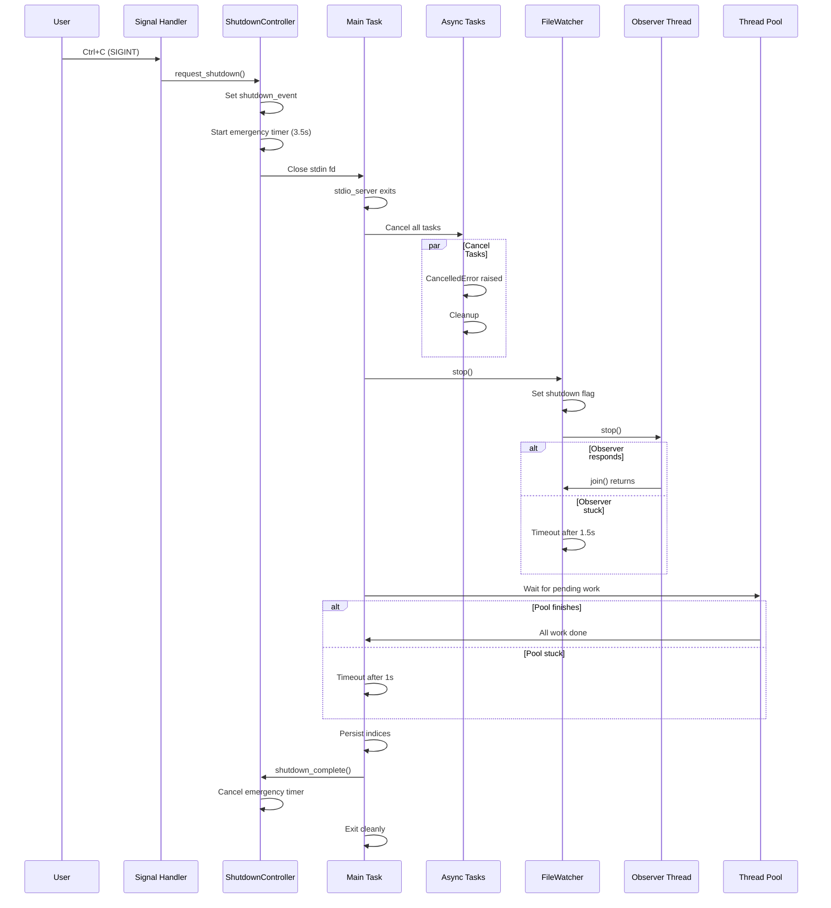

# Concurrency Model Design: mcp-markdown-ragdocs

**Version:** 1.0.0
**Date:** 2025-12-27
**Status:** Draft
**Related:** [architecture-redesign.md](architecture-redesign.md)

---

## Executive Summary

The `mcp-markdown-ragdocs` MCP server exhibits serious shutdown issues: unresponsive to Ctrl+C, hangs indefinitely, CPU spikes, and occasional coredumps. Root cause analysis reveals a **fundamental conflict** between the MCP library's anyio-based stdio transport, Python's signal handling, and our background threads (watchdog Observer, embedding model native threads). This document proposes a layered shutdown architecture with explicit cancellation propagation, cooperative thread termination, and fail-safe timeouts.

---

## Table of Contents

1. [Problem Analysis](#problem-analysis)
2. [Concurrency Inventory](#concurrency-inventory)
3. [Root Cause Analysis](#root-cause-analysis)
4. [Design Principles](#design-principles)
5. [Proposed Architecture](#proposed-architecture)
6. [Shutdown Sequence](#shutdown-sequence)
7. [Signal Handling Strategy](#signal-handling-strategy)
8. [Implementation Plan](#implementation-plan)
9. [Risk Register](#risk-register)
10. [Acceptance Criteria](#acceptance-criteria)

---

## Problem Analysis

### Observed Symptoms

| Symptom | Frequency | Severity |
|---------|:---------:|:--------:|
| First Ctrl+C doesn't terminate process | Always | High |
| Multiple Ctrl+C causes CPU spikes | Sometimes | High |
| Process hangs completely (unkillable) | Rare | Critical |
| "could not acquire lock for stdin at interpreter shutdown" | Sometimes | Medium |
| Coredump on exit | Rare | Critical |

### Reproduction Scenario

```bash
# Start MCP server
uv run mcp-markdown-ragdocs mcp --project my-docs

# Press Ctrl+C
# Expected: Clean shutdown in <2s
# Actual: No response, or delayed response, or hang
```

### Stack Trace Analysis

The "could not acquire lock for stdin" error originates from Python's `io` module during interpreter finalization. This occurs when:
1. A thread is blocked on `stdin.readline()` (anyio's stdin wrapper)
2. The main thread begins interpreter shutdown
3. The blocked thread cannot acquire the GIL to complete cleanup

---

## Concurrency Inventory

### Thread Model

```
┌─────────────────────────────────────────────────────────────────────────────┐
│                           Main Process                                       │
├─────────────────────────────────────────────────────────────────────────────┤
│  ┌─────────────────────────────────────────────────────────────────────┐   │
│  │                    Main Thread (asyncio event loop)                  │   │
│  │  ┌─────────────────────────────────────────────────────────────┐    │   │
│  │  │  anyio task group (from stdio_server)                        │    │   │
│  │  │  ├─ stdin_reader task (blocked on stdin.readline)            │    │   │
│  │  │  └─ stdout_writer task                                       │    │   │
│  │  └─────────────────────────────────────────────────────────────┘    │   │
│  │  ┌─────────────────────────────────────────────────────────────┐    │   │
│  │  │  Application tasks (asyncio.create_task)                     │    │   │
│  │  │  ├─ _periodic_reconciliation (sleeping most of time)         │    │   │
│  │  │  ├─ _background_index (if rebuilding)                        │    │   │
│  │  │  ├─ _build_initial_vocabulary (background)                   │    │   │
│  │  │  └─ watcher._process_events (polling queue)                  │    │   │
│  │  └─────────────────────────────────────────────────────────────┘    │   │
│  └─────────────────────────────────────────────────────────────────────┘   │
│                                                                             │
│  ┌─────────────────────────┐  ┌─────────────────────────────────────────┐  │
│  │  watchdog Observer      │  │  Thread Pool (asyncio.to_thread)        │  │
│  │  Thread (daemon=True)   │  │  ├─ index_document() calls              │  │
│  │  - FSEventHandler       │  │  ├─ persist() calls                     │  │
│  │  - puts to queue.Queue  │  │  └─ embedding model inference           │  │
│  └─────────────────────────┘  └─────────────────────────────────────────┘  │
│                                                                             │
│  ┌─────────────────────────────────────────────────────────────────────┐   │
│  │  Native Threads (unmanaged)                                          │   │
│  │  ├─ FAISS index operations                                           │   │
│  │  ├─ sentence-transformers inference (BLAS/MKL threads)               │   │
│  │  └─ tokenizers parallelism (via HuggingFace)                         │   │
│  └─────────────────────────────────────────────────────────────────────┘   │
└─────────────────────────────────────────────────────────────────────────────┘
```

### Component Lifecycle Dependencies


### Async Task Inventory

| Task | Created In | Cancellation Point | Timeout | Current Handling |
|------|-----------|-------------------|---------|------------------|
| `_periodic_reconciliation` | `context.startup()` | `asyncio.sleep()` | None | ✅ Catches `CancelledError` |
| `_background_index` | `context.startup()` | `asyncio.to_thread()` | None | ✅ Catches `CancelledError` |
| `_build_initial_vocabulary` | `context.startup()` | `asyncio.to_thread()` | None | ✅ Catches `CancelledError` |
| `watcher._process_events` | `watcher.start()` | `asyncio.sleep()`, `queue.get()` | None | ✅ Catches `CancelledError` |
| `stdin_reader` | MCP `stdio_server()` | `stdin.readline()` | **None** | ❌ Blocked on I/O |
| `stdout_writer` | MCP `stdio_server()` | `write_stream_reader` | None | ✅ Exits on stream close |

---

## Root Cause Analysis

### Primary Issue: stdin Blocking

The MCP library's `stdio_server()` creates an anyio task that reads from stdin:

```python
# From mcp/server/stdio.py
async def stdin_reader():
    try:
        async with read_stream_writer:
            async for line in stdin:  # <-- BLOCKING!
                # ...
    except anyio.ClosedResourceError:
        await anyio.lowlevel.checkpoint()
```

**Problem:** `async for line in stdin` ultimately calls `sys.stdin.readline()`, which:
1. Blocks the thread at the OS level (not cancellable by asyncio)
2. Holds the GIL intermittently
3. Cannot be interrupted by `CancelledError`

### Secondary Issue: Signal Handler Race

Current signal handling in `mcp_server.py`:

```python
def signal_handler(signum: int, frame) -> None:
    initiate_shutdown()
    # Chains to original handler (raises KeyboardInterrupt)
    if signum == signal.SIGINT and callable(original_sigint):
        original_sigint(signum, frame)
```

**Problem:** Signal handlers run in the main thread, potentially interrupting:
1. The asyncio event loop (safe)
2. A native extension holding the GIL (unsafe → coredump)
3. Python interpreter finalization (unsafe → lock errors)

### Tertiary Issue: Observer Thread Cleanup

The watchdog `Observer` thread:
1. Is started as a daemon thread (will be killed on process exit)
2. Uses native filesystem APIs (inotify on Linux, FSEvents on macOS)
3. `join(timeout)` doesn't guarantee termination

```python
# Current code
await asyncio.to_thread(self._observer.join, timeout=2.0)
if self._observer.is_alive():
    logger.warning("Observer thread did not stop within timeout")
    # Thread is left running!
```

### Native Thread Issue: Embedding Models

sentence-transformers and FAISS spawn native threads for:
- BLAS/MKL matrix operations (OMP_NUM_THREADS)
- Tokenizer parallelism (TOKENIZERS_PARALLELISM)

These threads:
1. Cannot be cancelled from Python
2. May be mid-computation when shutdown starts
3. Can cause hangs if they're waiting for GIL during finalization

---

## Design Principles

### P1: Cooperative Cancellation over Force Kill

**Rationale:** Python's GIL and native extensions make force-kill dangerous. All components must support cooperative shutdown via:
- `asyncio.CancelledError` for async tasks
- `threading.Event` for background threads
- Sentinel values or closed handles for blocking I/O

### P2: Layered Timeouts with Escalation

**Rationale:** Different components have different shutdown latencies. Use escalating timeouts:

| Layer | Timeout | Action on Timeout |
|-------|---------|-------------------|
| Graceful | 2s | Cancel remaining tasks |
| Forced | 1s | Close file descriptors |
| Emergency | 0.5s | `os._exit(0)` |

### P3: Signal Handler Minimalism

**Rationale:** Signal handlers must be async-signal-safe. Only set flags and close file descriptors—never call complex Python code.

### P4: Fail-Safe Exit

**Rationale:** If clean shutdown fails, `os._exit(0)` ensures the process terminates without running destructors that might hang.

### P5: Native Thread Isolation

**Rationale:** Native threads (FAISS, sentence-transformers) cannot be safely interrupted. Strategies:
- Limit concurrency to reduce active threads at shutdown
- Use timeouts on operations that spawn native threads
- Accept potential resource leaks in exchange for reliable termination

---

## Proposed Architecture

### Shutdown Controller

Introduce a centralized `ShutdownController` to coordinate the shutdown sequence:

```python
# src/shutdown.py
from dataclasses import dataclass, field
import asyncio
import os
import signal
import sys
import threading
from typing import Callable

@dataclass
class ShutdownController:
    """Coordinates graceful shutdown across all components."""

    _shutdown_event: asyncio.Event = field(default_factory=asyncio.Event)
    _force_event: threading.Event = field(default_factory=threading.Event)
    _callbacks: list[Callable[[], None]] = field(default_factory=list)
    _emergency_timeout: float = 3.5  # Total time before os._exit
    _emergency_timer: threading.Timer | None = None

    def request_shutdown(self) -> None:
        """Called from signal handler or stdin EOF."""
        if self._shutdown_event.is_set():
            # Second signal = immediate exit
            self._force_exit()
            return

        self._shutdown_event.set()
        self._start_emergency_timer()

        # Try to unblock stdin
        try:
            sys.stdin.close()
        except Exception:
            pass
        try:
            os.close(0)
        except Exception:
            pass

    def _start_emergency_timer(self) -> None:
        """Start timer that will force exit if shutdown takes too long."""
        def emergency_exit():
            if not self._force_event.is_set():
                os._exit(0)  # Nuclear option

        self._emergency_timer = threading.Timer(
            self._emergency_timeout,
            emergency_exit,
        )
        self._emergency_timer.daemon = True
        self._emergency_timer.start()

    def _force_exit(self) -> None:
        """Immediate exit for second signal."""
        self._force_event.set()
        os._exit(0)

    async def wait_for_shutdown(self) -> None:
        """Wait for shutdown signal (use in main loop)."""
        await self._shutdown_event.wait()

    def is_shutting_down(self) -> bool:
        return self._shutdown_event.is_set()

    def shutdown_complete(self) -> None:
        """Called when shutdown finishes cleanly."""
        self._force_event.set()
        if self._emergency_timer:
            self._emergency_timer.cancel()
```

### Modified stdio_server Integration

Since we cannot modify the MCP library's `stdio_server()`, we must work around its limitations:

```python
# src/mcp_server.py (modified run method)
async def run(self):
    """Run the MCP server with stdio transport."""
    shutdown_controller = ShutdownController()

    # Install signal handlers
    loop = asyncio.get_running_loop()
    for sig in (signal.SIGINT, signal.SIGTERM):
        loop.add_signal_handler(sig, shutdown_controller.request_shutdown)

    try:
        await self.startup()

        # Run stdio server with shutdown monitoring
        async with stdio_server() as (read_stream, write_stream):
            # Create a task group that can be cancelled
            async with anyio.create_task_group() as tg:
                # Monitor for shutdown
                async def shutdown_monitor():
                    await shutdown_controller.wait_for_shutdown()
                    tg.cancel_scope.cancel()

                tg.start_soon(shutdown_monitor)

                # Run the actual server
                async def run_server():
                    try:
                        await self.server.run(
                            read_stream,
                            write_stream,
                            self.server.create_initialization_options(),
                        )
                    except anyio.get_cancelled_exc_class():
                        pass

                tg.start_soon(run_server)

    except (asyncio.CancelledError, anyio.get_cancelled_exc_class()):
        pass
    finally:
        await self.shutdown()
        shutdown_controller.shutdown_complete()
```

### Modified FileWatcher

Add explicit shutdown event checking:

```python
# src/indexing/watcher.py (modified)
class FileWatcher:
    def __init__(self, ...):
        # ...
        self._shutdown_event = threading.Event()

    async def _process_events(self):
        """Process file events with shutdown awareness."""
        events: dict[str, EventType] = {}

        while self._running and not self._shutdown_event.is_set():
            try:
                try:
                    event_type, file_path = self._event_queue.get(timeout=0.1)
                    if file_path:
                        events[file_path] = event_type
                except queue.Empty:
                    if events:
                        await self._batch_process(events)
                        events = {}
                    # Use short sleep to check shutdown frequently
                    await asyncio.sleep(min(self._cooldown, 0.5))
            except asyncio.CancelledError:
                break

        # Final drain with timeout
        if events:
            try:
                async with asyncio.timeout(1.0):
                    await self._batch_process(events)
            except (asyncio.TimeoutError, Exception):
                pass

    async def stop(self):
        """Stop the watcher with guaranteed termination."""
        if not self._running:
            return

        self._running = False
        self._shutdown_event.set()

        # Cancel the event processing task
        if self._task:
            self._task.cancel()
            try:
                await asyncio.wait_for(
                    asyncio.shield(self._task),
                    timeout=1.0,
                )
            except (asyncio.TimeoutError, asyncio.CancelledError):
                pass
            self._task = None

        # Stop observer with force
        if self._observer:
            self._observer.stop()
            try:
                await asyncio.wait_for(
                    asyncio.to_thread(self._observer.join, timeout=1.0),
                    timeout=1.5,
                )
            except asyncio.TimeoutError:
                pass  # Observer may be stuck, proceed anyway
            self._observer = None
```

---

## Shutdown Sequence

### Sequence Diagram



### Timeout Budget

| Phase | Duration | Cumulative | Action |
|-------|----------|------------|--------|
| Signal received | 0s | 0s | Close stdin, set flag |
| Async tasks cancel | 0-1s | 1s | `CancelledError` propagation |
| FileWatcher stop | 0-1.5s | 2.5s | Observer join with timeout |
| Thread pool drain | 0-1s | 3.5s | Wait for `asyncio.to_thread` |
| **Emergency exit** | 3.5s | 3.5s | `os._exit(0)` |

---

## Signal Handling Strategy

### POSIX Signal Handling Rules

1. **Signal handlers must be minimal:** Only set flags, close file descriptors
2. **Never call Python code that acquires locks:** No logging, no complex objects
3. **Use `asyncio.loop.add_signal_handler()` when possible:** It's async-safe

### Implementation

```python
# src/mcp_server.py
async def main(argv: list[str] | None = None):
    # ... argument parsing ...

    shutdown_controller = ShutdownController()

    # Use asyncio's signal handling (safer than signal.signal)
    loop = asyncio.get_running_loop()

    for sig in (signal.SIGINT, signal.SIGTERM):
        loop.add_signal_handler(
            sig,
            shutdown_controller.request_shutdown,
        )

    server = MCPServer(project_override=args.project)

    try:
        await server.run(shutdown_controller)
    finally:
        shutdown_controller.shutdown_complete()


if __name__ == "__main__":
    try:
        asyncio.run(main())
    except KeyboardInterrupt:
        pass  # Already handled
```

### Why Not Use `signal.signal()`?

The current implementation uses `signal.signal()`, which has problems:

1. **Reentrancy:** Handler can be called while Python code is running
2. **GIL contention:** Handler competes with native threads for GIL
3. **Unsafe calls:** Current handler calls logging, sys.stdin.close(), etc.

`asyncio.loop.add_signal_handler()` schedules the handler as a callback in the event loop, which is much safer.

---

## Implementation Plan

### Phase 1: ShutdownController (~100 LOC, 1 day)

1. Create `src/shutdown.py` with `ShutdownController` class
2. Implement emergency timer mechanism
3. Unit tests for timeout behavior

**Files:**
- Create: `src/shutdown.py`
- Create: `tests/unit/test_shutdown.py`

### Phase 2: Refactor Signal Handling (~50 LOC, 1 day)

1. Replace `signal.signal()` with `loop.add_signal_handler()`
2. Integrate `ShutdownController` into `mcp_server.py`
3. Remove complex logic from signal handler

**Files:**
- Modify: `src/mcp_server.py`

### Phase 3: FileWatcher Shutdown (~80 LOC, 1 day)

1. Add `_shutdown_event` to `FileWatcher`
2. Implement bounded-time `stop()` method
3. Add timeout to final batch processing

**Files:**
- Modify: `src/indexing/watcher.py`
- Modify: `tests/integration/test_file_watching.py`

### Phase 4: ApplicationContext Shutdown (~50 LOC, 1 day)

1. Add timeout to task cancellation in `shutdown()`
2. Add overall shutdown timeout
3. Integration test for full shutdown sequence

**Files:**
- Modify: `src/context.py`
- Create: `tests/integration/test_shutdown.py`

### Phase 5: Native Thread Mitigation (~20 LOC, 0.5 days)

1. Set `TOKENIZERS_PARALLELISM=false` to reduce thread count
2. Document native thread limitations
3. Add environment variable setup to CLI entry point

**Files:**
- Modify: `src/cli.py`
- Modify: `docs/configuration.md`

---

## Risk Register

| ID | Risk | Likelihood | Impact | Mitigation |
|----|------|:----------:|:------:|------------|
| R1 | `os._exit()` causes data loss | Low | Medium | Persist indices before shutdown phases |
| R2 | MCP library changes break assumptions | Low | High | Pin MCP library version; abstract stdio handling |
| R3 | Emergency timer fires too early | Medium | Medium | Make timeout configurable; default to generous 3.5s |
| R4 | Native threads still cause hangs | Medium | Medium | Document as known limitation; suggest process manager with kill timeout |
| R5 | Observer thread leaks resources | Low | Low | Log warning; recommend process restart |

---

## Acceptance Criteria

### Functional

1. **Single Ctrl+C terminates:** Process exits within 4 seconds of first Ctrl+C
2. **Second Ctrl+C forces exit:** Immediate `os._exit(0)` on second signal
3. **Clean shutdown:** No "could not acquire lock" errors in normal operation
4. **Index persistence:** Indices saved before exit in graceful shutdown
5. **No coredumps:** Exit code 0 or SIGKILL, never SIGSEGV/SIGABRT

### Performance

| Metric | Target | Current |
|--------|--------|---------|
| Time to exit (normal) | < 4s | Varies (sometimes infinite) |
| Time to exit (forced) | < 0.5s | N/A |
| CPU during shutdown | < 10% | Sometimes 100% |

### Testing

```python
# tests/integration/test_shutdown.py
import subprocess
import signal
import time

def test_graceful_shutdown():
    """Single Ctrl+C terminates within 4 seconds."""
    proc = subprocess.Popen(
        ["uv", "run", "mcp-markdown-ragdocs", "mcp"],
        stdin=subprocess.PIPE,
        stdout=subprocess.PIPE,
    )
    time.sleep(2)  # Let server start

    proc.send_signal(signal.SIGINT)

    try:
        proc.wait(timeout=4)
    except subprocess.TimeoutExpired:
        proc.kill()
        raise AssertionError("Server did not exit within 4 seconds")

    assert proc.returncode == 0

def test_forced_shutdown():
    """Double Ctrl+C terminates immediately."""
    proc = subprocess.Popen(
        ["uv", "run", "mcp-markdown-ragdocs", "mcp"],
        stdin=subprocess.PIPE,
        stdout=subprocess.PIPE,
    )
    time.sleep(2)

    proc.send_signal(signal.SIGINT)
    time.sleep(0.1)
    proc.send_signal(signal.SIGINT)

    try:
        proc.wait(timeout=1)
    except subprocess.TimeoutExpired:
        proc.kill()
        raise AssertionError("Server did not exit within 1 second")
```

---

## Open Questions

- **Q1:** Should we use `anyio.from_thread.run_sync()` instead of `asyncio.to_thread()` for better cancellation? (Needs investigation of anyio semantics)
- **Q2:** Can we patch the MCP library's stdin reader to use `select()` with timeout? (Would require forking the library)
- **Q3:** Should we implement a watchdog timer that restarts the process if shutdown hangs? (Process manager responsibility)

---

## References

- [anyio documentation: Cancellation](https://anyio.readthedocs.io/en/stable/cancellation.html)
- [Python signal handling](https://docs.python.org/3/library/signal.html#execution-of-python-signal-handlers)
- [asyncio signal handling](https://docs.python.org/3/library/asyncio-eventloop.html#unix-signals)
- [MCP SDK stdio implementation](https://github.com/modelcontextprotocol/python-sdk/blob/main/src/mcp/server/stdio.py)
- [watchdog Observer lifecycle](https://pythonhosted.org/watchdog/api.html#watchdog.observers.api.BaseObserver)
