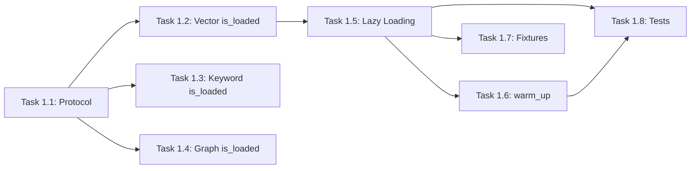
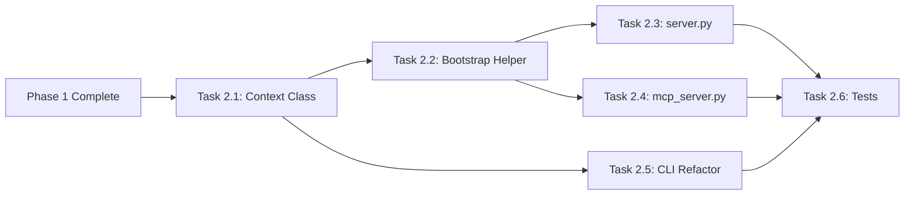
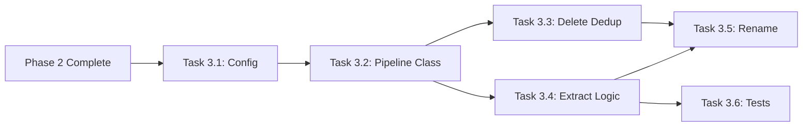
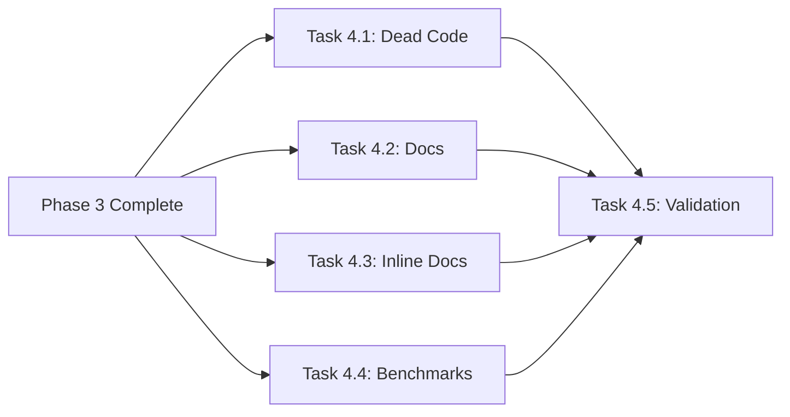

# Architecture Redesign Implementation Plan

## Overview

This plan implements the architecture redesign specified in [architecture-redesign.md](architecture-redesign.md). The redesign addresses five architectural concerns:

1. **P1**: Duplicated lifecycle logic across entry points (~200 LOC overlap)
2. **P2**: Eager embedding model load blocking cold start (2-4s penalty)
3. **P3**: No index protocol abstraction
4. **P4**: Redundant deduplication modules
5. **P5**: Tight config coupling in QueryOrchestrator

**Goals:**
- Cold start p95 < 1.0s (currently ~3s)
- Warm start p95 < 200ms
- Single source of truth for lifecycle management
- Protocol-based index abstraction for testability

---

## Phase 1: IndexProtocol + Lazy Loading

**Duration:** 2-3 days
**LOC:** +80 added, -30 removed, net +50

### Tasks

- [ ] **Task 1.1: Create IndexProtocol**
  - Files:
    - Create [src/indices/protocol.py](../../src/indices/protocol.py)
  - LOC estimate: 35
  - Dependencies: None
  - Acceptance:
    - Protocol defines `add_chunk`, `remove`, `search`, `persist`, `load`, `is_loaded` methods
    - Type signatures match existing index implementations
    - `pyright` passes with no errors

- [ ] **Task 1.2: Add `is_loaded()` to VectorIndex**
  - Files:
    - Modify [src/indices/vector.py](../../src/indices/vector.py) (lines 46-60)
  - LOC estimate: 8
  - Dependencies: Task 1.1
  - Acceptance:
    - `is_loaded()` returns `True` if `_index` is not `None`
    - Existing tests pass

- [ ] **Task 1.3: Add `is_loaded()` to KeywordIndex**
  - Files:
    - Modify [src/indices/keyword.py](../../src/indices/keyword.py) (lines 48-55)
  - LOC estimate: 5
  - Dependencies: Task 1.1
  - Acceptance:
    - `is_loaded()` returns `True` if `_index` is not `None`

- [ ] **Task 1.4: Add `is_loaded()` to GraphStore**
  - Files:
    - Modify [src/indices/graph.py](../../src/indices/graph.py) (lines 8-12)
  - LOC estimate: 5
  - Dependencies: Task 1.1
  - Acceptance:
    - `is_loaded()` returns `True` if `_graph` has nodes

- [ ] **Task 1.5: Implement lazy embedding model loading in VectorIndex**
  - Files:
    - Modify [src/indices/vector.py](../../src/indices/vector.py) (lines 46-60)
  - LOC estimate: 25
  - Dependencies: Task 1.2
  - Acceptance:
    - `__init__` stores `embedding_model_name` but does not load model
    - `_ensure_model_loaded()` method created with `threading.Lock` for thread safety
    - Model loaded on first `add_chunk()`, `search()`, or `expand_query()` call
    - Backward compatible: `embedding_model` parameter still works for tests

- [ ] **Task 1.6: Add `warm_up()` method to VectorIndex**
  - Files:
    - Modify [src/indices/vector.py](../../src/indices/vector.py)
  - LOC estimate: 8
  - Dependencies: Task 1.5
  - Acceptance:
    - `warm_up()` calls `_ensure_model_loaded()`
    - Can be called explicitly for latency-sensitive operations

- [ ] **Task 1.7: Update conftest.py fixtures for lazy loading**
  - Files:
    - Modify [tests/conftest.py](../../tests/conftest.py) (lines 65-75, 165-180)
  - LOC estimate: 15
  - Dependencies: Task 1.5
  - Acceptance:
    - `shared_embedding_model` fixture still works
    - New fixture `lazy_vector_index` available for testing lazy behavior
    - Existing tests using `shared_embedding_model` unchanged

- [ ] **Task 1.8: Add unit tests for lazy loading**
  - Files:
    - Create [tests/unit/test_lazy_loading.py](../../tests/unit/test_lazy_loading.py)
  - LOC estimate: 60
  - Dependencies: Task 1.5, Task 1.6
  - Acceptance:
    - Test: VectorIndex `__init__` does not load embedding model
    - Test: Model loaded on first `search()` call
    - Test: Model loaded on first `add_chunk()` call
    - Test: `warm_up()` loads model
    - Test: Thread safety of `_ensure_model_loaded()`

### Phase 1 Dependencies



### Phase 1 Exit Criteria

- `uv run mcp-markdown-ragdocs check-config` completes in <500ms (no embedding load)
- All existing tests pass
- `pyright` and `ruff` pass with 0 errors
- New tests for lazy loading pass

---

## Phase 2: ApplicationContext

**Duration:** 2-3 days
**LOC:** +150 added, -200 removed, net -50

### Tasks

- [ ] **Task 2.1: Create ApplicationContext class**
  - Files:
    - Create [src/context.py](../../src/context.py)
  - LOC estimate: 100
  - Dependencies: Phase 1 complete
  - Acceptance:
    - `@dataclass` with `config`, `index_manager`, `orchestrator`, `watcher` fields
    - `create()` class method handles project detection, index path resolution
    - `startup()` async method initializes indices, checks manifest, starts watcher
    - `shutdown()` async method stops watcher, persists indices
    - Supports `lazy_embeddings: bool` parameter (default `True`)
    - Supports `enable_watcher: bool` parameter (default `True`)

- [ ] **Task 2.2: Extract BootstrapService helper**
  - Files:
    - Modify [src/context.py](../../src/context.py)
  - LOC estimate: 50
  - Dependencies: Task 2.1
  - Acceptance:
    - `_check_and_rebuild_if_needed()` encapsulates manifest checking logic
    - `_discover_files()` encapsulates file discovery with include/exclude
    - Logic extracted from `server.py` lines 147-200 and `mcp_server.py` lines 155-195

- [ ] **Task 2.3: Refactor server.py to use ApplicationContext**
  - Files:
    - Modify [src/server.py](../../src/server.py) (lines 116-230)
  - LOC estimate: -80
  - Dependencies: Task 2.1, Task 2.2
  - Acceptance:
    - `lifespan()` creates `ApplicationContext` and calls `startup()`/`shutdown()`
    - `app.state` populated from context
    - Periodic reconciliation moved to context or kept in server
    - Net reduction in server.py LOC

- [ ] **Task 2.4: Refactor mcp_server.py to use ApplicationContext**
  - Files:
    - Modify [src/mcp_server.py](../../src/mcp_server.py) (lines 114-195)
  - LOC estimate: -60
  - Dependencies: Task 2.1, Task 2.2
  - Acceptance:
    - `MCPServer.__init__` accepts optional `ApplicationContext`
    - `startup()` delegates to context if provided
    - Existing `startup()` logic replaced with context usage

- [ ] **Task 2.5: Refactor cli.py commands to use ApplicationContext**
  - Files:
    - Modify [src/cli.py](../../src/cli.py) (lines 121-170, 261-335)
  - LOC estimate: -60
  - Dependencies: Task 2.1
  - Acceptance:
    - `rebuild_index_cmd` uses `ApplicationContext.create(enable_watcher=False)`
    - `query` command uses `ApplicationContext.create(enable_watcher=False)`
    - `run` command delegates to server
    - `mcp` command delegates to mcp_server
    - `check_config` does NOT use context (config only)

- [ ] **Task 2.6: Add integration tests for ApplicationContext**
  - Files:
    - Create [tests/integration/test_context.py](../../tests/integration/test_context.py)
  - LOC estimate: 80
  - Dependencies: Task 2.3, Task 2.4, Task 2.5
  - Acceptance:
    - Test: Context creates all components correctly
    - Test: `startup()` loads indices or triggers rebuild
    - Test: `shutdown()` persists indices
    - Test: Multiple contexts share module-level embedding cache (deferred)

### Phase 2 Dependencies



### Phase 2 Exit Criteria

- Single `ApplicationContext.create()` factory for all entry points
- `cli.py`, `server.py`, `mcp_server.py` each < 200 LOC
- < 50 LOC overlap between entry points
- All existing tests pass
- New integration tests pass

---

## Phase 3: SearchPipeline

**Duration:** 2-3 days
**LOC:** +150 added, -180 removed, net -30

### Tasks

- [ ] **Task 3.1: Create SearchPipelineConfig dataclass**
  - Files:
    - Create [src/search/pipeline.py](../../src/search/pipeline.py)
  - LOC estimate: 25
  - Dependencies: Phase 2 complete
  - Acceptance:
    - `@dataclass` with fields: `min_confidence`, `max_chunks_per_doc`, `dedup_enabled`, `dedup_threshold`, `rerank_enabled`, `rerank_model`, `rerank_top_n`
    - Default values match current behavior

- [ ] **Task 3.2: Create SearchPipeline class**
  - Files:
    - Modify [src/search/pipeline.py](../../src/search/pipeline.py)
  - LOC estimate: 100
  - Dependencies: Task 3.1
  - Acceptance:
    - `process()` method applies full pipeline: normalize → threshold → doc_limit → dedup → rerank
    - Accepts `fused_results`, `get_embedding`, `get_content`, `query` parameters
    - Returns `tuple[list[tuple[str, float]], CompressionStats]`
    - Lazy reranker initialization (matches current orchestrator pattern)

- [ ] **Task 3.3: Delete src/compression/deduplication.py**
  - Files:
    - Delete [src/compression/deduplication.py](../../src/compression/deduplication.py)
    - Modify [src/mcp_server.py](../../src/mcp_server.py) (lines 16-17, 280-290)
  - LOC estimate: -90
  - Dependencies: Task 3.2
  - Acceptance:
    - `mcp_server.py` uses `src/search/dedup.py` instead
    - `_handle_query_documents_compressed()` refactored to use pipeline
    - No references to `src/compression/deduplication` remain

- [ ] **Task 3.4: Extract pipeline logic from QueryOrchestrator**
  - Files:
    - Modify [src/search/orchestrator.py](../../src/search/orchestrator.py) (lines 50-130)
    - Modify [src/search/pipeline.py](../../src/search/pipeline.py)
  - LOC estimate: -80, +30
  - Dependencies: Task 3.2, Task 3.3
  - Acceptance:
    - `QueryOrchestrator.query()` delegates to `SearchPipeline.process()`
    - Orchestrator handles search execution, pipeline handles post-processing
    - `_get_chunk_embedding()`, `_get_chunk_content()` remain in orchestrator (passed to pipeline)

- [ ] **Task 3.5: Rename QueryOrchestrator to SearchOrchestrator**
  - Files:
    - Rename [src/search/orchestrator.py](../../src/search/orchestrator.py) → `orchestrator.py` (class rename only)
    - Update imports in:
      - [src/server.py](../../src/server.py)
      - [src/mcp_server.py](../../src/mcp_server.py)
      - [src/context.py](../../src/context.py)
      - Test files
  - LOC estimate: 15 (import changes)
  - Dependencies: Task 3.4
  - Acceptance:
    - All references updated
    - `pyright` passes

- [ ] **Task 3.6: Add unit tests for SearchPipeline**
  - Files:
    - Create [tests/unit/test_pipeline.py](../../tests/unit/test_pipeline.py)
  - LOC estimate: 80
  - Dependencies: Task 3.4
  - Acceptance:
    - Test: Pipeline applies threshold filter correctly
    - Test: Pipeline applies doc limit correctly
    - Test: Pipeline deduplication works with mock embeddings
    - Test: Pipeline reranking disabled by default
    - Test: Pipeline returns correct CompressionStats

### Phase 3 Dependencies



### Phase 3 Exit Criteria

- Single deduplication implementation in `src/search/dedup.py`
- `SearchPipeline` handles all post-fusion processing
- `SearchOrchestrator` handles search execution only
- All existing tests pass
- New pipeline tests pass

---

## Phase 4: Cleanup + Documentation

**Duration:** 1-2 days
**LOC:** +50 added, -100 removed, net -50

### Tasks

- [ ] **Task 4.1: Remove dead code paths**
  - Files:
    - Audit and clean [src/indices/vector.py](../../src/indices/vector.py)
    - Audit and clean [src/search/orchestrator.py](../../src/search/orchestrator.py)
    - Remove unused imports across all modified files
  - LOC estimate: -50
  - Dependencies: Phase 3 complete
  - Acceptance:
    - `ruff` reports 0 unused imports
    - No unreachable code paths

- [ ] **Task 4.2: Update architecture documentation**
  - Files:
    - Modify [docs/architecture.md](../../docs/architecture.md)
    - Create [docs/architecture/application-context.md](../../docs/architecture/application-context.md)
  - LOC estimate: 80
  - Dependencies: Phase 3 complete
  - Acceptance:
    - Architecture diagram updated to show `ApplicationContext`
    - New document explains lifecycle management
    - `IndexProtocol` documented

- [ ] **Task 4.3: Add inline documentation for new components**
  - Files:
    - [src/context.py](../../src/context.py)
    - [src/indices/protocol.py](../../src/indices/protocol.py)
    - [src/search/pipeline.py](../../src/search/pipeline.py)
  - LOC estimate: 30
  - Dependencies: Phase 3 complete
  - Acceptance:
    - All public methods have docstrings
    - Module docstrings explain purpose

- [ ] **Task 4.4: Add performance benchmark tests**
  - Files:
    - Modify [tests/performance/test_cold_start.py](../../tests/performance/test_cold_start.py) (or create)
    - Modify [tests/performance/test_warm_start.py](../../tests/performance/test_warm_start.py) (or create)
  - LOC estimate: 60
  - Dependencies: Phase 3 complete
  - Acceptance:
    - Benchmark: `check-config` cold start < 1.0s p95
    - Benchmark: Single file reindex < 200ms p95
    - Benchmarks run in CI (can be skipped with marker)

- [ ] **Task 4.5: Final test suite validation**
  - Files:
    - All test files
  - LOC estimate: 0 (validation only)
  - Dependencies: Task 4.1, Task 4.2, Task 4.3, Task 4.4
  - Acceptance:
    - `uv run pytest` passes with ≥85% coverage
    - `pyright` passes with 0 errors
    - `ruff` passes with 0 errors
    - Performance benchmarks meet targets

### Phase 4 Dependencies



### Phase 4 Exit Criteria

- Cold start p95 < 1.0s
- Warm start p95 < 200ms
- ≥85% test coverage
- 0 pyright/ruff errors
- Documentation updated

---

## Test Plan

### Tests Requiring Modification

| Test File | Reason | Changes |
|-----------|--------|---------|
| [tests/conftest.py](../../tests/conftest.py) | Lazy loading support | Add `lazy_vector_index` fixture |
| [tests/unit/test_vector_index.py](../../tests/unit/test_vector_index.py) | Lazy loading | Update init tests |
| [tests/integration/test_indexing.py](../../tests/integration/test_indexing.py) | Context usage | Use `ApplicationContext` |
| [tests/e2e/test_cli.py](../../tests/e2e/test_cli.py) | CLI refactor | Verify behavior unchanged |

### New Tests Required

| Test File | Phase | Purpose |
|-----------|-------|---------|
| [tests/unit/test_lazy_loading.py](../../tests/unit/test_lazy_loading.py) | 1 | Lazy embedding model loading |
| [tests/unit/test_protocol.py](../../tests/unit/test_protocol.py) | 1 | IndexProtocol compliance |
| [tests/integration/test_context.py](../../tests/integration/test_context.py) | 2 | ApplicationContext lifecycle |
| [tests/unit/test_pipeline.py](../../tests/unit/test_pipeline.py) | 3 | SearchPipeline stages |
| [tests/performance/test_cold_start.py](../../tests/performance/test_cold_start.py) | 4 | Cold start benchmark |
| [tests/performance/test_warm_start.py](../../tests/performance/test_warm_start.py) | 4 | Warm start benchmark |

### Performance Benchmarks

| Metric | Target | Current | Test |
|--------|--------|---------|------|
| Cold start (`check-config`) | < 1.0s p95 | ~3s | `test_cold_start.py` |
| Warm start (single file reindex) | < 200ms p95 | ~300ms | `test_warm_start.py` |
| Embedding model load | < 2.5s | ~3s | Part of cold start |

---

## Rollback Strategy

### Phase-Level Rollback

Each phase is designed to be independently rollbackable:

1. **Phase 1 Rollback**: Revert `src/indices/vector.py` to eager loading. Delete `protocol.py`.
2. **Phase 2 Rollback**: Delete `context.py`. Restore original `server.py`, `mcp_server.py`, `cli.py` from git.
3. **Phase 3 Rollback**: Delete `pipeline.py`. Restore `orchestrator.py` and `compression/deduplication.py`.
4. **Phase 4 Rollback**: No code changes to revert. Documentation can be left as-is.

### Feature Flags (Optional)

If incremental rollout is desired:

```python
# src/config.py
class FeatureFlags:
    lazy_embeddings: bool = True  # Phase 1
    use_context: bool = True      # Phase 2
    use_pipeline: bool = True     # Phase 3
```

### Git Strategy

- Create feature branch: `feature/architecture-redesign`
- Tag after each phase: `redesign-phase-1`, `redesign-phase-2`, etc.
- Squash merge to `main` after all phases complete

---

## File Map

### Files Created

| File | Phase | LOC |
|------|-------|-----|
| [src/indices/protocol.py](../../src/indices/protocol.py) | 1 | 35 |
| [src/context.py](../../src/context.py) | 2 | 150 |
| [src/search/pipeline.py](../../src/search/pipeline.py) | 3 | 125 |
| [tests/unit/test_lazy_loading.py](../../tests/unit/test_lazy_loading.py) | 1 | 60 |
| [tests/unit/test_protocol.py](../../tests/unit/test_protocol.py) | 1 | 40 |
| [tests/integration/test_context.py](../../tests/integration/test_context.py) | 2 | 80 |
| [tests/unit/test_pipeline.py](../../tests/unit/test_pipeline.py) | 3 | 80 |
| [docs/architecture/application-context.md](../../docs/architecture/application-context.md) | 4 | 50 |

### Files Modified

| File | Phase | Changes |
|------|-------|---------|
| [src/indices/vector.py](../../src/indices/vector.py) | 1 | Lazy loading, `is_loaded()`, `warm_up()` |
| [src/indices/keyword.py](../../src/indices/keyword.py) | 1 | `is_loaded()` |
| [src/indices/graph.py](../../src/indices/graph.py) | 1 | `is_loaded()` |
| [src/server.py](../../src/server.py) | 2 | Use `ApplicationContext` |
| [src/mcp_server.py](../../src/mcp_server.py) | 2, 3 | Use `ApplicationContext`, update dedup |
| [src/cli.py](../../src/cli.py) | 2 | Use `ApplicationContext` |
| [src/search/orchestrator.py](../../src/search/orchestrator.py) | 3 | Extract pipeline, rename |
| [tests/conftest.py](../../tests/conftest.py) | 1 | Lazy fixtures |
| [docs/architecture.md](../../docs/architecture.md) | 4 | Update diagrams |

### Files Deleted

| File | Phase | Reason |
|------|-------|--------|
| [src/compression/deduplication.py](../../src/compression/deduplication.py) | 3 | Consolidated into `search/dedup.py` |

---

## Summary

| Metric | Value |
|--------|-------|
| **Total Tasks** | 23 |
| **Estimated Total LOC** | +430 added, -510 removed, net -80 |
| **Duration** | 7-11 days |
| **Critical Path** | Phase 1 → Phase 2 → Phase 3 → Phase 4 |

### Critical Path Tasks

1. Task 1.5 (Lazy Loading) — blocks all Phase 2
2. Task 2.1 (ApplicationContext) — blocks CLI/server refactors
3. Task 3.2 (SearchPipeline) — blocks orchestrator extraction
4. Task 4.5 (Validation) — final gate

### Highest-Risk Tasks

| Task | Risk | Mitigation |
|------|------|------------|
| Task 1.5: Lazy Loading | Race condition on `_ensure_model_loaded()` | Use `threading.Lock`; add concurrency tests |
| Task 2.3: server.py refactor | Regression in lifespan management | Keep existing logic, wrap with context |
| Task 3.3: Delete deduplication.py | Break MCP compressed endpoint | Test `_handle_query_documents_compressed()` thoroughly |
| Task 3.4: Extract pipeline | Behavior drift in search results | Compare before/after results in integration tests |
