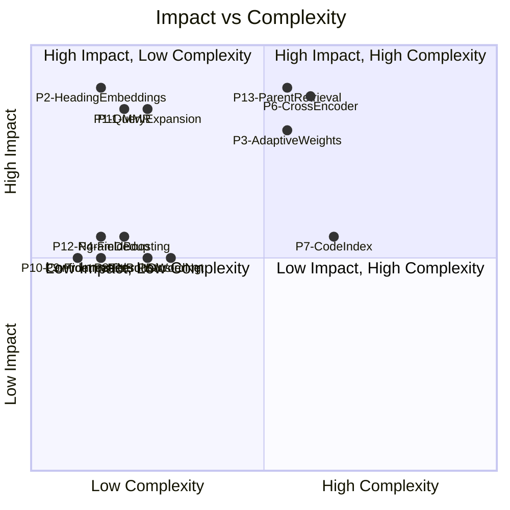
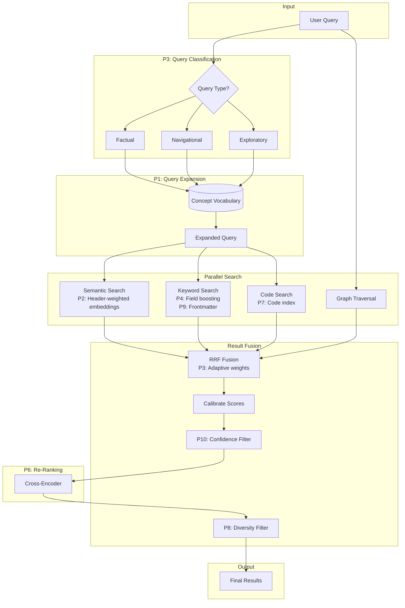
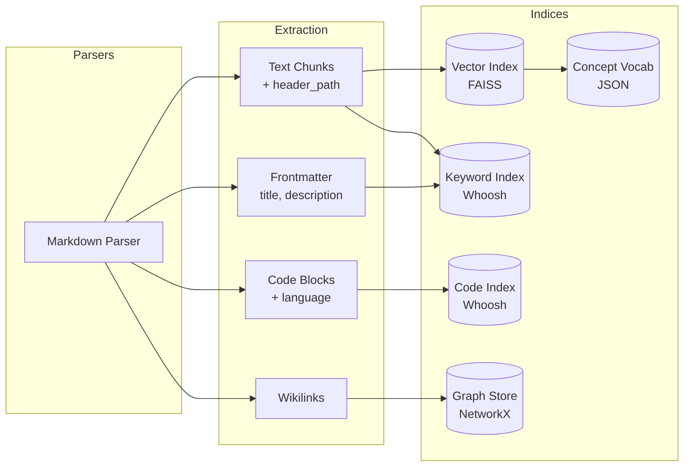

# 11. Search Quality Improvements

## Executive Summary

**Purpose:** Document 13 search quality improvement proposals for mcp-markdown-ragdocs, a local RAG documentation search system. Each proposal targets vocabulary mismatch, ranking precision, or result diversity.

**Scope:** Proposals span query expansion, embedding enrichment, re-ranking, index schema changes, result filtering, and diversity enforcement. All changes must work locally without API keys or internet. Constraints: deterministic, reproducible, minimal latency impact.

**Decision:** Phase 1 (P2, P4, P8, P9, P10) implemented. Phase 2 (P1, P6) implemented: query expansion via embeddings and cross-encoder re-ranking. Phase 3 adds adaptive strategies and specialized indices (P3, P7). Phase 4 adds advanced diversity and context techniques (P11, P12, P13). P5 (WordNet) deferred due to dependency overhead.

---

## 1. Goals & Non-Goals

### Goals
1. **Reduce vocabulary mismatch:** Surface relevant documents when query terms differ from document terminology.
2. **Improve ranking precision:** Ensure the most relevant chunks appear at top positions.
3. **Increase result diversity:** Prevent result lists dominated by chunks from a single document.
4. **Maintain local-first operation:** All improvements must work offline without external API calls.
5. **Preserve performance:** Query latency should not increase by more than 150ms for re-ranking, 50ms for other changes.

### Non-Goals
1. **Online learning:** No query logs, click tracking, or relevance feedback loops.
2. **External embedding APIs:** No OpenAI, Cohere, or cloud embedding services.
3. **GPU acceleration:** CPU-only inference for cross-encoder models.
4. **Multi-language support:** English-only tokenization and embeddings.
5. **Custom embedding training:** Use pre-trained models only.

---

## 2. Current State Analysis

### 2.1. Semantic Search

**File:** [src/indices/vector.py](../src/indices/vector.py)

| Component | Current Implementation |
|-----------|------------------------|
| Embedding Model | BAAI/bge-small-en-v1.5 (384 dimensions) |
| Vector Store | FAISS IndexFlatL2 |
| Chunking | LlamaIndex MarkdownNodeParser (512 chars, 50 overlap) |
| Metadata | `chunk_id`, `doc_id`, `header_path`, `file_path`, `tags`, `links` |

**Strength:** Finds conceptually related documents even when exact terms do not match.

**Weakness:** Generic chunk text produces embeddings that may not capture document-specific context (e.g., a chunk about "configuration" under "Authentication > Settings" embeds similarly to unrelated configuration chunks).

### 2.2. Keyword Search

**File:** [src/indices/keyword.py](../src/indices/keyword.py)

| Component | Current Implementation |
|-----------|------------------------|
| Engine | Whoosh with BM25F scoring |
| Analyzer | StemmingAnalyzer + 100+ stopwords, minsize=2 |
| Schema Fields | `id`, `doc_id`, `content`, `aliases`, `tags` |
| Query Parser | MultifieldParser across content, aliases, tags |

**Strength:** Exact term matching for function names, identifiers, specific phrases.

**Weakness:** No field boosting (headers, title, tags weighted equally to body text). Code blocks tokenized poorly (C++ becomes "c").

### 2.3. Graph Search

**File:** [src/indices/graph.py](../src/indices/graph.py)

| Component | Current Implementation |
|-----------|------------------------|
| Store | NetworkX directed graph |
| Traversal | 1-hop neighbors from candidate documents |
| Edge Types | Wikilinks `[[Target]]`, transclusions `![[Target]]` |

**Strength:** Surfaces structurally related documents not matched by keyword/semantic search.

**Weakness:** No scoring differentiation between link types. All neighbors receive equal treatment.

### 2.4. Result Fusion

**File:** [src/search/fusion.py](../src/search/fusion.py)

| Component | Current Implementation |
|-----------|------------------------|
| Algorithm | Reciprocal Rank Fusion (RRF) with k=60 |
| Strategy Weights | `semantic_weight`, `keyword_weight` (configurable), `graph=1.0` (fixed) |
| Recency Boost | Tier-based: 1.2x (<7 days), 1.1x (<30 days), 1.0x (older) |
| Calibration | Sigmoid calibration to [0, 1] after fusion |

**Strength:** Rank-based fusion handles heterogeneous score scales without calibration.

**Weakness:** Static weights regardless of query type. No re-ranking after fusion. No diversity enforcement.

### 2.5. Chunking

**File:** [src/parsers/markdown.py](../src/parsers/markdown.py) (header-based chunking)

| Component | Current Implementation |
|-----------|------------------------|
| Strategy | Header-based chunking with breadcrumb path |
| Min/Max Chars | 200 / 1500 (configurable) |
| Overlap | 100 chars |
| Metadata | `header_path` captures section hierarchy |

**Strength:** Preserves document structure. Header path provides context.

**Weakness:** Header path not included in embedding input—only stored as metadata.

---

## 3. Proposed Solutions

### P1: Query Expansion via Embeddings

**Impact:** High | **Complexity:** Low | **Status:** ✅ Implemented

**Description:** Before semantic search, generate 2-3 synthetic query variants by finding nearest neighbors to query embedding in a concept vocabulary extracted during indexing.

**Rationale:** Addresses vocabulary mismatch. Query "auth" expands to include "authentication", "authorization", "login" if those terms appear in indexed documents.

**Vocabulary Build Algorithm:**

**Stopword List (100+ words):**
```python
STOPWORDS = frozenset({
    "a", "an", "the", "and", "or", "but", "in", "on", "at", "to", "for",
    "of", "with", "by", "from", "as", "is", "was", "are", "were", "been",
    "be", "have", "has", "had", "do", "does", "did", "will", "would",
    "could", "should", "may", "might", "must", "shall", "can", "need",
    "this", "that", "these", "those", "it", "its", "they", "them", "their",
    "he", "she", "him", "her", "his", "hers", "we", "us", "our", "you",
    "your", "i", "me", "my", "who", "what", "which", "where", "when",
    "how", "why", "all", "each", "every", "both", "few", "more", "most",
    "other", "some", "such", "no", "not", "only", "same", "so", "than",
    "too", "very", "just", "also", "now", "here", "there", "then",
})
```

**Term Extraction:**
```python
def extract_terms(text):
    # Lowercase and extract alphanumeric words with hyphens/underscores
    pattern = r'\b[a-zA-Z][a-zA-Z0-9_-]*\b'
    terms = re.findall(pattern, text.lower())

    # Filter stopwords and minimum length
    terms = [t for t in terms if t not in STOPWORDS and len(t) >= 3]

    return terms
```

**Vocabulary Construction (executed during `persist()`):**
```python
def build_concept_vocabulary(all_chunks, embedding_model, top_n=10000):
    # Step 1: Extract and count term frequencies
    term_counts = Counter()
    for chunk in all_chunks:
        terms = extract_terms(chunk.content)
        term_counts.update(terms)

    # Step 2: Sort by frequency descending, take top 10,000
    top_terms = [term for term, count in term_counts.most_common(top_n)]

    # Step 3: Embed each term
    vocabulary = {}
    for term in top_terms:
        embedding = embedding_model.get_text_embedding(term)
        vocabulary[term] = embedding

    # Step 4: Persist to concept_vocabulary.json
    with open(vocabulary_path, 'w') as f:
        json.dump(vocabulary, f)

    return vocabulary
```

**Timing:**
- Vocabulary built during `persist()` call, NOT during indexing
- Incremental updates: track `_pending_terms` for efficiency
- Full rebuild on first persist or after major reindex

**Query Phase:**
```python
def expand_query(query_text, vocabulary, embedding_model, top_k=3):
    # Embed query
    query_embedding = embedding_model.get_text_embedding(query_text)

    # Find top-3 nearest term embeddings (cosine similarity)
    similarities = [
        (term, cosine_similarity(query_embedding, emb))
        for term, emb in vocabulary.items()
    ]
    similarities.sort(key=lambda x: x[1], reverse=True)

    # Append expansion terms to query
    expansion_terms = [term for term, score in similarities[:top_k]]
    expanded_query = f"{query_text} {' '.join(expansion_terms)}"

    return expanded_query
```

**File Changes:**
- [src/indices/vector.py](../src/indices/vector.py): Add `build_concept_vocabulary()`, `expand_query()`
- [src/search/orchestrator.py](../src/search/orchestrator.py): Call expansion before `_search_vector()`

**CLI Integration:**

The `rebuild-index` CLI command builds the concept vocabulary when `search.query_expansion_enabled = true`. This ensures the vocabulary is up-to-date with the indexed corpus. The command displays progress and vocabulary size on completion.

**Storage:**
- `concept_vocabulary.json` persisted alongside FAISS index
- Format: `{"term": [embedding_values], ...}`

**API Changes:** None (internal optimization)

**Testing Strategy:**
- Unit: `test_concept_vocabulary_extraction`, `test_query_expansion_synonyms`, `test_stopword_filtering`
- Integration: `test_expanded_query_finds_related_documents`

**LOC Estimate:** ~120 lines

---

### P2: Heading-Weighted Embeddings

**Impact:** High | **Complexity:** Low | **Status:** ✅ Implemented

**Description:** Prepend `header_path` breadcrumb to chunk content before generating embedding. Currently `header_path` is only stored as metadata.

**Rationale:** Enriches semantic context. A chunk under "Authentication > OAuth > Token Refresh" embeds differently than the same text under "Caching > TTL > Refresh".

**Current State:**
```python
# src/indices/vector.py add_chunk()
llama_doc = LlamaDocument(
    text=chunk.content,  # Only body text embedded
    metadata={"header_path": chunk.header_path, ...}
)
```

**Proposed State:**
```python
# Prepend header context to embedding input with double newline separator
embedding_text = f"{chunk.header_path}\n\n{chunk.content}" if chunk.header_path else chunk.content
llama_doc = LlamaDocument(
    text=embedding_text,
    metadata={"header_path": chunk.header_path, ...}
)
```

**Separator Significance:**
- Double newline (`\n\n`) treated as paragraph boundary by embedding model
- Without separator: "IntroductionConfiguration" becomes single phrase
- With separator: Header and content embed as distinct semantic units
- Preserves hierarchical context while maintaining semantic separation

**Embedding Text Examples:**

Without header_path:
```
"Configuration options include semantic_weight, keyword_weight, and rrf_k_constant."
```

With header_path (correct implementation):
```
"Search > Fusion Algorithm\n\nConfiguration options include semantic_weight, keyword_weight, and rrf_k_constant."
```

**File Changes:**
- [src/indices/vector.py](../src/indices/vector.py): Modify `add_chunk()` to prepend header_path with `\n\n` separator

**API Changes:** None (internal optimization)

**Testing Strategy:**
- Unit: `test_embedding_includes_header_path`, `test_separator_format`
- Integration: `test_header_context_improves_disambiguation`

**LOC Estimate:** ~10 lines

**Note:** Requires reindexing existing documents for change to take effect.

---

### P3: Query Type Classification + Adaptive Weights

**Impact:** High | **Complexity:** Medium

**Description:** Classify queries into factual/navigational/exploratory categories. Apply strategy-specific weight boosts dynamically.

**Query Types:**

| Type | Characteristics | Weight Adjustment |
|------|-----------------|-------------------|
| **Factual** | Contains specific terms, function names, exact phrases | keyword_weight × 1.5 |
| **Navigational** | References document structure ("in the auth section", "config guide") | graph_weight × 1.5 |
| **Exploratory** | Broad concepts, questions ("how does X work", "what is Y") | semantic_weight × 1.3 |

**Classification Heuristics:**
- Factual: Contains `camelCase`, `snake_case`, backticks, version numbers, exact phrases in quotes
- Navigational: Contains "section", "chapter", "guide", "in the X", references `[[wikilinks]]`
- Exploratory: Question words (what, how, why), broad nouns without qualifiers

**Implementation Approach:**

```python
def classify_query(query: str) -> QueryType:
    if re.search(r'`[^`]+`|[a-z]+[A-Z]|[a-z]+_[a-z]+', query):
        return QueryType.FACTUAL
    if re.search(r'\[\[|\]\]|section|chapter|guide', query, re.I):
        return QueryType.NAVIGATIONAL
    if re.search(r'\b(what|how|why|when|where)\b', query, re.I):
        return QueryType.EXPLORATORY
    return QueryType.EXPLORATORY  # Default
```

**File Changes:**
- [src/search/orchestrator.py](../src/search/orchestrator.py): Add `classify_query()`, modify weight calculation
- [src/models.py](../src/models.py): Add `QueryType` enum

**API Changes:** None (internal optimization)

**Testing Strategy:**
- Unit: `test_classify_factual_query`, `test_classify_navigational_query`, `test_classify_exploratory_query`
- Integration: `test_adaptive_weights_improve_factual_queries`

**LOC Estimate:** ~60 lines

---

### P4: BM25F Field Boosting for Tags & Headers

**Impact:** Medium | **Complexity:** Low

**Description:** Add `headers` field (h1-h3 text) to Whoosh schema with 2-3x boost. Increase tags field boost.

**Current Schema:**
```python
self._schema = Schema(
    id=ID(stored=True, unique=True),
    doc_id=ID(stored=True),
    content=TEXT(stored=False, analyzer=stem_analyzer),
    aliases=TEXT(stored=False, analyzer=stem_analyzer),
    tags=KEYWORD(stored=False, commas=True),
)
```

**Proposed Schema:**
```python
self._schema = Schema(
    id=ID(stored=True, unique=True),
    doc_id=ID(stored=True),
    content=TEXT(stored=False, analyzer=stem_analyzer),
    headers=TEXT(stored=False, analyzer=stem_analyzer, field_boost=3.0),  # NEW
    title=TEXT(stored=False, analyzer=stem_analyzer, field_boost=2.5),     # NEW
    aliases=TEXT(stored=False, analyzer=stem_analyzer),
    tags=KEYWORD(stored=False, commas=True, field_boost=2.0),              # BOOSTED
)
```

**File Changes:**
- [src/indices/keyword.py](../src/indices/keyword.py): Update schema, update `add_chunk()` to populate headers field
- [src/parsers/markdown.py](../src/parsers/markdown.py): Extract headers text for keyword index

**API Changes:** None (internal optimization)

**Testing Strategy:**
- Unit: `test_header_field_boosts_results`, `test_tag_field_boost`
- Integration: `test_title_match_ranks_higher`

**LOC Estimate:** ~40 lines

**Note:** Requires reindexing for schema change.

---

### P5: Synonym Injection via WordNet

**Impact:** Medium | **Complexity:** Low

**Description:** At query time, expand user queries with synonyms using local WordNet lookup.

**Implementation Approach:**
```python
from nltk.corpus import wordnet

def expand_with_synonyms(query: str, max_synonyms: int = 2) -> str:
    tokens = query.split()
    expanded = []
    for token in tokens:
        expanded.append(token)
        synsets = wordnet.synsets(token)
        synonyms = set()
        for syn in synsets[:2]:  # Limit to 2 synsets
            for lemma in syn.lemmas()[:max_synonyms]:
                if lemma.name() != token:
                    synonyms.add(lemma.name().replace('_', ' '))
        expanded.extend(list(synonyms)[:max_synonyms])
    return ' '.join(expanded)
```

**Example:**
- Input: "authenticate user"
- Output: "authenticate user verify credential"

**File Changes:**
- [src/search/orchestrator.py](../src/search/orchestrator.py): Add `expand_with_synonyms()`, call before keyword search
- [pyproject.toml](../pyproject.toml): Add `nltk` dependency (with wordnet data download)

**API Changes:** None (internal optimization)

**Testing Strategy:**
- Unit: `test_synonym_expansion_basic`, `test_synonym_expansion_no_matches`
- Integration: `test_synonyms_improve_recall`

**LOC Estimate:** ~30 lines

**Deferred:** NLTK dependency adds ~50MB download. Consider post-MVP.

---

### P6: Cross-Encoder Re-Ranking

**Impact:** High | **Complexity:** Medium

**Description:** After RRF fusion produces top-N candidates, apply lightweight cross-encoder to re-score query-passage pairs.

**Rationale:** Cross-encoders compute query-document interaction directly, achieving higher precision than bi-encoder (embedding) similarity. Trade-off: ~50-100ms per query for top-10 re-ranking.

**Model Selection:**

| Model | Size | Latency (CPU) | Quality |
|-------|------|---------------|---------|
| cross-encoder/ms-marco-MiniLM-L-6-v2 | 22MB | ~50ms/10 docs | Good |
| cross-encoder/ms-marco-TinyBERT-L-2-v2 | 17MB | ~30ms/10 docs | Acceptable |
| BAAI/bge-reranker-base | 110MB | ~150ms/10 docs | Best |

**Recommendation:** `cross-encoder/ms-marco-MiniLM-L-6-v2` for balance of quality and speed.

**Implementation Approach:**

```python
from sentence_transformers import CrossEncoder

class ReRanker:
    def __init__(self, model_name: str = "cross-encoder/ms-marco-MiniLM-L-6-v2"):
        self._model = CrossEncoder(model_name)

    def rerank(
        self,
        query: str,
        candidates: list[tuple[str, float]],  # [(chunk_id, rrf_score), ...]
        chunks: dict[str, str],  # chunk_id -> content
        top_n: int = 5
    ) -> list[tuple[str, float]]:
        pairs = [(query, chunks[cid]) for cid, _ in candidates if cid in chunks]
        scores = self._model.predict(pairs)
        reranked = sorted(zip(candidates, scores), key=lambda x: x[1], reverse=True)
        return [(cid, float(score)) for (cid, _), score in reranked[:top_n]]
```

**File Changes:**
- [src/search/reranker.py](../src/search/reranker.py): New file with `ReRanker` class
- [src/search/orchestrator.py](../src/search/orchestrator.py): Add optional re-ranking step after fusion
- [src/config.py](../src/config.py): Add `[search] rerank_enabled: bool = False`, `rerank_model: str`

**API Changes:**
- New config option: `[search] rerank_enabled = true`
- New config option: `[search] rerank_model = "cross-encoder/ms-marco-MiniLM-L-6-v2"`

**Testing Strategy:**
- Unit: `test_reranker_scores_relevant_higher`, `test_reranker_handles_empty_candidates`
- Integration: `test_rerank_improves_precision`
- Performance: `test_rerank_latency_under_100ms`

**LOC Estimate:** ~100 lines

---

### P7: Code Block Index

**Impact:** Medium | **Complexity:** Medium | **Status:** ✅ Implemented

**Description:** Dedicated index for code snippets with specialized tokenization (preserve syntax, no stemming, camelCase splitting).

**Rationale:** Current StemmingAnalyzer strips punctuation and stems tokens. "getAuthToken" becomes "getauthtoken", "C++" becomes "c". Code requires exact matching.

**Whoosh Schema:**
```python
Schema(
    id=ID(stored=True, unique=True),        # code_block_id
    doc_id=ID(stored=True),                 # parent document
    chunk_id=ID(stored=True),               # parent chunk
    content=TEXT(stored=True, analyzer=code_analyzer),
    language=KEYWORD(stored=True),          # python, javascript, etc.
)
```

**Code Analyzer:**
```python
from whoosh.analysis import RegexTokenizer, LowercaseFilter

# Splits on case changes, preserves symbols
code_analyzer = RegexTokenizer(r'[A-Z]?[a-z]+|[A-Z]+(?=[A-Z]|$)|[0-9]+|\S+') | LowercaseFilter()
```

**Tokenization Examples:**

| Input | Tokens Generated |
|-------|------------------|
| `getUserById` | `["getUserById", "get", "user", "by", "id"]` |
| `parse_json_data` | `["parse_json_data", "parse", "json", "data"]` |
| `HTTPResponse` | `["HTTPResponse", "HTTP", "response"]` |
| `std::vector` | `["std", "::", "vector"]` |
| `C++` | `["c++"]` (preserved) |
| `myVar123` | `["myvar123", "my", "var", "123"]` |

**Code Extraction:**
- During parsing, extract fenced code blocks (````lang ... ````)
- Index each code block as separate entry with language metadata
- Query both text and code indices in parallel during search

**File Changes:**
- [src/indices/code.py](../src/indices/code.py): New file with `CodeIndex` class
- [src/parsers/markdown.py](../src/parsers/markdown.py): Extract code blocks during parsing
- [src/search/orchestrator.py](../src/search/orchestrator.py): Query code index, include in fusion

**API Changes:**
- `[search] code_search_enabled: bool = false`
- `[search] code_search_weight: float = 1.0`

**Testing Strategy:**
- Unit: `test_code_tokenization_camelcase`, `test_code_preserves_punctuation`, `test_code_splits_snake_case`
- Integration: `test_code_search_finds_function_names`, `test_code_search_language_filtering`

**LOC Estimate:** ~150 lines

---

### P8: Result Clustering and Semantic Deduplication

**Impact:** Medium | **Complexity:** Low-Medium | **Status:** ✅ Implemented

**Description:** Three-stage deduplication pipeline ensures diverse, non-redundant results via (1) exact content hash dedup, (2) n-gram near-duplicate detection, (3) semantic embedding similarity clustering. Additionally applies document-level max-per-doc limits.

**Problem:**
1. Exact duplicates (copy-paste) waste result slots
2. Near-duplicates (minor edits, formatting changes) create redundancy
3. Paraphrases (semantically identical but different wording) reduce diversity
4. Top-N results may all come from same document if it contains multiple highly-ranked chunks

**Three-Stage Deduplication Pipeline:**

**Stage 1: Content Hash Deduplication (Exact Matches)**
```python
def deduplicate_by_content_hash(
    results: list[tuple[str, float]],
    get_content: Callable[[str], str]
) -> tuple[list[tuple[str, float]], int]:
    """Remove exact text duplicates via MD5 hash.

    Returns: (deduplicated_results, removed_exact_count)
    """
    seen_hashes = set()
    deduplicated = []
    removed = 0

    for chunk_id, score in results:
        content = get_content(chunk_id)
        content_hash = hashlib.md5(content.encode()).hexdigest()

        if content_hash not in seen_hashes:
            seen_hashes.add(content_hash)
            deduplicated.append((chunk_id, score))
        else:
            removed += 1

    return deduplicated, removed
```

**Stage 2: N-gram Deduplication (Near-Exact Matches via Jaccard Similarity)**
```python
def deduplicate_by_ngram(
    results: list[tuple[str, float]],
    get_content: Callable[[str], str],
    threshold: float = 0.7,
    n: int = 3
) -> tuple[list[tuple[str, float]], int]:
    """Remove near-duplicates via Jaccard similarity of trigrams.

    Returns: (deduplicated_results, removed_ngram_count)
    """
    def get_ngrams(text: str, n: int) -> set:
        words = text.lower().split()
        return set(' '.join(words[i:i+n]) for i in range(len(words)-n+1))

    def jaccard_similarity(set_a: set, set_b: set) -> float:
        if not set_a or not set_b:
            return 0.0
        intersection = len(set_a & set_b)
        union = len(set_a | set_b)
        return intersection / union if union > 0 else 0.0

    deduplicated = []
    removed = 0
    chunk_ngrams = {}

    for chunk_id, score in results:
        content = get_content(chunk_id)
        ngrams = get_ngrams(content, n)

        is_duplicate = False
        for existing_id in chunk_ngrams:
            existing_ngrams = chunk_ngrams[existing_id]
            similarity = jaccard_similarity(ngrams, existing_ngrams)
            if similarity >= threshold:
                is_duplicate = True
                removed += 1
                break

        if not is_duplicate:
            chunk_ngrams[chunk_id] = ngrams
            deduplicated.append((chunk_id, score))

    return deduplicated, removed
```

**Stage 3: Semantic Deduplication (Paraphrase Detection via Embedding Similarity)**
```python
def deduplicate_by_similarity(
    results: list[tuple[str, float]],
    get_embedding: Callable[[str], np.ndarray],
    similarity_threshold: float = 0.80
) -> tuple[list[tuple[str, float]], int]:
    """Cluster chunks by embedding cosine similarity.

    Returns: (deduplicated_results, clusters_merged_count)
    """
    if not results:
        return [], 0

    selected = []
    merged_count = 0

    for chunk_id, score in results:
        chunk_emb = get_embedding(chunk_id)
        if chunk_emb is None:
            selected.append((chunk_id, score))
            continue

        is_duplicate = False
        for sel_id, _ in selected:
            sel_emb = get_embedding(sel_id)
            if sel_emb is not None:
                sim = cosine_similarity(chunk_emb, sel_emb)
                if sim >= similarity_threshold:
                    is_duplicate = True
                    merged_count += 1
                    break

        if not is_duplicate:
            selected.append((chunk_id, score))

    return selected, merged_count
```

**Why This Order Matters:**
1. **Content hash (Stage 1) is fastest**: O(n) with constant-time hash lookup, eliminates exact duplicates before more expensive operations
2. **N-gram (Stage 2) faster than embeddings**: Jaccard similarity on sets faster than embedding lookup + cosine computation, catches near-exact matches
3. **Semantic (Stage 3) handles remaining paraphrases**: Most expensive, but operates on smallest candidate set after previous stages

**Component B: Per-Document Limit (Applied After All Dedup Stages)**
```python
def limit_per_document(
    results: list[tuple[str, float]],
    doc_id_map: dict[str, str],  # chunk_id -> doc_id
    max_per_doc: int
) -> list[tuple[str, float]]:
    """Limit chunks per document, preserving highest-scored chunks.

    Applied after all deduplication stages.
    """
    if max_per_doc <= 0:
        return results

    doc_counts = {}
    limited = []

    for chunk_id, score in results:
        doc_id = doc_id_map.get(chunk_id)
        if doc_id and doc_counts.get(doc_id, 0) >= max_per_doc:
            continue
        limited.append((chunk_id, score))
        if doc_id:
            doc_counts[doc_id] = doc_counts.get(doc_id, 0) + 1

    return limited
```

**Complete Processing Order:**
```
RRF Fusion
  ↓
Score Calibration [0.0, 1.0]
  ↓
Confidence Threshold Filter (P10)
  ↓
Stage 1: Content Hash Dedup (MD5)
  ↓
Stage 2: N-gram Dedup (Jaccard, threshold=0.7)
  ↓
Stage 3: Semantic Dedup (Cosine, threshold=0.80)
  ↓
Per-Document Limit (max_chunks_per_doc)
  ↓
Cross-Encoder Re-Ranking (P6, if enabled)
```

**Response Metadata:**
```python
@dataclass
class CompressionStats:
    original_count: int           # Results before any filtering
    after_threshold: int          # After confidence filter (P10)
    after_content_dedup: int      # After Stage 1 (MD5 hash)
    after_ngram_dedup: int        # After Stage 2 (Jaccard)
    after_dedup: int              # After Stage 3 (semantic cosine)
    after_doc_limit: int          # After per-document limit
    clusters_merged: int          # Count from Stage 3 only
```

**Rationale:** Sequential deduplication from fast-to-slow optimizes performance. Content hash eliminates obvious duplicates. N-gram catches minor variations. Semantic dedup handles paraphrases. Document limit ensures diversity across sources.

**File Changes:**
- [src/search/dedup.py](../src/search/dedup.py): All dedup functions
- [src/search/orchestrator.py](../src/search/orchestrator.py): Pipeline orchestration

**API Changes:**
- `[search] max_chunks_per_doc: int = 2`
- `[search] dedup_enabled: bool = false`
- `[search] dedup_similarity_threshold: float = 0.80` (semantic stage only)
- `[search] ngram_dedup_enabled: bool = true`
- `[search] ngram_dedup_threshold: float = 0.7`

**Testing Strategy:**
- Unit: `test_content_hash_dedup`, `test_ngram_dedup_threshold`, `test_semantic_dedup_clusters`, `test_doc_limit_preserves_ranking`
- Integration: `test_three_stage_pipeline_order`, `test_compression_stats_accuracy`

**LOC Estimate:** ~220 lines
- New config option: `[search] max_chunks_per_doc: int = 0` (0 = disabled)
- New config option: `[search] dedup_enabled: bool = false`
- New config option: `[search] dedup_similarity_threshold: float = 0.85`

**Response Metadata:**
```python
@dataclass
class DeduplicationStats:
    original_count: int         # Results before any filtering
    after_threshold: int        # Results after score threshold (P10)
    after_dedup: int            # Results after semantic dedup
    clusters_merged: int        # Number of duplicate clusters removed
    after_doc_limit: int        # Final results after per-doc limit
```

**Testing Strategy:**
- Unit: `test_dedup_limits_per_document`, `test_dedup_preserves_ranking`, `test_semantic_dedup_clusters_similar`, `test_semantic_dedup_threshold_tuning`
- Integration: `test_results_from_multiple_documents`, `test_redundant_content_deduplicated`

**LOC Estimate:** ~80 lines

---

### P9: Frontmatter Metadata Indexing and Boosting

**Impact:** Medium | **Complexity:** Low-Medium

**Description:** Index comprehensive frontmatter fields as first-class searchable content with field-specific boost weights. Leverage frontmatter for filtering, recency signals, and graph enhancement.

**Current State:** Frontmatter parsed but minimally indexed. Only `aliases` and `tags` extracted for keyword search.

**Frontmatter Fields to Index:**

| Field | Type | Boost | Purpose |
|-------|------|-------|----------|
| `title` | TEXT | 3.0 | Document title (highest boost) |
| `description` / `summary` | TEXT | 2.0 | Document summary |
| `keywords` | KEYWORD | 2.5 | SEO-style keywords (high boost) |
| `tags` | KEYWORD | 2.0 | Topic tags (existing, boost increased) |
| `aliases` | TEXT | 1.5 | Alternative names (existing) |
| `author` | TEXT | 1.0 | Author name (searchable, no boost) |
| `category` / `type` | KEYWORD | 1.0 | Document classification (filterable) |
| `date` / `created` / `modified` | DATETIME | N/A | Timestamps for recency (not boosted, used for sorting/filtering) |
| `related` | ID[] | N/A | Links to related documents (graph enhancement) |

**Schema Extension:**
```python
self._schema = Schema(
    id=ID(stored=True, unique=True),
    doc_id=ID(stored=True),
    content=TEXT(stored=False, analyzer=stem_analyzer),
    headers=TEXT(stored=False, analyzer=stem_analyzer, field_boost=3.0),
    # Frontmatter fields
    title=TEXT(stored=True, analyzer=stem_analyzer, field_boost=3.0),
    description=TEXT(stored=False, analyzer=stem_analyzer, field_boost=2.0),
    keywords=KEYWORD(stored=False, commas=True, field_boost=2.5),
    tags=KEYWORD(stored=False, commas=True, field_boost=2.0),
    aliases=TEXT(stored=False, analyzer=stem_analyzer, field_boost=1.5),
    author=TEXT(stored=False, analyzer=stem_analyzer),
    category=KEYWORD(stored=True),  # Stored for filtering
    modified_date=DATETIME(stored=True),  # For recency filtering
)
```

**Frontmatter Extraction:**
```python
def extract_frontmatter_fields(frontmatter: dict) -> dict:
    return {
        "title": frontmatter.get("title", ""),
        "description": frontmatter.get("description", frontmatter.get("summary", "")),
        "keywords": frontmatter.get("keywords", []),
        "tags": frontmatter.get("tags", []),
        "aliases": frontmatter.get("aliases", []),
        "author": frontmatter.get("author", ""),
        "category": frontmatter.get("category", frontmatter.get("type", "")),
        "modified_date": parse_date(frontmatter.get("modified",
                                     frontmatter.get("date",
                                     frontmatter.get("created")))),
        "related": frontmatter.get("related", []),  # For graph enhancement
    }
```

**Graph Enhancement via `related` Field:**
```python
# In graph index builder
for related_doc in frontmatter.get("related", []):
    # Add edge from current doc to related doc
    graph.add_edge(doc_id, resolve_doc_id(related_doc), edge_type="related")
```

**Filtering Capability:**
```python
# Filter by category during search
def search_with_filter(
    query: str,
    category: str | None = None,
    author: str | None = None,
    modified_after: datetime | None = None
) -> list[ChunkResult]:
    filter_clauses = []
    if category:
        filter_clauses.append(Term("category", category))
    if author:
        filter_clauses.append(Term("author", author))
    if modified_after:
        filter_clauses.append(DateRange("modified_date", modified_after, None))
    # Apply filters to search
```

**File Changes:**
- [src/indices/keyword.py](../src/indices/keyword.py): Extend schema with frontmatter fields
- [src/parsers/markdown.py](../src/parsers/markdown.py): Extract frontmatter fields to chunk metadata
- [src/indices/graph.py](../src/indices/graph.py): Add edges from `related` frontmatter field
- [src/models.py](../src/models.py): Add `FrontmatterFields` dataclass

**API Changes:**
- Future: `[search] filter_category` parameter (DEFERRED:API:category-filter)
- Future: `[search] filter_author` parameter (DEFERRED:API:author-filter)

**Testing Strategy:**
- Unit: `test_title_field_indexed`, `test_description_field_indexed`, `test_keywords_boost`, `test_author_searchable`, `test_related_graph_edges`
- Integration: `test_title_match_ranks_highest`, `test_keywords_improve_recall`, `test_category_filtering`

**LOC Estimate:** ~80 lines

**Note:** Requires reindexing for schema change. Related field graph integration optional (can be Phase 2).

---

### P10: Confidence Threshold Filtering

**Impact:** Medium | **Complexity:** Low

**Description:** Filter results below configurable confidence threshold. Return fewer results when confidence is low rather than returning noise. This is the primary score-based filtering mechanism applied before deduplication (P8).

**Rationale:**
1. When query does not match any documents well, returning low-confidence results creates noise. Better to return empty or fewer results.
2. Filtering low-relevance results before deduplication improves efficiency and ensures dedup operates on meaningful candidates.
3. Acts as first stage in the processing pipeline: threshold → dedup → doc-limit.

**Implementation:**
```python
def filter_by_confidence(
    results: list[tuple[str, float]],
    threshold: float = 0.3
) -> tuple[list[tuple[str, float]], int]:
    """Filter results below threshold.

    Returns: (filtered_results, original_count)
    """
    original_count = len(results)
    filtered = [(cid, score) for cid, score in results if score >= threshold]
    return filtered, original_count
```

**Edge Cases:**
- All results below threshold: Return empty list
- Only highest result above threshold: Return single result
- Threshold = 0.0: No filtering (backward compatible default)

**Processing Pipeline Position:**
```
RRF Fusion → Calibrate (sigmoid) → P10: Threshold Filter → P8: Semantic Dedup → P8: Doc Limit → P6: Re-rank
```

**File Changes:**
- [src/search/filters.py](../src/search/filters.py): New file with `filter_by_confidence()`
- [src/search/orchestrator.py](../src/search/orchestrator.py): Apply filtering as first post-fusion step
- [src/config.py](../src/config.py): Add `[search] min_confidence: float = 0.3`

**API Changes:**
- New config option: `[search] min_confidence = 0.3` (set to 0.0 to disable filtering)

**Testing Strategy:**
- Unit: `test_confidence_filter_removes_low_scores`, `test_confidence_filter_zero_returns_all`, `test_confidence_filter_returns_count`
- Integration: `test_low_confidence_query_returns_fewer_results`, `test_threshold_before_dedup_pipeline`

**LOC Estimate:** ~25 lines

---

### P11: Maximal Marginal Relevance (MMR)

**Impact:** High | **Complexity:** Low

**Description:** Replace greedy semantic deduplication with MMR-based selection. MMR iteratively selects documents that maximize a weighted combination of relevance to query and diversity from already-selected results.

**Rationale:** Current semantic dedup uses a fixed similarity threshold (0.85) which is binary—chunks are either duplicates or not. MMR provides a principled trade-off between relevance and diversity, allowing more nuanced selection.

**MMR Formula:**

$$\text{MMR} = \arg\max_{d \in R \setminus S} \left[ \lambda \cdot \text{Sim}(d, q) - (1-\lambda) \cdot \max_{d' \in S} \text{Sim}(d, d') \right]$$

Where:
- $d$ = candidate document
- $q$ = query
- $R$ = candidate set
- $S$ = already-selected set
- $\lambda$ = relevance vs diversity trade-off (0.5-0.7 typical)
- $\text{Sim}$ = cosine similarity

**Implementation Approach:**

```python
def select_mmr(
    query_embedding: list[float],
    candidates: list[tuple[str, float]],
    get_embedding: Callable[[str], list[float]],
    lambda_param: float = 0.7,
    top_n: int = 10,
) -> list[tuple[str, float]]:
    selected = []
    remaining = list(candidates)

    while len(selected) < top_n and remaining:
        best_score = float('-inf')
        best_idx = 0

        for i, (chunk_id, relevance_score) in enumerate(remaining):
            chunk_emb = get_embedding(chunk_id)

            # Relevance to query (use original score as proxy)
            relevance = relevance_score

            # Max similarity to already-selected
            if selected:
                max_sim = max(
                    cosine_similarity(chunk_emb, get_embedding(sel_id))
                    for sel_id, _ in selected
                )
            else:
                max_sim = 0.0

            # MMR score
            mmr_score = lambda_param * relevance - (1 - lambda_param) * max_sim

            if mmr_score > best_score:
                best_score = mmr_score
                best_idx = i

        selected.append(remaining.pop(best_idx))

    return selected
```

**File Changes:**
- [src/search/diversity.py](../src/search/diversity.py): New file with `select_mmr()`
- [src/search/orchestrator.py](../src/search/orchestrator.py): Replace semantic dedup with MMR when `mmr_enabled=True`
- [src/config.py](../src/config.py): Add `mmr_enabled: bool`, `mmr_lambda: float`

**API Changes:**
- New config option: `[search] mmr_enabled = false`
- New config option: `[search] mmr_lambda = 0.7` (higher = more relevance, lower = more diversity)

**Testing Strategy:**
- Unit: `test_mmr_selects_diverse`, `test_mmr_respects_lambda`, `test_mmr_empty_candidates`
- Integration: `test_mmr_improves_diversity_over_dedup`

**LOC Estimate:** ~60 lines

---

### P12: N-gram Overlap Deduplication (Fast Pre-filter)

**Impact:** Medium | **Complexity:** Low

**Description:** Add a fast pre-filter before embedding-based deduplication that removes exact and near-exact duplicates using character n-gram overlap (Jaccard similarity).

**Rationale:** Embedding comparison is expensive (requires embedding lookup + cosine computation). Many duplicates in chunked retrieval are exact or near-exact text matches (overlapping chunks, copy-pasted content). N-gram overlap is much faster and catches these cases.

**Jaccard Similarity with N-grams:**

$$\text{Jaccard}(A, B) = \frac{|\text{ngrams}(A) \cap \text{ngrams}(B)|}{|\text{ngrams}(A) \cup \text{ngrams}(B)|}$$

**Implementation Approach:**

```python
def get_ngrams(text: str, n: int = 3) -> set[str]:
    text = text.lower().replace(' ', '')
    return {text[i:i+n] for i in range(len(text) - n + 1)}

def jaccard_similarity(text_a: str, text_b: str, n: int = 3) -> float:
    ngrams_a = get_ngrams(text_a, n)
    ngrams_b = get_ngrams(text_b, n)
    if not ngrams_a or not ngrams_b:
        return 0.0
    intersection = len(ngrams_a & ngrams_b)
    union = len(ngrams_a | ngrams_b)
    return intersection / union

def deduplicate_by_ngram(
    results: list[tuple[str, float]],
    get_content: Callable[[str], str],
    threshold: float = 0.7,
    n: int = 3,
) -> tuple[list[tuple[str, float]], int]:
    kept = []
    removed_count = 0

    for chunk_id, score in results:
        content = get_content(chunk_id)
        is_duplicate = False

        for kept_id, _ in kept:
            kept_content = get_content(kept_id)
            if jaccard_similarity(content, kept_content, n) >= threshold:
                is_duplicate = True
                removed_count += 1
                break

        if not is_duplicate:
            kept.append((chunk_id, score))

    return kept, removed_count
```

**Processing Pipeline Position:**
```
RRF → Calibrate (sigmoid) → Threshold → N-gram Dedup (fast) → Semantic Dedup/MMR (slow) → Re-rank
```

**File Changes:**
- [src/search/dedup.py](../src/search/dedup.py): Add `get_ngrams()`, `jaccard_similarity()`, `deduplicate_by_ngram()`
- [src/search/orchestrator.py](../src/search/orchestrator.py): Insert n-gram dedup before semantic dedup
- [src/config.py](../src/config.py): Add `ngram_dedup_enabled: bool`, `ngram_dedup_threshold: float`

**API Changes:**
- New config option: `[search] ngram_dedup_enabled = true` (on by default—fast and effective)
- New config option: `[search] ngram_dedup_threshold = 0.7`

**Testing Strategy:**
- Unit: `test_ngram_extraction`, `test_jaccard_similarity`, `test_ngram_dedup_removes_exact_duplicates`
- Integration: `test_ngram_dedup_before_semantic`, `test_ngram_dedup_performance`

**LOC Estimate:** ~50 lines

---

### P13: Parent Document Retrieval

**Impact:** High | **Complexity:** Medium

**Description:** Embed small chunks for precision, but return the parent section (larger context window) in results. This provides both fine-grained retrieval and sufficient context for LLM consumption.

**Rationale:** Small chunks (512 chars) improve retrieval precision—specific sentences match better than paragraphs. But returning small chunks to an LLM loses context. Parent document retrieval decouples the unit of retrieval from the unit of return.

**Architecture:**

```
Document → Split into Sections (parent, ~2000 chars)
         → Split Sections into Chunks (child, ~512 chars)
         → Embed children, store parent_id reference
         → Search returns child matches
         → Expand to parent sections before returning
```

**Implementation Approach:**

**Parent Expansion Algorithm:**

```python
def _expand_to_parents(
    final_results: list[tuple[str, float]],
    vector_index: VectorIndex
) -> list[ChunkResult]:
    """Expand child chunks to parent sections, deduplicating by parent ID.

    Applied AFTER all filtering stages (threshold, dedup, doc-limit, rerank).
    Returns parent content instead of child content for better LLM context.
    """
    seen_parents = set()
    expanded = []

    for chunk_id, score in final_results:
        # Retrieve chunk data including metadata
        chunk_data = vector_index.get_chunk_by_id(chunk_id)
        parent_id = chunk_data["metadata"].get("parent_chunk_id")

        if parent_id and parent_id not in seen_parents:
            # Expand to parent: return parent content, ID, metadata
            parent_content = vector_index.get_parent_content(parent_id)
            expanded.append(ChunkResult(
                chunk_id=parent_id,  # Return parent ID
                doc_id=chunk_data["doc_id"],
                content=parent_content,  # Return parent content
                score=score,  # Preserve child's relevance score
                parent_chunk_id=parent_id,
                header_path=chunk_data["metadata"]["header_path"],
                metadata=chunk_data["metadata"]
            ))
            seen_parents.add(parent_id)

        elif not parent_id:
            # Chunk has no parent (is already section-level)
            expanded.append(ChunkResult(
                chunk_id=chunk_id,
                doc_id=chunk_data["doc_id"],
                content=chunk_data["content"],
                score=score,
                parent_chunk_id=None,
                header_path=chunk_data["metadata"]["header_path"],
                metadata=chunk_data["metadata"]
            ))

    return expanded
```

**Key Points:**
- Expansion happens **AFTER** all filtering stages (threshold, dedup, doc-limit, rerank)
- Multiple children from same parent → single parent in results
- Parent IDs deduplicated via `seen_parents` set
- Chunks without parents passed through unchanged
- Preserves child's relevance score (parent inherits it)

**Processing Pipeline Position:**
```
... → Per-Document Limit → Re-rank → P13: Parent Expansion → Return
```

**Chunking Strategy Change:**

| Level | Size | Overlap | Purpose |
|-------|------|---------|----------|
| Section (parent) | 1500-2000 chars | 200 chars | Return unit, provides context |
| Chunk (child) | 400-600 chars | 100 chars | Retrieval unit, precision |

**File Changes:**
- [src/parsers/markdown.py](../src/parsers/markdown.py): Generate two-level chunks (sections + sub-chunks)
- [src/indices/vector.py](../src/indices/vector.py): Store parent reference in metadata
- [src/search/orchestrator.py](../src/search/orchestrator.py): Expand to parents before returning
- [src/models.py](../src/models.py): Add `parent_chunk_id`, `parent_content` to ChunkResult
- [src/config.py](../src/config.py): Add `parent_retrieval_enabled: bool`

**API Changes:**
- New config option: `[search] parent_retrieval_enabled = false`
- ChunkResult may contain parent content instead of child content when enabled

**Testing Strategy:**
- Unit: `test_two_level_chunking`, `test_parent_reference_stored`, `test_expand_to_parents`
- Integration: `test_parent_retrieval_returns_larger_context`, `test_parent_dedup_across_children`

**LOC Estimate:** ~120 lines

**Note:** Requires reindexing for two-level chunk structure.

---

## 4. Decision Matrix

| Proposal | Impact | Complexity | Risk | Dependencies | Phase |
|----------|--------|------------|------|--------------|-------|
| **P1: Query Expansion** | High | Low | Low | None | **2** ✅ |
| **P2: Heading-Weighted Embeddings** | High | Low | Low | Reindex | **1** ✅ |
| **P3: Adaptive Weights** | High | Medium | Medium | None | 3 |
| **P4: BM25F Field Boosting** | Medium | Low | Low | Reindex | **1** ✅ |
| **P5: WordNet Synonyms** | Medium | Low | Low | NLTK (~50MB) | Deferred |
| **P6: Cross-Encoder Re-Ranking** | High | Medium | Medium | sentence-transformers | **2** ✅ |
| **P7: Code Block Index** | Medium | Medium | Medium | New index | 3 |
| **P8: Result Clustering + Dedup** | Medium | Low-Medium | Low | Embeddings access | **1** ✅ |
| **P9: Frontmatter Indexing** | Medium | Low-Medium | Low | Reindex | **1** ✅ |
| **P10: Confidence Filtering** | Medium | Low | Low | None | **1** ✅ |
| **P11: MMR Diversity** | High | Low | Low | Embeddings access | 4 |
| **P12: N-gram Pre-filter** | Medium | Low | Low | None | 4 |
| **P13: Parent Document Retrieval** | High | Medium | Medium | Reindex | 4 |

### Impact Assessment



---

## 5. Implementation Plan

### Phase 1: Quick Wins (Week 1) ✅ IMPLEMENTED

| Task | Proposal | LOC | Status |
|------|----------|-----|--------|
| Prepend header_path to embedding input | P2 | ~10 | ✅ |
| Add headers/title fields to Whoosh schema | P4 | ~60 | ✅ |
| Index frontmatter fields (title, description, keywords, author, category) | P9 | ~80 | ✅ |
| Add confidence threshold filtering | P10 | ~25 | ✅ |
| Add semantic deduplication module | P8 | ~60 | ✅ |
| Add per-document limit | P8 | ~20 | ✅ |
| Add CompressionStats to response | P8/P10 | ~30 | ✅ |

**Implementation Notes:**

1. **Heading-Weighted Embeddings (P2):** Chunks prepend `header_path` to content before embedding in [src/indices/vector.py](../src/indices/vector.py). Requires reindexing.

2. **BM25F Field Boosting (P4):** Extended schema in [src/indices/keyword.py](../src/indices/keyword.py):
   - `title` (boost 3.0)
   - `headers` (boost 2.5)
   - `keywords` (boost 2.5)
   - `description` (boost 2.0)
   - `tags` (boost 2.0)
   - `aliases` (boost 1.5)
   - `author` (boost 1.0)
   - `category` (no boost)
   - MultifieldParser searches all TEXT fields. Requires reindexing.

3. **Frontmatter Indexing (P9):** [src/parsers/markdown.py](../src/parsers/markdown.py) extracts: title, description, summary, keywords, author, category, type, related. The `related` field adds edges to graph index.

4. **Confidence Filtering (P10):** [src/search/filters.py](../src/search/filters.py) implements `filter_by_confidence()`. Applied first in post-fusion pipeline.

5. **Semantic Deduplication (P8):** [src/search/dedup.py](../src/search/dedup.py) implements `deduplicate_by_similarity()` using cosine similarity threshold (default 0.85).

6. **Per-Document Limit (P8):** [src/search/dedup.py](../src/search/dedup.py) implements `limit_per_document()`.

7. **Processing Pipeline:** Orchestrator in [src/search/orchestrator.py](../src/search/orchestrator.py) applies: calibrate (sigmoid) → confidence filter → doc limit → dedup → top_n. Returns `tuple[list[ChunkResult], CompressionStats]`.

8. **CompressionStats:** Added to [src/models.py](../src/models.py) with fields: `original_count`, `after_threshold`, `after_doc_limit`, `after_dedup`, `clusters_merged`.

**Acceptance Criteria:**
- [x] Queries matching header text rank in top 3 positions
- [x] Queries matching document title rank position 1
- [x] Queries matching frontmatter keywords rank in top 5 positions
- [x] Low-confidence queries return empty results when threshold applied
- [x] Semantically similar chunks deduplicated (sim > 0.85)
- [x] Results from single document limited when max_chunks_per_doc > 0
- [x] CompressionStats populated in response when filtering active
- [x] All existing tests pass after reindex

**Reindexing Required:** Schema changes (P2, P4, P9) require full index rebuild. Run `uv run mcp-markdown-ragdocs rebuild-index`

### Phase 2: Precision Improvements (Week 2-3) ✅ IMPLEMENTED

| Task | Proposal | LOC | Status |
|------|----------|-----|--------|
| Build concept vocabulary during indexing | P1 | ~50 | ✅ |
| Query expansion with nearest terms | P1 | ~30 | ✅ |
| Cross-encoder re-ranking module | P6 | ~80 | ✅ |
| Config options for re-ranking | P6 | ~20 | ✅ |

**Implementation Notes:**

1. **Query Expansion via Embeddings (P1):** [src/indices/vector.py](../src/indices/vector.py) implements:
   - `build_concept_vocabulary()`: Extracts terms from chunks, embeds each term using the same model
   - `expand_query()`: Finds top-3 nearest terms to query embedding via cosine similarity
   - Vocabulary persisted as `concept_vocabulary.json` alongside index
   - Vocabulary built during `persist()` after indexing completes
   - Requires reindexing to build initial vocabulary

2. **Cross-Encoder Re-Ranking (P6):** [src/search/reranker.py](../src/search/reranker.py) implements:
   - `ReRanker` class with lazy model loading (loaded on first `rerank()` call)
   - Default model: `cross-encoder/ms-marco-MiniLM-L-6-v2` (22MB, ~50ms/10 docs)
   - Integrates into orchestrator after dedup pipeline
   - Configurable via `rerank_enabled`, `rerank_model`, `rerank_top_n`

3. **Processing Pipeline (updated):**
   ```
    RRF Fusion → Calibrate (sigmoid) → Threshold → Doc Limit → Dedup → Re-rank → top_n
   ```

**Acceptance Criteria:**
- [x] Query "auth" finds documents containing "authentication" (expansion working)
- [x] Re-ranking latency <100ms for top-10 candidates
- [x] Vocabulary persisted and loaded with index

### Phase 3: Advanced Features (Week 4+)

| Task | Proposal | LOC | Duration |
|------|----------|-----|----------|
| Query type classifier | P3 | 40 | 2h |
| Adaptive weight application | P3 | 20 | 1h |
| Code block extraction | P7 | 60 | 3h |
| Code index with specialized tokenizer | P7 | 90 | 4h |
| Result diversity (max per doc) | P8 | 40 | 2h |

**Total:** ~250 LOC, 12 hours

**Acceptance Criteria:**
- [ ] Factual queries (with code identifiers) boost keyword weight
- [ ] Code search finds `getAuthToken` exactly
- [ ] Top-5 results include chunks from ≥3 different documents

### Phase 4: Diversity & Context (Week 6+)

| Task | Proposal | LOC | Duration |
|------|----------|-----|----------|
| MMR-based selection | P11 | 60 | 2h |
| N-gram overlap deduplication | P12 | 50 | 1.5h |
| Two-level chunking (parent/child) | P13 | 80 | 3h |
| Parent expansion in retrieval | P13 | 40 | 1.5h |

**Total:** ~230 LOC, 8 hours

**Acceptance Criteria:**
- [ ] MMR with λ=0.5 produces more diverse results than threshold dedup
- [ ] N-gram dedup removes >90% of exact duplicates before semantic dedup
- [ ] Parent retrieval returns sections containing matched chunks
- [ ] Processing pipeline: threshold → n-gram → MMR/semantic → doc-limit → rerank

---

## 6. Architecture Diagrams

### Query Flow with Improvements



### Index Architecture with Code Index



---

## 7. API Contract

### New Configuration Options

```toml
[search]
# Existing options
semantic_weight = 1.0
keyword_weight = 1.0
recency_bias = 0.5
rrf_k_constant = 60

# P10: Confidence threshold (0.0 = disabled, recommended 0.3 for filtering)
min_confidence = 0.3

# P8: Result clustering and deduplication
max_chunks_per_doc = 0              # 0 = disabled
dedup_enabled = false               # Enable semantic deduplication
dedup_similarity_threshold = 0.85   # Cosine similarity threshold for clustering

# P6: Cross-encoder re-ranking
rerank_enabled = false
rerank_model = "cross-encoder/ms-marco-MiniLM-L-6-v2"
rerank_top_n = 10                   # Max candidates to re-rank
```

### Config Dataclass Changes

**File:** [src/config.py](../src/config.py)

```python
@dataclass
class SearchConfig:
    semantic_weight: float = 1.0
    keyword_weight: float = 1.0
    recency_bias: float = 0.5
    rrf_k_constant: int = 60
    min_confidence: float = 0.3                    # P10: Score threshold
    max_chunks_per_doc: int = 0                    # P8: Per-doc limit (0 = disabled)
    dedup_enabled: bool = False                    # P8: Semantic deduplication
    dedup_similarity_threshold: float = 0.85       # P8: Clustering threshold
    rerank_enabled: bool = False                   # P6: Cross-encoder
    rerank_model: str = "cross-encoder/ms-marco-MiniLM-L-6-v2"  # P6
    rerank_top_n: int = 10                         # P6: Max candidates to re-rank
```

### Response Metadata Extension

**File:** [src/models.py](../src/models.py)

```python
@dataclass
class CompressionStats:
    """Statistics about result filtering and deduplication."""
    original_count: int         # Results from RRF fusion
    after_threshold: int        # After min_confidence filter (P10)
    after_dedup: int            # After semantic dedup (P8)
    clusters_merged: int        # Duplicate clusters removed
    after_doc_limit: int        # After max_chunks_per_doc (P8)

@dataclass
class QueryResponse:
    answer: str
    results: list[ChunkResult]
    compression_stats: CompressionStats | None = None  # Populated when filtering active
```

### QueryOrchestrator.query() Changes

No signature changes. Internal implementation adds:
1. Query expansion (P1)
2. Query classification (P3)
3. Adaptive weight calculation (P3)
4. Confidence filtering (P10)
5. Diversity filtering (P8)
6. Re-ranking (P6)

**Behavioral Invariants (unchanged):**
1. `len(results) <= top_n`
2. `all(0.0 <= score <= 1.0 for _, score in results)`
3. `results[i].score >= results[i+1].score`

---

## 8. Risk & Assumption Register

| ID | Risk | Likelihood | Impact | Mitigation | Status |
|----|------|-----------|--------|------------|--------|
| R1 | Re-ranking adds >150ms latency | Medium | Medium | Use TinyBERT model, limit to top-10 candidates | Mitigated |
| R2 | Concept vocabulary grows too large | Low | Low | Limit to top-10K terms by frequency | Mitigated |
| R3 | Query expansion introduces noise | Medium | Low | Limit to top-3 similar terms, use cosine threshold | Mitigated |
| R4 | Field boosting degrades existing queries | Low | Medium | A/B test on benchmark corpus before deploy | Requires testing |
| R5 | Cross-encoder model download fails offline | Medium | High | Bundle model in package or document manual download | Acceptable |
| R6 | Reindexing required for schema changes | High | Low | Document in release notes, provide migration script | Accepted |
| R7 | Adaptive weights misclassify queries | Medium | Low | Default to exploratory type when uncertain | Mitigated |
| R8 | Semantic dedup removes relevant distinct chunks | Low | Medium | Conservative similarity threshold (0.85), user-configurable | Mitigated |
| R9 | Frontmatter fields missing in user documents | Medium | Low | Graceful fallback to empty values, no boost applied | Accepted |
| R10 | Related field creates invalid graph edges | Low | Low | Validate target document exists before adding edge | Mitigated |

**Assumptions:**
1. Users accept reindexing requirement for schema changes (P2, P4, P9)
2. CPU-only inference acceptable for cross-encoder (no GPU required)
3. English-only queries (no multi-language tokenization)
4. 50-100ms latency increase acceptable for re-ranking
5. sentence-transformers library acceptable as dependency
6. Chunk embeddings accessible at query time for semantic dedup (P8)
7. Most markdown knowledge bases include frontmatter with at least `title` field
8. Similarity threshold 0.85 is appropriate default for semantic dedup
9. `query_documents_compressed` tool concept deprecated; features merged into primary tool

---

## 9. Testing Strategy

### Unit Tests

| Proposal | Test File | Test Cases |
|----------|-----------|------------|
| P1 | tests/unit/test_query_expansion.py | `test_concept_vocabulary_build`, `test_expand_query_finds_synonyms`, `test_expand_query_empty` |
| P2 | tests/unit/test_vector_index.py | `test_embedding_includes_header_path` |
| P3 | tests/unit/test_query_classifier.py | `test_classify_factual`, `test_classify_navigational`, `test_classify_exploratory` |
| P4 | tests/unit/test_keyword_index.py | `test_header_field_boost`, `test_title_field_boost` |
| P6 | tests/unit/test_reranker.py | `test_rerank_scores`, `test_rerank_empty`, `test_rerank_preserves_top` |
| P7 | tests/unit/test_code_index.py | `test_camelcase_tokenization`, `test_preserve_punctuation` |
| P8 | tests/unit/test_dedup.py | `test_limit_per_doc`, `test_semantic_dedup_clusters`, `test_semantic_dedup_threshold`, `test_dedup_preserves_order`, `test_compression_stats` |
| P9 | tests/unit/test_frontmatter_index.py | `test_title_indexed`, `test_description_indexed`, `test_keywords_boost`, `test_author_searchable`, `test_category_filterable`, `test_related_graph_edges` |
| P10 | tests/unit/test_confidence.py | `test_filter_below_threshold`, `test_filter_all_below`, `test_filter_returns_count` |

### Integration Tests

| Test Case | Proposals Covered | Description |
|-----------|-------------------|-------------|
| `test_header_context_improves_ranking` | P2 | Same query text, different headers → different rankings |
| `test_field_boost_title_top` | P4, P9 | Query matching title appears at position 1 |
| `test_frontmatter_keywords_improve_recall` | P9 | Query matching keywords field ranks higher |
| `test_expansion_finds_related` | P1 | Query "auth" finds "authentication" document |
| `test_rerank_improves_ndcg` | P6 | NDCG@5 higher with re-ranking enabled |
| `test_code_search_exact_match` | P7 | Query "getAuthToken" finds exact function |
| `test_diversity_multiple_docs` | P8 | Top-5 includes ≥3 unique documents |
| `test_semantic_dedup_removes_redundant` | P8 | Near-duplicate chunks clustered and deduplicated |
| `test_compression_stats_populated` | P8, P10 | CompressionStats in response reflects filtering |

### Benchmark Corpus

Create test corpus with known relevance judgments:
- 50 markdown documents across 5 topics
- 100 queries with ground-truth relevant documents
- Metrics: NDCG@5, NDCG@10, MRR, Recall@10

---

## 10. Open Questions

**Q1: Should re-ranking be enabled by default?**
- **Context:** Re-ranking adds latency but improves precision
- **Options:** (A) Off by default, opt-in; (B) On by default, opt-out
- **Recommendation:** Option A—users who need speed can skip; document trade-off
- **Decision:** DEFERRED:CONFIG:rerank-default

**Q2: How to handle concept vocabulary staleness?**
- **Context:** Vocabulary built at index time may not include new terms from recent documents
- **Options:** (A) Rebuild on every index update; (B) Incremental update; (C) Periodic rebuild
- **Recommendation:** Option A for correctness; vocabulary build is fast (<1s for 10K terms)
- **Decision:** DEFERRED:IMPLEMENTATION:vocabulary-update-strategy

**Q3: Should code search be a separate MCP tool?**
- **Context:** Code search has different query patterns than prose search
- **Options:** (A) Unified `query_documents` with auto-detection; (B) Separate `query_code` tool
- **Recommendation:** Option A—keep single tool, route based on query content
- **Decision:** DEFERRED:API:code-search-tool

---

## 11. References

| Resource | URL |
|----------|-----|
| BGE Embedding Models | https://huggingface.co/BAAI/bge-small-en-v1.5 |
| MS MARCO Cross-Encoders | https://huggingface.co/cross-encoder/ms-marco-MiniLM-L-6-v2 |
| Reciprocal Rank Fusion Paper | https://dl.acm.org/doi/10.1145/1571941.1572114 |
| Whoosh BM25F Documentation | https://whoosh.readthedocs.io/en/latest/api/scoring.html |
| Maximal Marginal Relevance | https://www.cs.cmu.edu/~jgc/publication/The_Use_MMR_Diversity_Based_LTMIR_1998.pdf |
| NLTK WordNet | https://www.nltk.org/howto/wordnet.html |

---

## Appendix A: Benchmark Results (Placeholder)

*To be populated after Phase 1 implementation with baseline metrics.*

| Metric | Baseline | Phase 1 | Phase 2 | Phase 3 |
|--------|----------|---------|---------|---------|
| NDCG@5 | TBD | TBD | TBD | TBD |
| NDCG@10 | TBD | TBD | TBD | TBD |
| MRR | TBD | TBD | TBD | TBD |
| Query Latency p50 | TBD | TBD | TBD | TBD |
| Query Latency p95 | TBD | TBD | TBD | TBD |

---

## Appendix B: Glossary

| Term | Definition |
|------|------------|
| **BM25F** | Best Matching 25 with field-level boosting. Probabilistic ranking function for keyword search. |
| **Cross-encoder** | Neural model that processes query-document pairs jointly, computing relevance score from concatenated input. Higher precision than bi-encoders. |
| **Bi-encoder** | Neural model that embeds query and document separately, computing similarity via vector operations. Used by semantic search. |
| **RRF** | Reciprocal Rank Fusion. Rank-based fusion algorithm: `score = Σ 1/(k + rank)` |
| **MMR** | Maximal Marginal Relevance. Diversity-aware ranking: balances relevance with novelty. |
| **NDCG** | Normalized Discounted Cumulative Gain. Ranking quality metric accounting for position and relevance grade. |
| **MRR** | Mean Reciprocal Rank. Average of 1/rank for first relevant result across queries. |
| **Concept vocabulary** | Index of unique terms with embeddings, used for query expansion. |
| **Semantic deduplication** | Clustering chunks by embedding similarity to remove near-identical content across documents. |
| **Compression stats** | Metadata tracking result counts through filtering pipeline: original → threshold → dedup → doc-limit. |
| **Frontmatter** | YAML metadata block at start of Markdown files containing title, tags, author, and other document attributes. |
