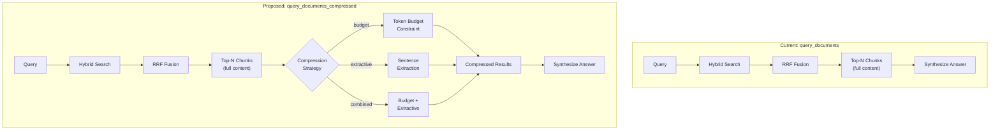

# 12. Context Compression

## Executive Summary

**Purpose:** Design a second query tool (`query_documents_compressed`) that reduces context size to avoid LLM context window poisoning when retrieving multiple document chunks.

**Scope:** Evaluate 6 compression strategies; propose API surface for new tool; provide decision matrix for implementation prioritization.

**Decision Required:** ~~Select compression strategy (or combination) balancing token reduction, quality preservation, and implementation complexity.~~ **IMPLEMENTED:** Score thresholding + semantic deduplication. LLM-based summarization rejected.

---

## 1. Current State Analysis

### 1.1 Current `query_documents` API Surface

**Location:** [src/mcp_server.py](../src/mcp_server.py#L44-L54)

```python
Tool(
    name="query_documents",
    inputSchema={
        "properties": {
            "query": {"type": "string"},
            "top_n": {"type": "integer", "default": 5, "minimum": 1, "maximum": 100},
        },
        "required": ["query"],
    },
)
```

**Parameters:**
| Parameter | Type | Default | Description |
|-----------|------|---------|-------------|
| `query` | string | (required) | Natural language query |
| `top_n` | integer | 5 | Maximum results to return |

### 1.2 Response Structure

**ChunkResult Model:** [src/models.py](../src/models.py#L17-L30)

```python
@dataclass
class ChunkResult:
    chunk_id: str      # Unique identifier
    doc_id: str        # Parent document ID
    score: float       # Normalized relevance [0.0, 1.0]
    header_path: str   # Section hierarchy
    file_path: str     # Source file
    content: str       # Full chunk text (200-1500 chars)
```

**MCP Response Format:** [src/mcp_server.py](../src/mcp_server.py#L70-L81)

```
# Answer

{synthesized_answer}

# Source Documents

**Result 1** (Score: 0.9500)
File: architecture.md
Section: Components > IndexManager

{full_chunk_content}
```

### 1.3 Response Size Analysis

| Scenario | Chunks | Chars/Chunk | Total Content | Est. Tokens |
|----------|--------|-------------|---------------|-------------|
| Default (top_n=5) | 5 | 750 (avg) | 3,750 | ~940 |
| Default (top_n=5) | 5 | 1,500 (max) | 7,500 | ~1,875 |
| Extended (top_n=10) | 10 | 750 (avg) | 7,500 | ~1,875 |
| Extended (top_n=10) | 10 | 1,500 (max) | 15,000 | ~3,750 |
| Discovery (top_n=25) | 25 | 750 (avg) | 18,750 | ~4,688 |

**Note:** Token estimates use ~4 chars/token approximation. Actual varies by content.

### 1.4 Problem Statement

**Context Bloat Scenarios:**
1. User requests many results (`top_n=20+`)
2. Chunks at maximum size (1500 chars each)
3. Redundant content across similar chunks
4. Low-relevance chunks included due to `top_n` requirement

**Consequences:**
- Consumes LLM context window budget
- Reduces space for conversation history
- May include irrelevant content that confuses LLM
- Higher API costs for token-based billing

---

## 1.5 Architecture Comparison



**Legend:**
- Rectangles: Processing steps
- Diamond: Decision point (strategy selection)
- Arrows: Data flow

---

## 2. Proposed Compression Strategies

### 2.1 Token Budget Constraint ❌ DEFERRED

**Status:** Not implemented. Clipping approach less desirable than compression.

**Description:** Stop adding chunks when cumulative token count exceeds a configurable budget.

**Technical Approach:**
1. Accept `max_tokens` parameter (default: 2000)
2. Iterate through ranked chunks
3. Estimate token count per chunk (chars / 4)
4. Stop when next chunk would exceed budget
5. Return partial results with `truncated: true` flag

**Pros:**
- Guaranteed budget compliance
- No content modification (full chunks preserved)
- Zero latency overhead
- Works with existing chunk storage

**Cons:**
- May return fewer results than `top_n`
- Abrupt cutoff may exclude relevant content
- No optimization within budget (all-or-nothing per chunk)

**Dependencies:** None (uses existing infrastructure)

**Implementation Complexity:** Low

### 2.2 Extractive Summarization ❌ DEFERRED

**Status:** Not implemented. Sentence boundary detection adds complexity without clear benefit over semantic dedup.

**Description:** Select key sentences from each chunk using query-aware relevance scoring.

**Technical Approach:**
1. Tokenize chunk into sentences (spaCy or regex)
2. Score each sentence:
   - Embedding similarity to query
   - TF-IDF overlap with query terms
   - Position bias (first sentences often summarize)
3. Select top-k sentences per chunk (k = budget / chunk_count)
4. Preserve sentence order in output

**Pros:**
- Preserves exact source text (no hallucination)
- Query-aware selection (keeps most relevant content)
- Configurable compression ratio
- No LLM dependency

**Cons:**
- May fragment meaning if key sentences depend on context
- Sentence boundary detection imperfect for technical content
- Requires sentence scoring infrastructure

**Dependencies:**
- Sentence tokenizer (spaCy, NLTK, or regex)
- Embedding model for sentence scoring (already available)

**Implementation Complexity:** Medium

### 2.3 Abstractive Summarization (LLM-Based) ❌ REJECTED

**Status:** Rejected. See ADR-1 below.

**Description:** Use LLM to rewrite/condense each chunk into a shorter summary.

**Technical Approach:**
1. For each chunk, call LLM with prompt:
   ```
   Summarize the following content in {target_length} words,
   preserving key facts relevant to: {query}

   {chunk_content}
   ```
2. Cache summaries keyed by (chunk_id, query_hash, target_length)
3. Return compressed chunks with `summary: true` flag

**Pros:**
- High-quality, coherent summaries
- Significant token reduction (50-80%)
- Maintains semantic completeness
- Can highlight query-specific aspects

**Cons:**
- Adds LLM inference latency (100-500ms per chunk)
- Requires LLM availability (may fail)
- Risk of hallucination or information loss
- Additional API costs
- Caching complexity for query-specific summaries

**Dependencies:**
- LLM endpoint (already configured for synthesis)
- Summary cache (new infrastructure)

**Implementation Complexity:** Medium (code), High (operational)

### 2.4 Semantic Deduplication ✅ IMPLEMENTED

**Status:** Implemented in [src/compression/deduplication.py](../src/compression/deduplication.py).

**Description:** Cluster similar chunks and return one representative per cluster.

**Technical Approach:**
1. Compute pairwise cosine similarity between chunk embeddings
2. Cluster chunks using:
   - Threshold-based grouping (sim > 0.85 = same cluster)
   - Or k-means with k = min(top_n, unique_clusters)
3. Select highest-scoring chunk from each cluster
4. Return deduplicated set

**Pros:**
- Removes redundant content
- Maintains diversity in results
- Uses existing embeddings (no new computation)
- Improves information density

**Cons:**
- Clustering adds computational overhead
- May lose nuanced differences between similar chunks
- Threshold selection affects results significantly
- Less effective if content already diverse

**Dependencies:**
- Access to chunk embeddings (available in VectorIndex)
- Clustering algorithm (scikit-learn or numpy)

**Implementation Complexity:** Medium

### 2.5 Aggressive Score Thresholding ✅ IMPLEMENTED

**Status:** Implemented in [src/compression/thresholding.py](../src/compression/thresholding.py).

**Description:** Only return chunks above a minimum relevance score threshold.

**Technical Approach:**
1. Accept `min_score` parameter (default: 0.5)
2. Filter results: `[r for r in results if r.score >= min_score]`
3. Return filtered set (may be empty)

**Pros:**
- Extremely simple implementation
- Removes low-quality results
- No content modification
- Zero latency overhead

**Cons:**
- Score semantics are relative (best result always 1.0)
- May return empty results for sparse queries
- Threshold selection arbitrary without absolute scoring
- Does not address size of remaining chunks

**Dependencies:** None

**Implementation Complexity:** Very Low

### 2.6 Hierarchical Compression ❌ DEFERRED

**Status:** Not implemented. Two-tool interaction adds complexity.

**Description:** Return short summaries with drill-down capability for full content.

**Technical Approach:**
1. Generate one-line summary per chunk:
   - First sentence, or
   - Header path + word count
2. Return compressed list with `chunk_id` references
3. Provide `expand_chunk(chunk_id)` tool for full content
4. Client decides which chunks to expand

**Response Example:**
```json
{
  "answer": "...",
  "summaries": [
    {"chunk_id": "auth_chunk_0", "preview": "Authentication via JWT tokens", "score": 0.95},
    {"chunk_id": "config_chunk_2", "preview": "Configuration options for OAuth", "score": 0.82}
  ]
}
```

**Pros:**
- Minimal initial token usage (70-90% reduction)
- User controls detail level
- Good for browsing/exploration
- Preserves full content access

**Cons:**
- Requires follow-up queries for full content
- More complex API surface (two tools)
- Client must implement expansion logic
- Not suitable for single-turn interactions

**Dependencies:**
- New MCP tool (`expand_chunk`)
- Client-side expansion logic

**Implementation Complexity:** Medium

---

## 3. Decision Matrix

| Option | Complexity | Quality Preservation | Token Reduction | Latency Impact | LLM Dependency | Best For |
|--------|------------|---------------------|-----------------|----------------|----------------|----------|
| **Token Budget Constraint** | Low | High (full chunks) | Guaranteed | None | No | Strict token limits |
| **Extractive Summarization** | Medium | Medium-High | 30-60% | Low (+10ms) | No | Query-focused compression |
| **Abstractive Summarization** | Medium+ | Medium (may hallucinate) | 50-80% | High (+200ms/chunk) | Yes | High compression needs |
| **Semantic Deduplication** | Medium | High (removes redundancy) | 20-50% | Low (+20ms) | No | Redundant result sets |
| **Score Thresholding** | Very Low | High (no modification) | Variable | None | No | Filtering low-quality results |
| **Hierarchical Compression** | Medium | High (on-demand) | 70-90% initial | None | No | Exploratory browsing |

---

## 4. Decision (2025-12-23)

### 4.1 Selected Approach: Score Thresholding + Semantic Deduplication

**Rejected:**
- Token Budget Constraint — Clipping is less desirable than compression
- Extractive Summarization — Not selected for initial implementation
- Abstractive Summarization — LLM dependency unacceptable
- Hierarchical Compression — Two-tool interaction adds complexity

**Selected:**
1. **Score Thresholding** — Filter results below configurable relevance threshold
2. **Semantic Deduplication** — Cluster similar chunks across ALL results, return one representative per cluster

**Rationale:**
- Compression over clipping (dedup removes redundancy without truncating)
- No LLM dependency (uses existing embedding model for similarity)
- Improves information density (removes near-duplicate content)
- Score thresholding removes noise before deduplication

### 4.2 Tool Definition

```python
Tool(
    name="query_documents_compressed",
    description="Search documents with context compression. Filters low-relevance results and removes semantic duplicates.",
    inputSchema={
        "type": "object",
        "properties": {
            "query": {
                "type": "string",
                "description": "Natural language query",
            },
            "top_n": {
                "type": "integer",
                "description": "Maximum results to return (default: 5)",
                "default": 5,
                "minimum": 1,
                "maximum": 100,
            },
            "min_score": {
                "type": "number",
                "description": "Minimum relevance score threshold (default: 0.3)",
                "default": 0.3,
                "minimum": 0.0,
                "maximum": 1.0,
            },
            "similarity_threshold": {
                "type": "number",
                "description": "Cosine similarity threshold for deduplication (default: 0.85)",
                "default": 0.85,
                "minimum": 0.5,
                "maximum": 1.0,
            },
        },
        "required": ["query"],
    },
)
```

### 4.3 Response Structure

Response format matches `query_documents` (same `ChunkResult` structure). Additional metadata in response:

```python
{
    "answer": str,                    # Synthesized answer
    "results": list[ChunkResult],     # Deduplicated results
    "compression_stats": {
        "original_count": int,        # Results before filtering
        "after_threshold": int,       # Results after score filter
        "after_dedup": int,           # Final results after dedup
        "clusters_merged": int,       # Number of duplicate clusters removed
    }
}
```

### 4.4 Implementation Order

| Phase | Scope | LOC Est. | Duration |
|-------|-------|----------|----------|
| 1 | Score thresholding in orchestrator | ~30 | 30 min |
| 2 | Semantic deduplication module | ~120 | 2 hours |
| 3 | New MCP tool registration | ~60 | 1 hour |
| 4 | Integration + compression stats | ~40 | 30 min |
| 5 | Tests + documentation | ~200 | 3 hours |

**Total:** ~450 LOC, ~7 hours

---

## 5. Open Questions (Resolved)

1. ~~**Default `max_tokens` value**~~ — **RESOLVED:** Token budget approach rejected in favor of deduplication.

2. ~~**Sentence boundary detection**~~ — **DEFERRED:** Not needed for selected approach (dedup uses embeddings, not sentences).

3. **Compression indicator in response:** **RESOLVED:** Include `compression_stats` object showing original_count, after_threshold, after_dedup, clusters_merged.

4. ~~**Score threshold integration**~~ — **RESOLVED:** Score thresholding applied before deduplication as first filter.

5. **Similarity threshold default:** 0.85 selected as reasonable balance. Higher (0.9+) may miss semantic duplicates; lower (0.7) may merge distinct content.

---

## 6. Architecture Decision Records

### ADR-1: Rejection of LLM-Based Summarization

**Status:** Rejected

**Context:** Context compression requires reducing token count while preserving semantic value. LLM-based abstractive summarization can achieve 50-80% compression with coherent output.

**Decision:** Reject LLM-based summarization in favor of score thresholding + semantic deduplication.

**Alternatives Considered:**

| Option | Pros | Cons |
|--------|------|------|
| LLM Summarization | High compression (50-80%), coherent output | Latency (+100-500ms/chunk), LLM dependency, hallucination risk, API costs, cache complexity |
| **Score Thresholding (selected)** | Zero latency, deterministic, no dependencies | May return fewer results |
| **Semantic Dedup (selected)** | Removes redundancy, uses existing embeddings | May lose nuanced differences |
| Extractive Summarization | Preserves source text | Sentence boundary issues for technical content |
| Token Budget | Guaranteed budget | Abrupt cutoff, no optimization within budget |

**Rationale:**
1. **Local-first constraint:** This project operates without external API keys. LLM summarization would require either an external API (violates constraint) or local LLM inference (adds significant resource requirements).
2. **Latency budget:** 100-500ms per chunk exceeds acceptable latency for interactive use.
3. **Hallucination risk:** Summarization may introduce inaccuracies into technical documentation.
4. **Determinism:** Score thresholding and deduplication produce reproducible results.

The selected approach (threshold + dedup) achieves compression through information density improvement rather than content rewriting.

**Implementation:**
- Score thresholding: [src/compression/thresholding.py](../src/compression/thresholding.py)
- Semantic deduplication: [src/compression/deduplication.py](../src/compression/deduplication.py)

---

## 7. Risks and Mitigations

| Risk | Likelihood | Impact | Mitigation |
|------|-----------|--------|------------|
| ~~Extractive summarization loses critical context~~ | ~~Medium~~ | ~~High~~ | N/A (approach not implemented) |
| ~~Token estimation inaccurate~~ | ~~Low~~ | ~~Low~~ | N/A (token budget not implemented) |
| Compression degrades synthesis quality | Medium | Medium | A/B test compressed vs full responses; measure answer accuracy |
| User confusion about two query tools | Low | Low | Clear documentation; consider single tool with compression flag |
| Semantic dedup removes relevant distinct chunks | Low | Medium | Conservative threshold (0.85), user-configurable |

---

## 8. Related Documents

- [spec 06: Hybrid Search Strategy](06-hybrid-search-strategy.md) - RRF fusion and scoring
- [spec 08: Document Chunking](08-document-chunking.md) - Chunk size constraints
- [spec 09: Aggregate Scoring System](09-aggregate-scoring-system.md) - Score normalization
